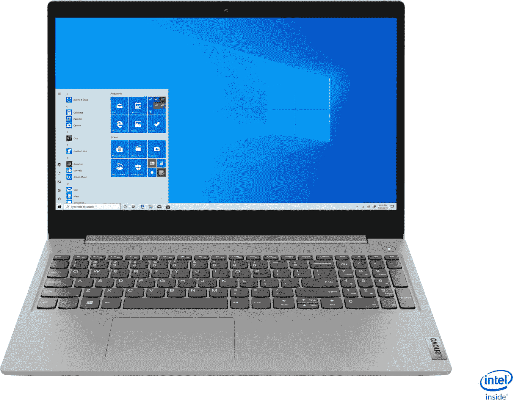
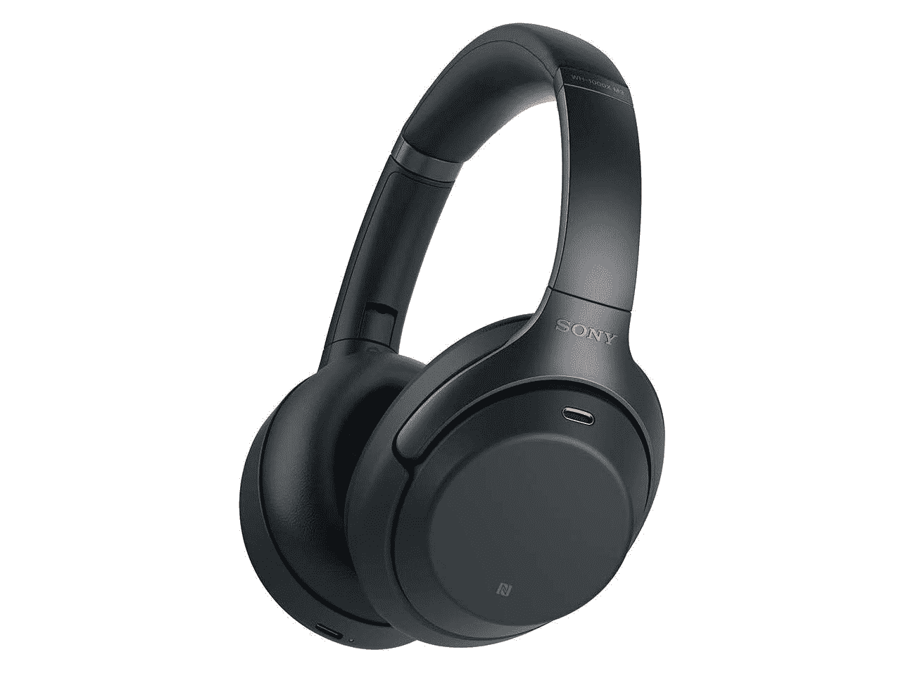
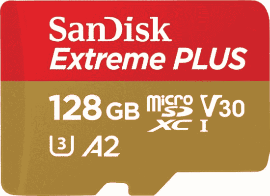

# 非亚马逊 Prime Day 2020 交易:索尼 XM3，Surface 交易&更多！

> 原文：<https://www.xda-developers.com/10-non-amazon-prime-day-deals/>

# 最后一分钟非亚马逊 Prime Day 2020 交易:Surface Deals，索尼 XM3 售价 229 美元，苹果 AirPod Pro，Corsair，等等！

今天是 2020 年的黄金日，但这并不意味着只有亚马逊有优惠！这是我们本周从其他零售商那里收集到的前 10 名。

你认为亚马逊会是唯一一家在 2020 年黄金日有交易的公司吗？其他零售商也在黄金时段开展销售活动，他们希望你和他们一起消费。在某些情况下，这些交易甚至比 Prime Day 产品更好——而且你不需要订阅就可以利用它！

但是，随着亚马逊在 48 小时内给你提供大量的交易，你很难移开视线，筛选更多的交易。不过，你不必担心这一点——我们已经做了研究，并在下面列出了 2020 年非亚马逊 Prime Day 的十大最佳交易！

* * *

 <picture></picture> 

Lenovo Ideapad 3 15 Laptop, just $300

##### 联想 IdeaPad 3

不要满足于笔记本电脑。联想 IdeaPad 3 运行 Windows 10，8GB 内存和第十代英特尔处理器。这款笔记本电脑几乎可以做你想做的任何事情，还可以运行一些资源消耗较少的游戏。

 <picture></picture> 

Sony WH-1000XM3 for $229!!

##### 索尼 WH-1000XM3

这些是 XM4 的吗？不，但是你真的不能错过索尼 XM3 的，而且它们比新型号便宜！在新蛋只需 229 美元就能买到这些超赞的降噪蓝牙耳机——不附带会员资格或礼品卡！

##### Bose QuietComfort 35 II

亚马逊不是唯一出售 Bose QC 35 的零售商！你可以在 Target 花 100 美元买到这些令人惊叹的耳机，有黑色、银色或玫瑰金可供选择。趁他们还活着，把这些拿走！

##### 微软 Surface Pro X

微软目前正在就其广受欢迎的 Surface 系列产品进行交易！以 1270 美元的价格购买带键盘盖的 Surface Pro X，或者以 600 美元的低价购买 Surface Pro 7 键盘套装。

##### 苹果 AirPods Pro

在 Target 购买苹果 AirPods Pro 可节省 50 美元！这些无线、降噪的 bud 广受好评，苹果产品也不经常上市销售。在 Target 抢购一个，根据您的位置，您可能有资格获得店内提货和当天送货服务！

##### vizio MQ8 650 英寸 4K QLED 电视

在此类活动期间，沃尔玛一直是电视促销的好零售商，Prime Day 也不例外。Vizio 的 65 英寸 4K 智能电视今天仅售 698 美元，比建议零售价低 80 美元。如果你在正确的位置，你甚至可以获得两天免费送货！

 <picture></picture> 

Insignia 2.1-Channel 80W Soundbar with Subwoofer

##### Insignia 2.1 声道 80W 条形音箱，带低音炮

通常 150 美元，在百思买只需 70 美元就能买到 Insignia 的 2.1 声道条形音箱和低音炮。如果你住在公寓里，或者你不能全力以赴地使用家庭影院系统，这款音箱和低音炮将以较低的价格为你提供出色的音频。

 <picture></picture> 

CORSAIR K70 RGB MK.2 Mechanical Keyboard

##### 海盗船 K70 RGB MK.2 机械键盘

想要一个伟大的海盗键盘交易？前往百思买！K70 MKII 仅售 90 美元，比建议零售价低 60 美元。Cherry MX 交换机是行业标准，比 Razer 或 Logitech 更容易定制和维修，Corsair 始终是高质量的选择。

 <picture></picture> 

$100 Off a Dell 32-inch LED Curved Monitor with HDR

##### 戴尔 S3220DGF 32 英寸曲面 QHD 游戏显示器

黄金日是升级游戏显示器的最佳时机，百思买正好满足您的需求。戴尔 32 英寸曲面 FreeSync 显示器节省 100 美元，总价格降至 350 美元。凭借 165Hz 的刷新率和 FreeSync 技术，这是你可以用来玩游戏的较好显示器之一，但不是超宽显示器！

 <picture></picture> 

SanDisk Extreme PLUS 128GB microSDXC, just $20

##### SanDisk Extreme Plus microSD 卡

百思买的购物车在增长吗？用 SanDisk microSD 完成它！Extreme Plus 128 GB 型号仅售 20 美元，非常适合扩展您的智能手机或交换机内存。

## 其他交易

下面的交易都是很好的交易，但并没有进入我们的十大名单。请将这些视为您可能也应该知道的其他交易！