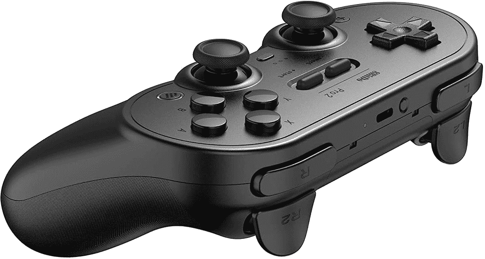

# 立即以 45 美元的价格购买 8Bitdo Pro 2 控制器

> 原文：<https://www.xda-developers.com/8bitdo-pro-2-deal-december-2021/>

8Bitdo 出售一些最好的蓝牙控制器，尤其是那些更依赖方向键而不是操纵杆的游戏。8Bitdo Pro 2 是该公司目前的旗舰游戏手柄，采用大型人体工程学设计，支持多种平台，现在售价为 44.99 美元。这仅比原价低 5 美元，但这只是它第二次在亚马逊上市，而且与之前的历史低点持平。

8Bitdo Pro 2 与大多数其他游戏控制器没有太大不同，除了 D-Pad 位于大多数其他游戏手柄上主操纵杆的位置。这使得它非常适合使用 D-Pad 的游戏，如侧滚平台和老式游戏机的模拟游戏(如《SNES》、《Game Boy/Game Boy Advance》和《NES》)。仍然有两个操纵杆和两组触发按钮，所以现代游戏是可以玩的，但 8Bitdo Pro 2 绝对是 D-Pad 游戏的亮点。

 <picture></picture> 

8Bitdo Pro 2

##### 8Bitdo Pro 2

该控制器可以很好地与 Windows、Mac、Switch、Android 和 Linux 兼容。单击产品页面上的优惠券按钮，获得 5 美元的折扣。

8Bitdo Pro 2 的另一个主要卖点是多平台支持。和大多数 8Bitdo 的其他控制器一样，Pro 2 可以在不同的软件模式之间切换(背面有一个小的硬件开关)，比大多数控制器更具多功能性。它可以连接到 Windows、任天堂 Switch、macOS、Android 和大多数支持蓝牙的 Linux PCs。最棒的是，控制器使用 USB Type-C 充电——这里没有 AA 电池或 microUSB 端口。

如果 8Bitdo Pro 2 不是你的最佳选择，请查看我们列出的[最佳安卓游戏控制器](https://www.xda-developers.com/best-android-game-controllers/)和[最佳任天堂 Switch 控制器](https://www.xda-developers.com/best-nintendo-switch-controllers/)。我们已经为每个平台编译了一些最好的控制器，因此无论您的设计偏好或价格范围，都可能有适合每个人的东西。如果你还在寻找一两件礼物的话，这些选择中的任何一个都会是很棒的节日礼物。