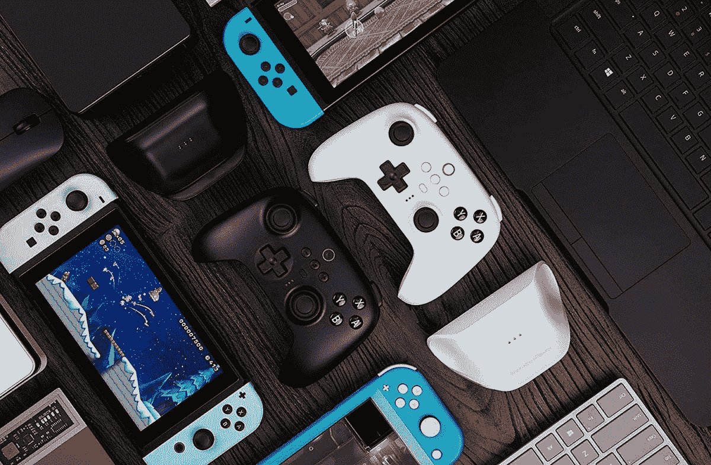
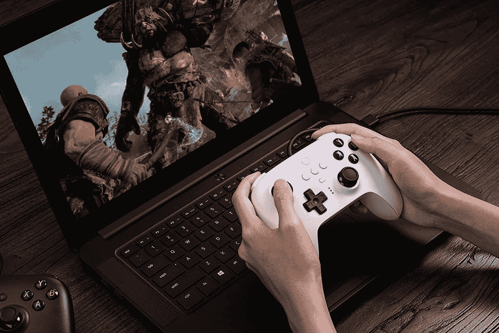
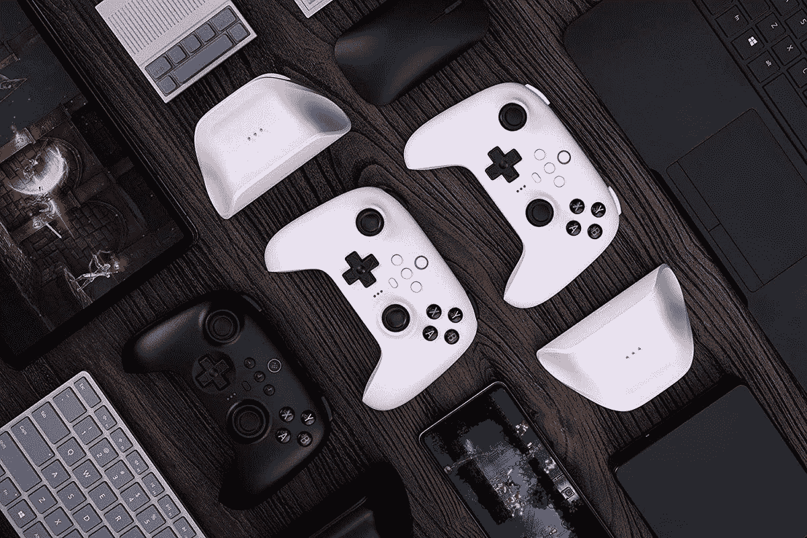

# 8Bitdo 推出三款新终极控制器，起价 34.99 美元

> 原文：<https://www.xda-developers.com/8bitdo-ultimate-controllers/>

8bitdo 以其质量控制器而闻名，为 PC，Xbox，PlayStation，甚至任天堂 Switch 提供了广泛的选择。该公司现在正在增加其已经强大的阵容，宣布在 [8BitDo Ultimate](https://www.xda-developers.com/8bitdo-ultimate-wired-controller/) 系列下推出三款新控制器，分别具有无线蓝牙模型、2.4Ghz 模型和有线模型。这些控制器现在可以预订，预计将于 10 月发布。

用于任天堂 Switch 和 Windows 的 8bitdo Ultimate 蓝牙控制器设计时尚，还配有充电底座。正如你可能猜测的那样，该设备与交换机兼容，但由于包含 2.4Ghz 无线适配器，它也与 PC 兼容。该设备提供了一个微妙的设计，有黑色和白色两种颜色，触感很好，如带霍尔效应传感器的拇指棒、背部拨片、自定义配置按钮等。控制器也可以使用配套软件进行定制，这些软件可以加载到 PC、iOS 或 Android 设备上。该设备还具有隆隆声和运动支持，一次充电可使用长达 22 小时。

8bitdo Ultimate 有线控制器兼容 Windows PC、Android、任天堂 Switch 和 Raspberry Pi。在很大程度上，其功能与无线通信完全相同。主要的区别是你必须插上这个控制器。有一些小的不同，比如增强的抓地力和可调节的扳机，等等。该控制器可兼容运行 Windows 10 或 [Windows 11](https://www.xda-developers.com/windows-11/) 的电脑。它还兼容运行 Android 9 或更高版本的设备。为了在交换机上使用它，控制台必须运行固件 3.0 或更高版本。令人欣慰的是，控制器有一根 1.8 米长的电缆，并有两种颜色可供选择:黑色或白色。

8bitdo Ultimate wireless 2.4G 控制器支持 Windows、Android 和 Raspberry Pi。该控制器提供了与蓝牙控制器相同的强大功能，背面有 pro 拨片、自定义配置开关等。有一些小的不同，比如 Xbox 风格的按钮和使用 ALP 技术的拇指棒。它还具有充电底座和定制功能，可以使用 8bitdo 的 PC 软件进行应用。支持振动，一次充电可提供长达 15 小时的电池续航时间。该设备有三种颜色:黑色、白色和粉色。它将与 2.4Ghz 适配器捆绑在一起。

你现在可以直接从亚马逊预购控制器。8bitdo 旗舰版蓝牙控制器的售价为 69.99 美元，8bitdo 旗舰版有线控制器的售价为 34.99 美元，8bitdo 旗舰版无线 2.4G 控制器的零售价为 49.99 美元。控制器将于 2022 年 10 月 28 日发布。

 <picture></picture> 

8Bitdo Ultimate Bluetooth Controller

##### 8Bitdo 蓝牙有线控制器

8Bitdo Ultimate 蓝牙控制器，带充电底座，用于开关和窗户的蓝牙控制器

 <picture></picture> 

8BitDo Ultimate Wired Controller

##### 8Bitdo 终极有线控制器

8BitDo 终极有线控制器，适用于 Windows、Android、Raspberry Pi 和 Switch 的 USB 有线控制器

 <picture></picture> 

8BitDo Ultimate Wireless 2.4g Controller

##### 8BitDo 终极无线 2.4g 控制器

8BitDo Ultimate 无线 2.4g 控制器，带充电底座，适用于 Windows、Android 和 Raspberry Pi 的 2.4g 控制器

* * *

来源: [8Bitdo](https://twitter.com/8BitDo/status/1564629014102216706) (推特)