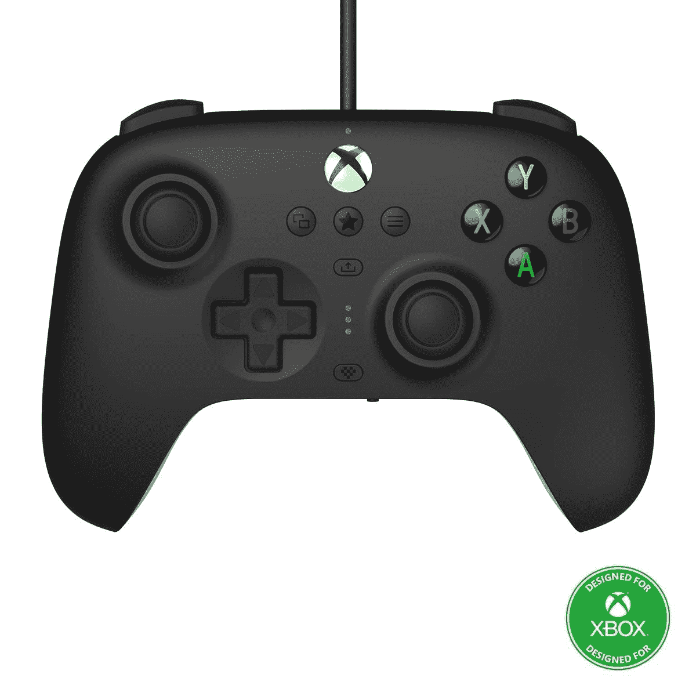

# 8Bitdo 展示了采用 Xbox 式设计的终极有线控制器

> 原文：<https://www.xda-developers.com/8bitdo-ultimate-wired-controller/>

# 8Bitdo 展示了采用 Xbox 式设计的终极有线控制器

新的 8Bitdo Ultimate 有线控制器是一款用于 Xbox 和 PC 的有线游戏手柄，非常类似于微软自己的控制器。

8Bitdo 是较受欢迎的第三方游戏控制器制造商之一，尤其是在玩复古游戏或其他为方向垫设计的游戏的人中间。现在，该公司发布了一款新的“终极有线控制器”，具有更传统的游戏手柄布局和官方 Xbox 许可。

8Bitdo 的大多数控制器都将方向板(D-Pad)放在大多数其他控制器都有主模拟杆的地方，这对于主要为 4 向移动设计的游戏来说更加舒适，如平台游戏或模拟游戏。然而，新的终极有线控制器的 D-Pad 和模拟杆的位置与现代 Xbox 和 DualShock 控制器相同。

这也是一个官方授权的 Xbox 产品，所以它和微软自己的控制器有相同的标志和图标。您可以在软件中更改模拟操纵杆和触发器的灵敏度，每个按钮可以重新映射到不同的功能(最下面的中间按钮在不同的配置文件之间切换)。8Bitdo 出售黑色或白色的控制器，还有一个集成的 3.5 毫米音频插孔，可以快速方便地连接耳机。

与大多数 8Bitdo 的其他控制器不同，这只能用于 Xbox 游戏机和 PC，并且只能通过 USB 连接。尽管控制器中有蓝牙支持，但它仅用于无线连接 iOS 或 Android 上的“终极软件应用程序”——它不能通过蓝牙作为游戏控制器，这有点奇怪。这款控制器可能仍然适用于一些使用 USB-OTG 适配器的 Android 手机和平板电脑，但在开始向买家发货之前，无法确定这一点。

8Bitdo Ultimate 有线控制器将于 2022 年 5 月 31 日发布，可通过以下链接在亚马逊预订。这款控制器两种颜色的售价都是 44.99 美元。

 <picture></picture> 

8Bitdo Ultimate Wired Controller

##### 8Bitdo 终极有线控制器

这个有线控制器是为 PC 和 Xbox 设计的，没有别的。

**Via:** [濒临绝境](https://www.theverge.com/2022/3/8/22966831/8bitdo-ultimate-wired-controller-for-xbox-announced-price-release-date)