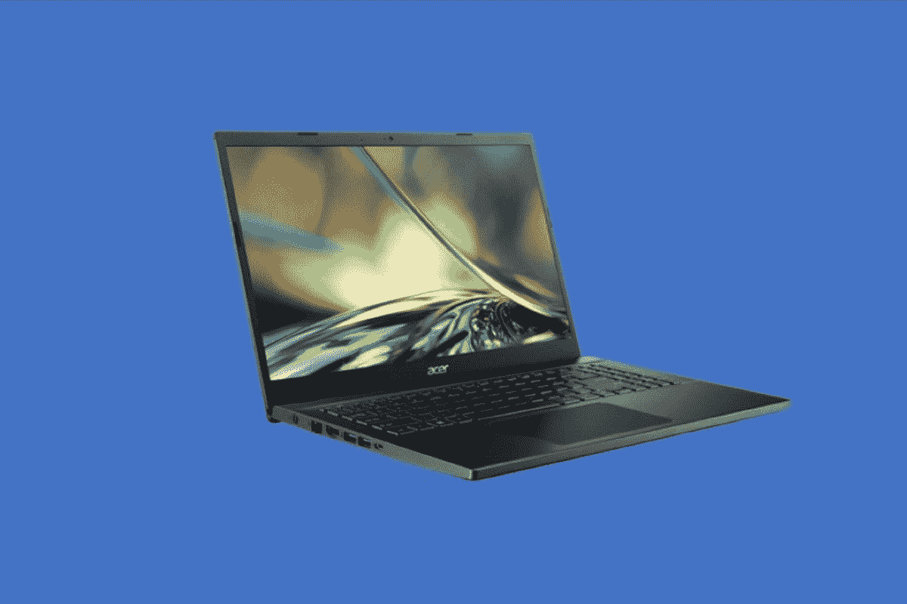
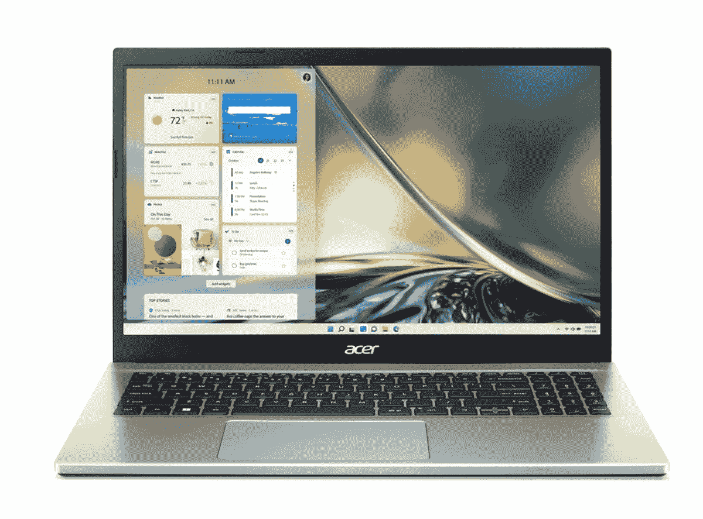

# 宏碁出售配有 RTX 3050 GPU 的宏碁 Aspire 7 降至 800 美元以下

> 原文：<https://www.xda-developers.com/acer-aspire-7-with-rtx-3050-sale/>

我们现在是 10 月份，这意味着[新款笔记本电脑](https://www.xda-developers.com/best-laptops/)将会大量上市。因此，如果你想借此机会为自己找一台像样的笔记本电脑，从 10 月 6 日到 10 月 13 日，宏碁在其网站上有一些很棒的交易。这些交易将配有 Nvidia GeForce RTX 3050 的宏碁 Aspire 7 的价格降至 800 美元以下，还降低了其他高端笔记本电脑和更经济实惠的 Windows 11 设备的价格，这些设备现在低至 269 美元。

最受欢迎的是采用 RTX 3050 显卡的宏碁 Aspire 7。这款笔记本电脑通常定价为 900 美元，但现在不到 800 美元，售价为 699.99 美元。这款 15-6 英寸笔记本电脑是一款非常棒的入门创作型笔记本电脑，或者由于采用了 RTX 3050 显卡，适合玩轻度游戏。它拥有 FHD 1920 x 1080p 显示屏和背光键盘，非常适合在晚上进行多任务处理、玩游戏或编辑视频。除此之外，这款笔记本电脑在不超过 1000 美元的价格范围内也非常强大。它采用了今年的英特尔酷睿 i5-1240P 芯片，运行功率为 28 瓦。8GB 的内存和 512GB 的存储空间超过了这款笔记本电脑的规格，我们认为这有利于多任务处理，并可以在设备上存储任何文件，而不用担心固态硬盘或云存储。

 <picture></picture> 

Acer Aspire 7 ($200 off)

##### 宏碁 Aspire 7(降价 200 美元)

宏碁 Aspire 7 是一款非常适合初学者的笔记本电脑，采用 RTX 显卡和 FHD 显示屏，并配有背光键盘。它甚至内置了最新的英特尔 CPU。

宏碁限时销售的另一款笔记本电脑是宏碁 Aspire 3 A315-59-71NF。这款笔记本电脑没有我们之前推出的宏碁 Aspire 7 功能强大，但它的售价是 579.99 美元，而不是 850 美元，是一款非常出色的笔记本电脑。你将会以非常便宜的价格买到英特尔 U 系列的高端 CPU。该笔记本电脑配备英特尔酷睿 i7-1255U CPU，具有 2 个性能内核和 8 个效率内核。搭配 8GB 内存和 512GB 存储，我们认为这是一款非常棒的日常笔记本电脑。甚至显示屏也很不错，因为它也是全高清的，大小为 15.6 英寸，让你有空间打开所有你想打开的应用程序。

 <picture></picture> 

Acer Aspire 3 ($270 off)

##### 宏碁 Aspire 3(降价 270 美元)

Acer Aspire 3 是一款工作效率极高的笔记本电脑，采用了 U 系列英特尔 CPU 和 15.6 英寸超大显示屏。

我们已经强调了这两个最大的交易，但我们在宏碁的网站上注意到，一些更强大的笔记本电脑仍然有一些更大的折扣。如果你想要一台时尚的笔记本电脑来玩游戏，或者是一台用于视频编辑和其他任务的笔记本电脑，看看下面这些选择。该列表包括宏碁 Enduro Urban、宏碁 Porsche Design 和宏碁 Predator Triton 300。

如果这些笔记本电脑对你的需求来说太贵了，那么不要担心。宏碁在更主流的设备上也有折扣，Chromebooks 的价格要低得多。这些都是没有 GPU 的生产力笔记本电脑。这是我们在打折时发现的一些。请注意，我们的第一个选择是 Arm 驱动的 Chromebook，它的销售仅适用于 10 月 6 日和 10 月 7 日。至于我们的第二个选择，也是 Chromebook，但采用英特尔技术，销售仅适用于 10 月 8 日和 9 日。

宏碁的一些其他销售带来了一些游戏显示器的交易，你可能想投资购买这些新的笔记本电脑。现在，你可以以 279 美元买到 [Predator XB271HU 游戏显示器，这比通常价格 499.99 美元低了 220 美元。不过请注意，你必须尽快处理这些交易，它们只会持续到 10 月 13 日，除了我们指明的地方。](https://www.anrdoezrs.net/links/100122946/type/dlg/sid/UUxdaUeUpU43950/https://store.acer.com/en-us/27-predator-gaming-monitor-xb271hu-bmiprz)