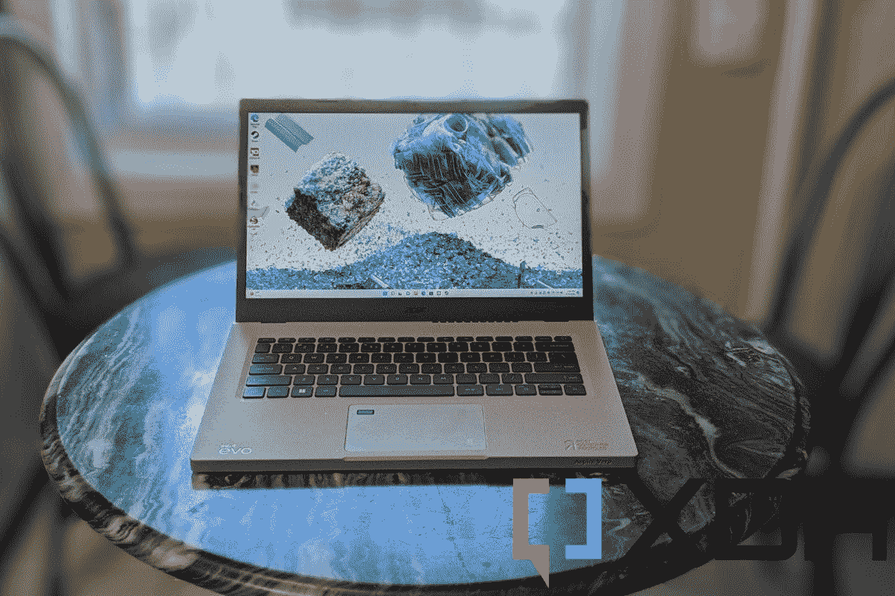

# Acer Aspire Vero (14 英寸)评测:独特的环保笔记本电脑

> 原文：<https://www.xda-developers.com/acer-aspire-vero-review/>

当你购买价格接近 800 美元的笔记本电脑时，你通常会考虑规格和价格。你永远不会想到你的新笔记本电脑对环境有多友好。或者，如果它使用回收材料和升级内容。你只是想要[一台最好的笔记本电脑](https://www.xda-developers.com/best-laptops/),感觉很高级，而且经久耐用。

嗯，我最近收到了宏碁 Aspire Vero 的评测，在使用了几个星期后，我认为它在这个故事的另一边。这是一个塑料笔记本电脑，绝对不是一个高端设备。它将我倾向于评论的所有与高端笔记本电脑相关的常见事物推到了一边。相反，它的目标是帮助拯救地球。它配备了英特尔酷睿 i7-1255U CPU、16GB 内存和 1TB 固态硬盘，与其他同类笔记本电脑和其他[预算宏碁笔记本电脑一样，在处理日常任务时也表现不错。](https://www.xda-developers.com/best-acer-laptops/#:~:text=XDA%20VIDEO%20OF%20THE%20DAY%20Navigate%20this%20article%3A,Best%20for%20content%20creators%3A%20Acer%20ConceptD%207%20Ezel)

这款笔记本电脑不把最好的显示器规格和制造质量放在第一位，而是注重可持续发展。它甚至还可以升级，这对于 700 美元的价格来说是一个惊喜。它可能看起来很便宜，但如果你真的关心拯救地球，它仍然是一款性能卓越的笔记本电脑。

 <picture></picture> 

Acer Aspire Vero

##### 宏碁 Aspire Vero

宏碁 Aspire Vero 是一款全塑料环保笔记本电脑，由于采用了英特尔的 U 系列 CPU，性能出色

**浏览此评论:**

## Acer Aspire Vero 定价和供货情况

*   宏碁 Aspire Vero 在 Acer.com 有八种不同的配置，起价 700 美元
*   我要评测的 14 英寸版本是最高端的型号。它的定价为 900 美元

你现在可以在 Acer.com 或者通过沃尔玛、Adorama、MicroCenter、新蛋和亚马逊等合作伙伴购买 14 英寸或 15.6 英寸的宏碁 Aspire Vero。这些零售商可能比 Acer.com 便宜。宏碁在其网站上建议起价为 700 美元，但亚马逊将定期出售这款笔记本电脑。

有许多不同的型号可供你选择。最便宜的 700 美元，配备了去年的第 11 代英特尔酷睿 i5-1155G7 CPU，8GB 内存和 256GB 固态硬盘。根据您选择的设备和屏幕大小，添加更多内存和存储或选择更新的第 12 代英特尔酷睿 i7 或英特尔酷睿 i5 CPU 将使您的价格上涨数百美元。宏碁在我的机型上打出了比底价低 200 美元的高价。我有 16GB 内存、英特尔酷睿 i7-1255U 和 1TB 固态硬盘。

## 宏碁 Aspire Vero 规格

| 

规范

 | 

附加说明

 |
| --- | --- |
| **CPU** | 

*   英特尔酷睿 i7-1255U 处理器(12 MB 智能高速缓存，1.7 GHz 性能-采用英特尔睿频加速技术 2.0 的内核最高可达 4.7 GHz)

 |
| **图形** |  |
| **显示** | 

*   14 英寸 IPS，FHD 1920 x 1080，300 尼特，16:9 宽高比

 |
| **尺寸&重量** | 

*   12.94 x 8.8 x 0.7 英寸& 3.31 磅

 |
| **记忆** |  |
| **存储** |  |
| **电池** | 

*   56 瓦时 3 芯锂离子电池

 |
| **端口** | 

*   1 个 USB-C，带 Thunderbolt 4
*   2 个 USB-A
*   1 个 HDMI 2.1 接口
*   充电器的 DC 输入(可选)
*   3.5 毫米耳机和麦克风插孔

 |
| **音频&麦克风** | 

*   Acer TrueHarmony 技术可实现更低的失真、更宽的频率范围、类似耳机的音频和强劲的声音
*   宏碁纯化。双内置麦克风的 AI 降噪语音技术。功能包括远场拾音、通过神经网络的动态降噪、自适应波束形成以及预定义的个人和电话会议模式。

 |
| **连通性** | 

*   英特尔无线 Wi-Fi 6E AX211
*   802.11 a/b/g/n/ac/ax 无线局域网
*   支持蓝牙 5.2 及更高版本

 |
| **摄像机** | 

*   1080p 高清视频，60 fps，时间降噪

 |
| **颜色** | 

*   使用免漆底盘不使用任何颜色

 |
| **材质** |  |
| **生物识别** | 

*   触控板上的 Windows Hello 指纹识别器

 |
| **可升级组件** |  |

## 设计:它是塑料的，环保的

*   它由塑料制成，对于一台 900 美元的笔记本电脑来说，感觉非常便宜
*   有很多可回收材料在使用
*   你会发现设备上有大量的端口

宏碁 Aspire Vero 的亮点(也是不足之处)绝对是这种设计。我很习惯评论由铝、镁甚至金属制成的笔记本电脑。在这个设备的外表上找不到任何东西。不过，这是有原因的。宏碁希望保持这款笔记本电脑的可持续性，让它看起来独一无二，但我不是它的粉丝。

对于我的单元成本 900 美元的价格，甚至 700 美元的介绍价格，我不明白为什么有人会想要购买像这样的廉价塑料笔记本电脑。除非你有环保意识，想为一个更清洁、更绿色的地球做贡献。我认为笔记本电脑应该是高端设备。

无论如何，尽管我讨厌塑料笔记本电脑，但这种设计有很多很酷的东西，这让我想放弃宏碁。许多笔记本电脑制造商现在对笔记本电脑部件更加环保。例如，惠普在蜻蜓使用了海洋塑料。苹果在 MacBook 外壳中使用再生铝。宏碁在多个方面将这一点提升到了一个新的水平，而且是以其他笔记本电脑制造商没有的新方式。

我第一次注意到这一点是在底盘上。与 ThinkPads 或其他设备不同，它是无油漆的，到处都是黄色和灰色的雀斑。宏碁表示，这可以减少释放到环境中的挥发性有机化合物的影响。它还由消费后回收(PCR)塑料制成，既环保又能减少垃圾填埋。宏碁表示，50%的 PCR 塑料用于机箱，30%用于键帽。生产过程中产生的废料也被回收和再利用。所有这些都有助于将制造笔记本电脑的碳排放量减少 21%。

所有这些都很好，但对于这个价格的东西来说，感觉很糟糕。笔记本电脑盖子弯曲很多，按在键盘甲板上会让甲板弯曲。我从来不想在笔记本电脑上有这种感觉，尤其是你可以用同样的价格买到像联想 Yoga 7i 这样的全铝设备。如果这是一台 300 美元的笔记本电脑，你通常会发现塑料材料的范围，那么我会给宏碁一个通行证。

这也是一款相当方正的笔记本电脑。它看起来比联想 ThinkPad 等其他 Windows 设备要方正得多。这就是为什么它 0.7 英寸厚，3.3 磅重。谁能想到塑料会这么重？

关于设计有两件事-端口以及服务和升级的能力。有了端口，有很多要避免加密狗。右侧有一个 USB-A 端口。左侧是一个 Thunderbolt 4 端口、HDMI 和另一个 USB-A，然后是耳机插孔。这种厚厚的机箱可能会让宏碁包括这些端口。

至于升级的方式。您可以用普通螺丝刀拆下设备的背面。这样就可以访问 SSD 进行更改。这是宏碁使这款笔记本电脑可以长期重复使用的愿景的一部分。我真的很喜欢笔记本电脑的可升级性，因为这意味着你不必拘泥于结账时得到的规格。

虽然我没有尝试过，但我可以把 SSD 换成另一个 SSD，并从 fresh 安装 Windows。甚至内部组件看起来也很容易更换。电池没有拧紧或焊接。扬声器安装在角落里，没有胶水，你可以很容易地分辨出笔记本电脑的哪个部分有什么用途。我很久没见过这种模块化了，向宏碁致敬！

## 显示和声音:狭窄，沉闷，尤其是这个价格

*   14 英寸显示器有时会感觉局促，因为它不是 16:10 的宽高比显示器
*   网络摄像头的分辨率为 1080 像素，相当不错，并且具有改善图像的软件功能

当我使用宏碁 Aspire Vero 工作时，我对显示器感到失望。色彩准确度和亮度(达到 267 尼特的亮度)还可以，但我希望更好。根据我的色度计，它达到了 70%的 Adobe RGB、67%的 NTSC、70%的 P3 和 92%的 sRGB。

这些色域相当单调，尤其是至关重要的 Adobe RGB。这就是为什么我经常发现自己踢了亮度，以确保场景看起来更有活力。当我在 YouTube 上以较低的亮度观看 NASCAR 集锦时，我错过了很多东西，比如汽车上灯光的微光，或者挡风玻璃上精细橡胶的堆积。即使是网页浏览，如果亮度不是一直在上升，我为这篇评论拍摄的产品照片在屏幕上看起来也很单调。没有太多的对比和黑点。

请注意，我刚刚评测了 HP Envy 16 和 HP ZBook Firefly G9，它们的显示屏都很棒。这些笔记本电脑有更新的 16:10 宽高比显示器，它让我忘记了 16:9 是多么可怕。我知道这款笔记本电脑起价 700 美元，16:10 的显示屏被认为是顶级的，但我真的希望它是标准的。当我尝试打开许多窗口并尝试进行多任务处理时，像这样的 16:9 显示器感觉太拥挤了。

至少显示屏上方的网络摄像头还过得去。这是一个 1080p 的网络摄像头，而此时大多数笔记本电脑制造商正在远离 720p。其他笔记本电脑制造商正在使用 5MP 网络摄像头，但 1080p 也不错。在每周的 Google Meet 通话中，我看起来没有模糊或褪色，我认为这台笔记本电脑上的宏碁时域降噪技术真的有帮助。

## 键盘和触控板:我讨厌键盘

*   键盘吱吱作响，糟糕透了
*   “E”和“R”键帽上颠倒的文字会极大地分散注意力
*   触控板是塑料的，非常好用

在键盘和触控板上，我有一些复杂的感觉。键盘很烂，但是触控板很棒。我真的对 900 美元的键盘感到失望。这是我对 HP Stream 这样的入门级笔记本电脑的期望。

当我在这篇评论中打字时，键盘感觉太便宜了。当我打字时，我听到许多钥匙吱吱的声音。回车键和反斜杠键也太接近了，我发现自己经常会错误地按到其中的一个。哦，我知道宏碁想让用户知道这款笔记本电脑是环保的，它的“E”和“R”键是黄色的，可以反过来模仿 reduce 和 recycle，但这真的导致了太多的错别字。这是一个巨大的视觉干扰！

不过，触控板也不算太差。像笔记本电脑的其他部分一样，它也是塑料的，但摸起来很光滑，类似于玻璃。这意味着它很大，点击时会发出大量噪音。更好的是，宏碁在触控板中偷偷放了一个指纹读取器。正因为如此，我才能很快登录宏碁。

## 性能:这款笔记本电脑的最佳之处

*   英特尔的第 12 代 U 系列带来了强大的性能
*   电池寿命很长，超过 6 小时

宏碁 Aspire Vero 采用英特尔第 12 代 U 系列芯片。这位于英特尔堆的底部，在运行功率为 45 瓦的 H 级 CPU 以及运行功率为 28 瓦的中功率 P 级 CPU 之后。它有 2 个性能内核和 8 个效率内核，最大运行频率为 4.70 GHz。我的设备中的英特尔酷睿 17-1255U 的运行功率为 15 瓦，这对于电池寿命来说非常好。

总的来说，我觉得这款 U 系列芯片在工作效率和我使用笔记本电脑的主要任务之间达到了完美的平衡。连接到 4K 显示器和 4K 的流媒体内容并没有降低这台笔记本电脑的速度。我通常在微软 Edge 中平衡 12 个标签的工作流程也是如此。即使是轻度游戏也运行良好，CS: GO 在中等设置下运行流畅，尽管它让笔记本电脑的粉丝们疯狂。

| 

试运转

 | 

宏碁 Aspire Vero(英特尔酷睿 i7-1255u)

 | 

[联想 Yoga 7i (2022)](https://www.xda-developers.com/lenovo-yoga-7i-2022-review/#LenovoYoga7iDesign) 酷睿 i7-1255U

 | 

[联想 Yoga 9i](https://www.xda-developers.com/lenovo-yoga-9i-2022-review/) 酷睿 i7-1260P

 | 

[华为 MateBook 16S](https://www.xda-developers.com/huawei-matebook-16s-review/) 酷睿 i7-12700H

 |
| --- | --- | --- | --- | --- |
| PC Mark 10 | 5,482 | 5,453 | 5,616 | 5,501 |
| 3D 标记:时间间谍 | 1,786 | 1,774 | 1,678 | 1,957 |
| Geekbench 5(单/多) | 1,717/8552 | 1,694 / 8,370 | 1,736 / 9,525 | 1,779/ 9,789 |
| Cinebench R23(单/多) | 1,751/8068 | 1,763 / 7,315 | 1,638 / 7,757 | 1,815/10,615 |
| 交叉标记(总体/生产力/创造力/响应能力) | 1,699/1,643/1,754/1,710 | 1,492 / 1,420 / 1,661 / 1,251 | 1,454 / 1,353 / 1,650 / 1,235 | 1,720 / 1,576 / 1,917 / 1,619 |

你可以从 CrossMark 生产率得分中看出这一点，该得分在 2500 分中达到 1643 分。即使是 PC Mark 10 也给了它 5，482 的高分，而在英特尔 P 级笔记本电脑方面，宏碁 Aspire 的分数甚至更接近。这只是向您展示了这款笔记本电脑在塑料机箱中没有节流和过热的情况下性能有多好。

这只是性能，但电池寿命也很棒。我用宏碁 Aspire 进行网络工作，一次充电几乎可以让我用一整天。在屏幕亮度为 40%左右，Windows 电池设置为*最佳能效*的情况下，我获得了 6 小时的电池。在同样的设置下插入 4K 显示器，它在 3 点左右减半。我通常将 5 小时作为笔记本电脑最佳电池的基线，所以这很好。

## 你应该买宏碁 Aspire Vero 吗？

宏碁 Aspire Vero 是一款环保笔记本电脑，但你真的不应该买它。我认为在价格上有更好的笔记本电脑，比如联想 Yoga 7i、Yoga 9i，甚至是华为 MateBook 16S。

**谁应该购买宏碁 Aspire Vero**

*   那些关心环境的人
*   任何喜欢塑料笔记本电脑的人
*   任何想要高性能笔记本电脑的人

**谁不应该购买宏碁 Aspire Vero**

*   那些想要高级感觉设备的人

在使用宏碁 Aspire Vero 两周后，我确实喜欢它的整体性能，但让我感到困扰的一点是塑料设计。不过它对环境还是很好的，所以如果我买了它，我会很自豪。

 <picture></picture> 

Acer Aspire Vero

##### 宏碁 Aspire Vero

宏碁 Aspire Vero 是一款全塑料环保笔记本电脑，由于采用了英特尔的 U 系列 CPU，性能出色