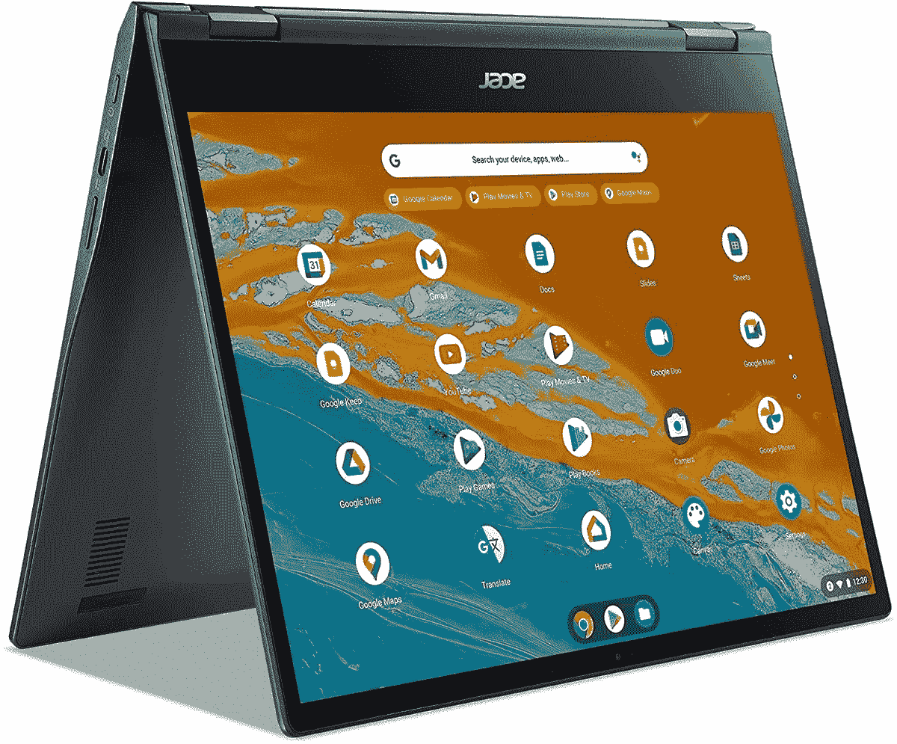

# 宏碁 Chromebook Spin 513 评测:联发科的一大惊喜

> 原文：<https://www.xda-developers.com/acer-chromebook-spin-513-mediatek-review/>

我用过的一些最好的 Chromebooks 采用了英特尔、AMD 或高通的芯片。我认为这些芯片对 Chromebooks 来说非常强大。但是 Chromebook 市场上有一个玩家是很多人(甚至我自己)经常忽略的:联发科。自 2016 年以来，它一直是 Chromebook 故事的一部分，最近，它将其最新的芯片放在了一些伟大的 Chromebook 型号中。宏碁 Chromebook Spin 513 就是其中之一。

与上一代的高通骁龙 7C 相比，今年的 Spin 513 Chromebook 型号采用了联发科的 Kompanio 1380 八核 CPU ，这是联发科芯片生产线的顶级产品。将这一点与该设备略显时尚的设计以及超长的电池寿命相结合，你会发现这款 Chromebook 的价格低于 600 美元，真是令人惊讶。在我的演示期间，我真的很喜欢使用这款 Chromebook，尽管当设备太忙时，我遇到了一些小的性能问题。

 <picture></picture> 

Acer Chromebook Spin 513

宏碁 Chromebook Spin 513 是一款出色的 Chromebook，这要归功于联发科 Kompanio 1380 八核 CPU、设计上的 bling 触感以及 3:2 的宽高比显示屏。

*关于此次评测:这款 Chromebook 是联发科发给我们的，用于评测 Kompanio 1380 的样品。我们被允许在审查期后保留该设备。*

**浏览此评论:**

## Acer Chromebook Spin 513 定价和供货情况

*   宏碁 Chromebook Spin 513 在亚马逊上售价 549 美元

你今天可以从亚马逊购买 549 美元的宏碁 Chromebook Spin 513。不过，注意不要买上一代版本，里面有高通骁龙 7C。供应可能有限；在撰写这篇评论时，亚马逊只剩下三款，宏碁的零售网站[也缺货。](https://www.anrdoezrs.net/links/100122946/type/dlg/sid/UUxdaUeUpU44239/https://store.acer.com/en-us/acer-chromebook-spin-513-cp513-2h-k62y)

## 宏碁 Chromebook Spin 513 规格

| 规范 | 附加说明 |
| --- | --- |
| **CPU** | 

*   联发科 Kompanio 1380 八核 CPU

 |
| **图形** | 

*   五核 Arm-Mali G57 GPU

 |
| **显示** | 

*   13.5 英寸，3:2 宽高比，2256 x 1504 分辨率，360 尼特，支持笔

 |
| **尺寸&重量** | 

*   11.81 x 9.25 x 0.64 英寸/2.82 磅

 |
| **记忆** |  |
| **储存** |  |
| **电池** | 

*   额定电池寿命为 11 小时

 |
| **端口** | 

*   2 个 USB-C 端口
*   1 个 USB-A 端口
*   microSD 卡插槽
*   3.5 毫米耳机插孔

 |
| **音频&麦克风** |  |
| **连通性** | 

*   IEEE 802.11 a/b/g/n/ac/ax
*   蓝牙 5.2

 |
| **摄像机** |  |
| **颜色** |  |
| **材质** | 

*   铝与宏基抗菌设计

 |
| **操作系统** |  |

## 设计:重量轻，带一点珠光宝气

*   我喜欢 Chromebook 顶盖上闪亮的边缘
*   这款 Chromebook 非常坚固，手感极佳
*   这是一个紧凑的装置

我不会撒谎，现在很多二合一设备看起来都一样，尤其是 Chromebooks。不过，凭借 Chromebook Spin 513，宏碁试图有所不同。这款 Chromebook 的顶盖有一些闪亮的装饰，可以很好地补充机箱的其余部分。这也让我想起了联想 Yoga Windows 笔记本电脑的菱形边缘。

除此之外，Chromebook 的侧面在端口处有一点“隆起”。我称之为驼峰，因为这个区域比前面底盘的其余部分厚。Chromebook 的两侧从后到前由厚变薄。当你使用 Chromebook 或将其转换为平板电脑模式时，这实际上给了你滑动手指的空间。

说到转换到平板电脑模式，这款 Chromebook 的铰链和整体设计非常强大。它不是塑料的，因此感觉很结实。相信我，我试着尽可能用力按压键盘，没有任何弯曲。

总的来说，这也是一款漂亮小巧的 Chromebook。它的尺寸为 11.81 x 9.25 x 0.64 英寸，重量约为 2.82 磅。事实上，我带着这款 Chromebook 去纽约北部进行了一次快速的周末家庭旅行，它没有给我的背包增加额外的负担。这并不奇怪，因为许多现代 Chromebooks 都很紧凑。作为参考，一款售价 1000 美元的 Chromebook，[惠普精英蜻蜓 Chromebook](https://www.xda-developers.com/hp-elite-dragonfly-chromebook-review/#design) 同样重 2.6 磅，厚约 0.6 英寸。

我喜欢盖子上闪亮的装饰。它赋予了这款 Chromebook 一些风格。

在其他设计领域，我确实喜欢包含 USB-A 端口。USB-C 是未来和现在，但不是每个人都准备好了，尤其是如果你像我一样，总是使用 USB 驱动器和固态硬盘。HDMI 本来也不错，但那是为了更大的宏碁 Chromebook Spin 713。我[不得不用转换器](https://www.xda-developers.com/best-docking-stations-chromebooks/)把它连接到我家的显示器上。

## 显示:3:2 对生产力来说是惊人的，但我讨厌底部下巴

*   该屏幕具有超高的 2256 x 1504 分辨率，结合 3:2 的宽高比，非常有利于提高工作效率
*   显示器非常明亮和丰富多彩

通过多年使用 Windows 2 合 1 和 Chromebooks，我注意到了这个行业的两大趋势。显示器的边框越来越薄，原始设备制造商将笔记本电脑的显示器切换到 16:10 或 3:2 的宽高比。不幸的是。这款 Chromebook 只有一个趋势:3:2 的宽高比。Chromebook Spin 513 仍然有一个丑陋的底部边框，但对于低于 600 美元的价格，很难抱怨。

对于这款 Chromebook 的价格，我确实认为显示屏还是不错的。这款设备拥有像素封装的 13.5 英寸 2256 x 1504 分辨率显示屏，亮度可达 360 尼特。不过，我用来评测笔记本电脑的常用工具在 ChromeOS 上并不适用，所以我必须更主观一点来支持我的说法。

对于我的日常工作流程，我并排堆叠两个 Chrome 窗口。这款 Chromebook 更高的 3:2 宽高比让我可以看到更多的互联网。网页感觉更完整了，减少了很多截断。除此之外，显示器还支持 USI 笔。一个没有提供给我审查，但如此高分辨率的屏幕，我不明白为什么有人不会想用这台机器快速涂鸦或做笔记。

这款 Chromebook 的显示屏非常适合工作效率，但它的底部边框很丑。

为了测试亮度和色彩准确度，我最终在这台设备上观看了我最喜欢的 NBC 系列，并将其转换为 stand tent。《芝加哥大火》是一部色彩丰富的电视剧，有许多对比鲜明的场景。在一集里，一家剧院着火了，我不禁注意到显示器上的火焰看起来有多亮。它看起来没有褪色或暗淡。该显示器在颜色准确性方面做得很好，但对某些人来说可能太反光了。当我在一个阳光明媚的日子使用它并打开窗户时，我注意到了这一点。

显示器上面是一架 720p。1080p 是新的标准，但对于 Chromebook 来说，你不能抱怨。它可以完成基本的通话，但在光线不好的情况下效果不佳。

## 键盘:有弹性，非常棒

*   键盘是背光的
*   它也有弹性和准确性
*   我喜欢光滑的触控板

有时 Chromebook 上的键盘可能不太出色，所以我很高兴使用 Chromebook Spin 513 上的键盘。对我来说，最重要的部分是背光。我喜欢在床上使用我的笔记本电脑，所以我很高兴 Chromebook Spin 513 甚至有背光，不怎么出血。除此之外，按键有很好的弹性，这帮助我实现了快速的打字速度。

触控板也很好用。它滚动起来出奇的流畅，不会像廉价的 Chromebook 的触控板那样发出很多噪音。它也很大，为滚动留出了很多空间。这款 Chromebook 从来不用外接鼠标。

*   联发科 Kompanio 1380 八核 CPU 很好地满足了我的网页浏览需求，以及 Android 游戏
*   我在日常使用的 Chromebook 上将其与第 10 代英特尔酷睿 i5 CPU 进行了基准测试，除了多核性能之外，两者几乎相同。

对我来说，这款 Chromebook 真正的惊喜是联发科 Kompanio 1380 八核 CPU。这是对上一代设备的一个改变，上一代设备内部有一个高通骁龙 7c。我日常使用的 Chromebook，三星 Galaxy Chromebook，配备了英特尔第十代 CPU，所以我真的预计这款联发科芯片会比它慢得多。伙计，我错了。这是一款性能非常好的芯片。

如果你不熟悉联发科 CPU，那么考虑这个。联发科 Kompanio 1380 是其最高端的芯片，旨在提供优质的 Chromebook 体验。它位于 1000 系列，800 系列和 500 系列之上。它也是使用最新的 TSMC 6 纳米工艺制造的。它有四个性能核心(Cortex A78 2.6 GHz-3Ghz)和四个效率核心(Cortex A55 2.00 GHz)。)CPU 也是 5 核 GPU。所有这些都有助于 Chromebook 在性能方面表现出色。

我用来测试 Windows 笔记本电脑的常用软件套件在 ChromeOS 上无法运行，所以我不得不稍微调整一下。我运行了 Android 版本的 Geekbench 5，以及速度计 2.0 基准测试。Android 版本的 Geekbench 5 与 Windows 版本的运行并不完全相同。与此同时，速度计 2.0 运行模拟网页，以 140 为标度测量网络应用程序的响应度。

在基准测试中，宏碁 Chromebook Spin 513 的单核得分为 936，多核得分为 3250。用速度计 2.0 打了 45.6 分。我用第十代英特尔酷睿 i5-1210U CPU 对我的日常 Chromebook 进行了基准测试，结果几乎相同。它获得了 820 的单科成绩和 2285 的多科成绩。在速度计 2.0 上，我的三星 Chromebook 得分 59.9。凭借更高的多核性能，可以看出这款联发科 CPU 的性能和高效内核如何帮助它更好地与这款旧的英特尔 CPU 相抗衡。

对于 Android 应用程序和更多应用程序来说，这是一款性能非常好的芯片。

不过，我只是给出了这些基准供参考。在我的日常工作流程中，这款联发科 CPU 在性能方面绰绰有余。它在 Chrome 中处理了 10 多个标签(Instagram Android 应用程序在后台打开)，没有任何问题。网页加载偶尔会有点慢，但一旦启动并运行，体验会很流畅。

除此之外，我玩过一些我能想到的最高端的安卓游戏。这包括安卓版本的*沥青 9、*以及*侠盗猎车手 III* 和*使命召唤手机*。所有这三个运行完美，没有冻结或没有滞后。即使在我基于英特尔技术的 Chromebook 上，我有时也会觉得这些游戏运行缓慢。我只希望这款 Chromebook 有传统的固态硬盘，而不是 eMMC 存储，因为游戏有时会加载缓慢。不管怎样，这仍然是一款适合安卓游戏的 Chromebook。

至于电池寿命，我在这台 Chromebook 上工作了一整天，还剩下一些。我估计大约需要 9 个小时。我在上午 9 点开始一天 100%充电，到下午 4 点，在工作日结束时，Chromebook 的电量下降到 25%。这比我评测过的一些 Windows 笔记本电脑要好。

## 该不该买宏碁 Chromebook Spin 513？

**谁应该购买宏碁 Chromebook Spin 513**

*   任何在 Chromebook 上玩安卓游戏或使用安卓应用的人
*   任何想要长续航 Chromebook 的人
*   任何在网络上做大量工作的人

**谁不应该购买宏碁 Chromebook Spin 513**

*   想要一台具有超级沉浸式显示屏的 Chromebook 的人

总而言之，我确实喜欢宏碁 Chromebook Spin 513。它在性能方面相当不错，是我用过的最好的 Chromebook 二合一设备之一。我只是希望显示器没有丑陋的底部下巴。这将使它成为最佳 Chromebook 的竞争者，与惠普精英版蜻蜓 Chromebook 齐名。在那之前，它绝对是 2022 年[最好的宏碁 chrome book](https://www.xda-developers.com/best-acer-chromebooks/#:~:text=XDA%20VIDEO%20OF%20THE%20DAY%20Navigate%20this%20article%3A,512%20Chromebook%20Best%20for%20education%3A%20Acer%20Chromebook%20314)之一。

 <picture></picture> 

Acer Chromebook Spin 513

宏碁 Chromebook Spin 513 是一款出色的 Chromebook，这要归功于联发科 Kompanio 1380 八核 CPU、设计上的 bling 风格以及 3:2 的宽高比显示屏。