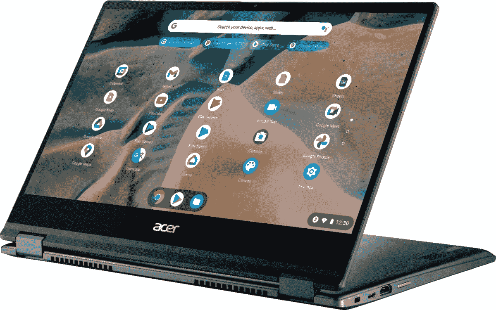

# Acer Chromebook Spin 514 评测:坚固、可靠、快速

> 原文：<https://www.xda-developers.com/acer-chromebook-spin-514-review/>

宏碁在今年 CES 前夕发布了 Spin 514 Chromebook。这款采用 AMD 显卡的锐龙 Chromebook 旨在终结 chrome book 不是高性能机器的普遍观点。毫无疑问，宏碁是 Chromebook 市场的主要 OEM 厂商，所以当他们宣布这款设备时，我很兴奋。

在拿起 Spin 514 之前，我刚刚评测完联想 ThinkPad C13 Yoga Chromebook。该设备也使用锐龙 5 处理器。在我的 C13 评测中，我注意到了电池寿命和图形加速方面的一些关键错误。Spin 514 能翻转(或旋转)锐龙 Chromebooks 上的脚本，不负众望吗？

## 宏碁 Chromebook Spin 514:规格

| 规格 | 宏碁 Chromebook Spin 514 |
| --- | --- |
| **尺寸&重量** | 

*   0.68 英寸 x 12.7 英寸 x 8.9 英寸
*   3.64 磅

 |
| **显示** | 

*   14 英寸 FHD (1920 x 1080) IPS
*   LED 背光
*   触摸屏
*   电影水晶(眩光)

 |
| **处理器** | 

*   高达 AMD 锐龙 5 3500C
*   2.10 GHz 四核(4 核)

 |
| **内存&存储** | 

*   4GB 或 8GB 内存
*   64 或 128 GB eMMc 存储

 |
| **电池&充电** | 

*   长达 10 小时，4670 毫安时
*   锂离子电池

 |
| **安全** | 

*   Chromebook 的分立 H1 可信平台模块(TPM)解决方案
*   肯辛顿锁

 |
| **前置摄像头** |  |
| **面向世界的摄像头** |  |
| **端口** |  |
| **音频** |  |
| **连通性** | 

*   IEEE 802.11ac
*   蓝牙 5.0

 |
| **软件** | Chrome OS |
| **其他特征** | 

*   呈薄雾绿色
*   2 合 1 敞篷车

 |

***About this review:** I received the Spin 514 model with 8GB RAM, 128 GB eMMc storage, and the Ryzen 5 processor from Acer for testing. Acer did not have any input in any part of this review.*

## 设计和键盘/触摸板

拆开 Spin 514 的包装，一开始感觉有点重。事实证明，这是因为对于这种尺寸的机箱来说，它实际上很重。这是你会发现的最重的 14 英寸 Chromebooks 之一，重 3.64 磅，比华硕或惠普的领先型号重得多。不过这也不全是坏事，因为 Spin 514 令人难以置信地坚固，有一个坚固的铝制底盘，没有太多的弯曲。

雾绿色相当有趣。这是许多产品的新流行色。它看起来是绿色的，但同时也是灰色的。很难说它到底是什么颜色，因为它确实会根据光线照射在盖子上的方式而变化。内部触摸板周围的银色装饰给设备带来了精致的优雅，微妙但时尚。使用 Spin 514 你肯定不会在人群中脱颖而出，但它是一款足够好看的 Chromebook。

铰链也非常坚固，可以防止笔记本电脑在帐篷模式下不必要的移动。实际上，几天后重量并没有给我带来太大的困扰，因为我也经常在包里放一台 16 英寸的 Macbook Pro。另一方面，如果你想要一台超便携的 Chromebook，这可能不适合你。

我也很高兴地告诉大家，Spin 514 成功通过了单手开启测试。由于坚固的设计和增加的重量，您可以在啜饮早晨的饮料时用一只手轻松打开盖子。

打开盖子，你会看到一个背光键盘，上面有轻触键，打字很有趣。这款键盘的移动量恰到好处，感觉它属于一款价格高得多的设备。令人惊叹的键盘在 Chromebooks 上并不太常见，但宏碁在这方面做得很好。

除了 ThinkPad C13 Yoga，这是我在 Chromebook 上使用过的最好的键盘。在 Spin 514 上写文章时，我能够快速准确地打字。我唯一的小抱怨是键盘上的背光有点暗，但这没什么大不了的。

这个触摸板对于便携式 Chromebook 来说也相当宽敞。我的笔记本电脑触摸板标准是 MacBook Pro，但这个对于 14 英寸的 Chromebook 来说是一个不错的尺寸。触摸板面积约为 4.25 x 3.125 英寸。我发现用手势导航网页很流畅。触摸板也有令人满意的点击感，不会感觉太糊，这是我在这种尺寸的 Chromebooks 上经常注意到的问题。

最后，我们来讨论一下 Spin 513 上的可用端口。你有 2 个 USB-C 端口，1 个 USB-A 端口，Kensington 锁插槽和一个麦克风/耳机插孔。令人耳目一新的是，还找到了 HDMI 端口和 microSD 插槽，这使得连接更广泛的外部显示器和扩展存储变得更加容易。请记住，如果您需要添加更多外围设备，您可以随时为 Chromebooks 选择一个[最佳 USB-C 扩展坞](https://www.xda-developers.com/best-docking-stations-chromebooks/)。

总的来说，宏碁在 Spin 514 上的构建和端口选择方面做得很好。它还通过了 MIL-STD-810H 认证，这意味着它通过了跌落、溢出和极端温度的严格测试。如果你需要一款坚固耐用的 Chromebook，Spin 514 绝对是更好的选择之一。

## 显示器、性能和电池寿命

Spin 514 上的 FHD 触摸屏有点令人费解。一方面，它产生具有精确颜色的清晰图像。另一方面，对比度不足，即使在室内亮度也是个问题。

我的机型的峰值亮度约为 210 尼特，明显低于该级别 Chromebooks 的平均水平。当然，色彩质量更主观一些，但在我观看网飞时，某些色调看起来很柔和。

如果您将 Spin 514 移出，显示器会是一个相当大的缺点。峰值亮度对于阳光直射来说确实不够。即使你一直调高亮度以求生存，这也会显著影响电池寿命。

那些整天在明亮的环境中使用笔记本电脑的人可能应该看看别的地方。谈到峰值亮度和流媒体，Galaxy Chromebook 2 和宏碁自己的 Spin 713 都是更好的选择。

不过触摸精度不错，在平板模式下使用 Android 应用没有问题。帐篷模式是非常坚固的，由于前面提到的庞大的建设。正如宏碁的许多其他 Chromebooks 一样(比如我最近评论的的 [Spin 513)，扬声器是媒体消费的真正贬低者。](https://www.xda-developers.com/acer-chromebook-spin-513-review/)

你有立体声扬声器，但他们是底部发射，这从来不是最佳的。最大音量仍然很安静，听音乐时低音几乎为零。音频对于偶尔的播客或流媒体电影来说还过得去，但要确保你戴上耳机听音乐。

Spin 514 的性能非常稳定。你可以相对轻松地运行 Android 应用，包括密集型游戏。我花了相当多的时间玩沥青 9，奥拓的奥德赛，和 NBA 果酱。所有这些游戏在 Chromebook 上都玩得非常好。我还花了相当多的时间在 Spin 514 上玩 Stadia，这是一种在帐篷模式下使用笔记本电脑的相当愉快的体验。

当然，我也喜欢在我的 Chromebook 上运行 Linux 应用程序，使用 GIMP 和 Kdenlive 进行一些简单的照片和视频编辑。锐龙 5 处理器基本上胜任了任务，我很少注意到粉丝们的不满。不幸的是，Spin 514 仍然存在一些我在 ThinkPad C13 Yoga Chromebook 上注意到的锐龙特有的问题。

某些视频播放器仍然会死机和黑屏(也许这只是需要更新 Chrome OS 来解决)，电池百分比似乎也没有校准好。通常情况下，电池电量会一次增加 5%，这不是你在路上工作时真正想看到的。

在电池寿命方面，Spin 514 不那么令人印象深刻。这可能是因为我刚刚提到的校准不佳的电池电量，或者可能是因为我需要在最大亮度下运行，因为显示器很暗。不管是哪种情况，我都努力争取到了宏碁在规格页面上宣传的 10 小时使用时间。在测试期间，我最多能使用 7 个小时。对于 Windows PC 来说，这听起来是一个不错的数字，但对于 Chromebook 来说却相当糟糕。不过，如果你真的喜欢这里的一切，你可以拿一个便携式电池充电器来度过这一天。

## 结论

我认为宏碁在 Spin 514 上取得了成功。他们推出了一款耐用的 Chromebook，具有良好的外观、稳定的性能和令人印象深刻的键盘。昏暗的显示屏和平庸的电池寿命当然是令人担忧的问题。然而，至少有一些希望，未来的 Chrome OS 更新可以修复锐龙优化问题，并延长电池寿命。如果你正在寻找一款坚固的 Chromebook，并且不介意巨大的尺寸和重量，这可能是宏碁最好的 chrome book 之一。

另一方面，如果你一直在户外使用 Chromebook 或者现在需要全天的电池续航时间，你可能需要跳过这一步。Galaxy Chromebook 2，华硕 Flip C436，宏碁 Spin 713 都有更高的峰值亮度和更好的电池寿命。它们的价格也略高，所以你需要在你的储蓄罐里多放一些硬币。

 <picture></picture> 

Acer Chromebook Spin 514

##### 宏基 Spin 5

宏碁的 Spin 514 在 AMD 锐龙 5 处理器的支持下，提供了坚固的设计和令人印象深刻的性能。它的显示屏有点暗，电池续航时间一般，但在工作效率和安卓游戏方面表现出色。