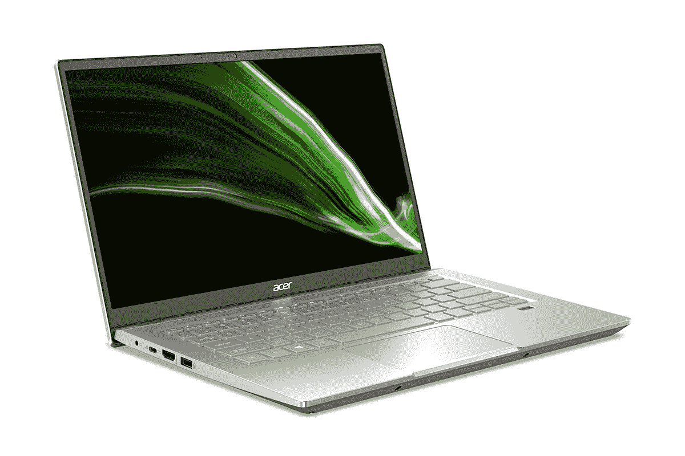
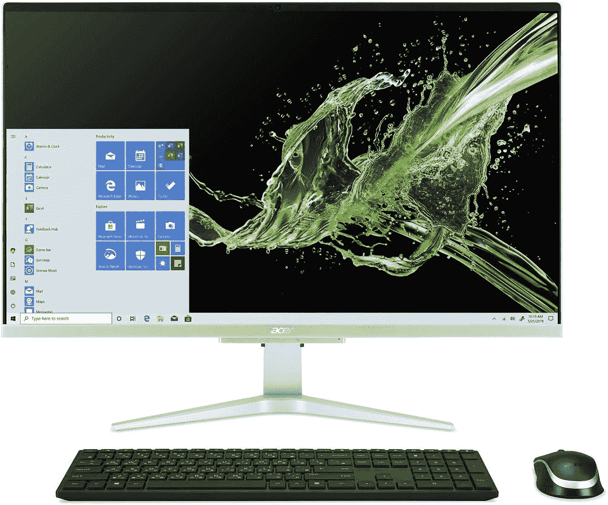

# 宏碁的 Swift X 笔记本电脑配有 RTX 显卡，在网络星期一的售价降至 900 美元

> 原文：<https://www.xda-developers.com/acer-cyber-monday-swift-x/>

黑色星期五可能结束了，但现在网络星期一在这里，这意味着仍然有一些很好的交易可以利用。宏碁已经启动了在网络星期一的交易，其中包括一些大交易，例如最近的 Swift X 笔记本电脑现在售价不到 900 美元，比官方价格低 200 美元。部分一体机台式电脑也有折扣。

从笔记本电脑开始，Acer Swift X 是一款功能强大的笔记本电脑，采用八核 AMD 锐龙 8 5800U 处理器，外加 NVIDIA GeForce RTX 3050 Ti 显卡。这使得这是一款非常棒的笔记本电脑，适合日常使用、内容创作，甚至是一些游戏。最重要的是，你有 16GB 的内存和 512GB 的固态硬盘，所以你可以得到很好的服务。对于 900 美元，这是一个很好的机会。

 <picture></picture> 

Acer Swift X ($200 off)

##### 宏基 Swift X

Acer Swift X 采用强大的 AMD 锐龙 7 处理器和 NVIDIA GeForce RTX 显卡，是一款功能强大的轻量级设备。

除了内部规格之外，Acer Swift X 还包括一个 100% sRGB 覆盖的全高清显示屏，并配有指纹识别器，以便更方便地登录。尽管采用了强大的显卡，但它仍然只有 17.9 毫米厚，重量仅超过 3 磅，因此它是一款非常便携的笔记本电脑。

如果你想要更薄更轻的东西，宏碁 Swift 3 也有不错的折扣。这款配备 AMD 锐龙 7 5700U、8GB 内存和 512GB 固态硬盘的机型现在降至 580 美元，比官方定价低了 170 美元。

 <picture></picture> 

Acer Swift 3 ($170 off)

##### 宏碁 Swift 3

Acer Swift 3 是一款轻薄的笔记本电脑，配备 AMD 锐龙 7 处理器、8GB 内存和 512GGB 固态硬盘。

除了它的规格，它还拥有 100% sRGB 的全高清显示屏，并包括指纹读取器。它甚至比 Swift X 更轻，重 2.65 磅，也更薄，只有 15.9 毫米。

如果你对台式电脑或一体机(AiO)更感兴趣，那么宏碁 Aspire C27 也包括在网络星期一的交易中。这是一台一体机；这意味着规格和显示器是同一个硬件的一部分，它包括可靠的规格。它配备了英特尔酷睿 i7-1165G7 处理器，加上 NVIDIA GeForce MX330 显卡。您还可以获得 16GB 的内存、512GB 的固态硬盘和 1TB 的硬盘，因此您将有足够的空间来存储大量文件。

 <picture></picture> 

Acer Aspire C27 ($220 off)

##### 宏碁 Aspire C27

Acer Aspire C27 配备高端移动组件，设计纤薄，但仍能提供出色的性能。它还包括一个 Windows 10 Pro 许可证，可以升级到 Windows 11。

这些是笔记本电脑级别的规格，但这并不意味着它会很慢，因为它们也是高端组件。除了这些规格，你还会得到一个 27 英寸的全高清屏幕和一个带隐私快门的内置网络摄像头。正如你所料，这款电脑还配有无线键盘和鼠标。这个包的一个好处是，它附带了 Windows 10 Pro 许可证，并且还支持 Windows 11 升级。

如果你想要便宜一点的东西，有另一个版本的 Aspire C27，有一些低端规格，应该很棒。这包括采用 Iris Xe 显卡的英特尔酷睿 i5-1135G7、12GB 内存和 512GB 固态硬盘。这款宏碁 Aspire 27 在亚马逊的售价为 750 美元，比正常价格低 150 美元。

在找别的吗？查看我们的[网络星期一个人电脑交易中心](https://www.xda-developers.com/best-black-friday-pc-gaming-deals/),以更诱人的价格找到更多优秀的产品。如果你正在寻找其他类型的交易，我们也有一个专注于智能手机的中心[网络星期一交易](https://www.xda-developers.com/black-friday/)。