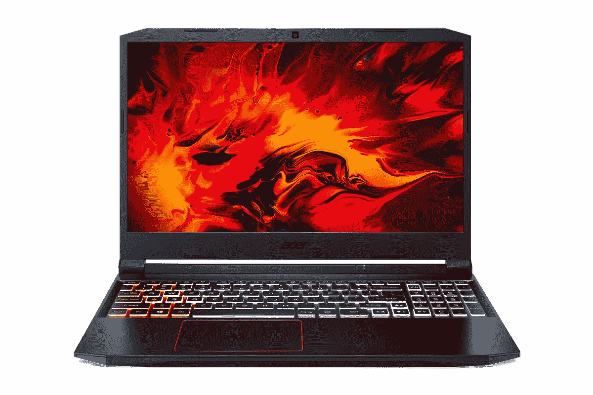

# Acer Nitro 5 现已在印度上市，采用第 11 代英特尔 H 系列处理器

> 原文：<https://www.xda-developers.com/acer-nitro-5-11th-gen-intel-india-launch/>

今年迄今为止，宏碁一直表现良好，该公司现在宣布在印度推出另一款 Nitro 5 游戏笔记本电脑。该公司现在提供采用最新的第 11 代英特尔酷睿 H 系列处理器的笔记本电脑。最新型号与 AMD 锐龙 5 5600H 型号并列，后者于上周[发布](https://www.xda-developers.com/acer-nitro-5-amd-ryzen-5000-india-launch/)，第十代英特尔酷睿 i5 型号[上个月宣布为印度第一款搭载新 NVIDIA GeForce RTX 3060 GPU 的笔记本电脑](https://www.xda-developers.com/acer-nitro-5-2021-india-launch/)。

## Acer Nitro 5:规格

| 

规格

 | 

Acer Nitro 5

 |
| --- | --- |
| **尺寸&重量** | 

*   363 x 255 x 23.9 毫米
*   2.2 千克

 |
| **显示** | 

*   15.6 英寸全高清(1920x1080) IPS
*   144 赫兹刷新率
*   3 毫秒响应时间

 |
| **处理器** | 

*   英特尔酷睿 i5-11300H (2.6GHz / 4.4GHz)

 |
| **GPU** | 

*   英伟达 GeForce GTX 1650 (4GB)

 |
| **闸板&存放** | 

*   8GB DDR4(最高 32GB)
*   512GB PCIe 3.0 NVMe 固态硬盘(附加固态硬盘插槽)
*   高达 2TB 硬盘

 |
| **电池&充电器** | 

*   57.6 瓦时(声称 8.5 小时)
*   135W 充电器

 |
| **输入/输出** | 

*   2 个 USB 3.2 第 1 代 A 型
*   USB 3.2 Gen 2 Type-A(断电充电)
*   USB 3.2 Gen 2 Type-C (Thunderbolt 4)
*   高清晰度多媒体接口
*   以太网
*   通电
*   3.5 毫米耳机/麦克风组合插孔

 |
| **连通性** | 

*   黑仔 Wi-Fi 6 AX 1650i
*   蓝牙 5.1

 |
| **OS** |  |
| **其他特征** | 

*   4 区 RGB 背光键盘
*   720 像素网络摄像头

 |

最新款特别针对休闲游戏玩家和电子竞技爱好者。它的价格相对较低，在₹69,990.像其他两个模型，你会得到相同的设计与塑料完成四周。15.6 英寸 IPS 显示屏具有全高清(1920 x 1080 像素)分辨率和 144Hz 刷新率，响应时间为 3 毫秒。这款笔记本电脑采用第 11 代英特尔酷睿 i5-11300H，这是一款四核处理器，睿频速度高达 4.4 GHz。Nitro 5 游戏笔记本电脑将采用单一配置，配有 8GB DDR 4 内存，可扩展至 32GB，以及 512GB PCIe Gen3 SSD。这款笔记本电脑还支持高达 2TB 的硬盘，但宏碁没有提供这种硬盘。笔记本电脑上还有一个辅助 SSD 插槽，可用于额外存储。

连接方面，你可以获得黑仔 Wi-Fi 6 AX 1650i、蓝牙 5.1，而 I/O 端口包括 HDMI、RJ45 以太网、3.5 毫米耳机和麦克风组合、两个 USB 3.2 Gen 1 端口、一个带 Thunderbolt 4 的 USB 3.2 Gen 2 Type-C 端口和一个带断电充电的 USB 3.2 Gen 2 端口。Nitro 5 上的电池是 57.5 瓦时，据称可持续 8.5 小时。其他功能包括宏碁的 CoolBoost 技术，该技术在内部使用双风扇和四排气口设计，以使 Nitro 5 在重负载下保持冷却，并获得一致的性能。你还会得到一个四区 RGB 键盘和一个 720p 网络摄像头。

### 定价和可用性

搭载全新第 11 代英特尔酷睿 i5 处理器的新款宏碁 Nitro 5 售价为₹69,990(约 932 美元)。它将可通过宏碁专卖店、宏碁在线商店和亚马逊印度购买。

 <picture></picture> 

Acer Nitro 5

##### Acer Nitro 5

新的 Acer Nitro 5 对于休闲游戏玩家和电子竞技爱好者来说是一个非常好的选择