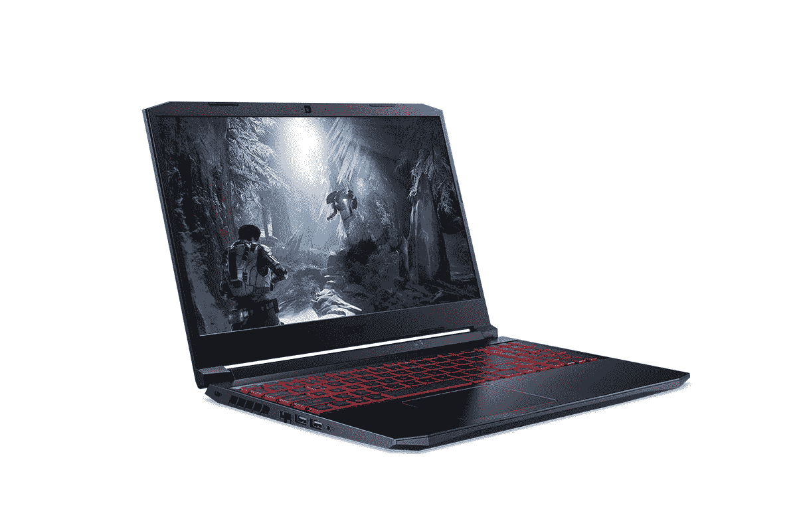

# 搭载 NVIDIA GeForce RTX 3060 的 Acer Nitro 5 游戏笔记本电脑在印度发布

> 原文：<https://www.xda-developers.com/acer-nitro-5-2021-india-launch/>

继在印度推出 Aspire 7 之后，宏碁现在又推出了中端游戏笔记本电脑。新的 Nitro 5 通过添加新的 NVIDIA GeForce RTX 3060 显卡，比去年略有提升。该公司声称，这是印度第一款搭载英伟达新 GPU 的游戏笔记本电脑。虽然这是事实，但考虑到华硕已经在销售该产品，华硕最近还[宣布了 TUF Dash F15](https://www.xda-developers.com/asus-tuf-dash-f15-india-launch/) ，该产品有 RTX 3060 或 RTX 3070 可供选择，将于本月晚些时候开始销售。

## Acer Nitro 5:规格

| 

规格

 | 

Acer Nitro 5

 |
| --- | --- |
| **尺寸&重量** | 

*   363 x 255 x 23.9 毫米
*   2.3 千克

 |
| **显示** | 

*   15.6 英寸全高清(1920x1080) IPS
*   144 赫兹刷新率
*   3 毫秒响应时间

 |
| **处理器** | 

*   英特尔酷睿 i5-10300H (2.5GHz / 4.5GHz)

 |
| **GPU** | 

*   英伟达 GeForce RTX 3060 (6GB DDR6)

 |
| **闸板&存放** | 

*   8GB/16GB DDR4
*   256GB PCIe 3.0 NVMe 固态硬盘
*   1TB 硬盘 7200PRM

 |
| **电池&充电器** | 

*   57.6 瓦时(声称 10 小时)
*   180W 充电器

 |
| **输入/输出** | 

*   2 个 USB 3.2 第 1 代 A 型
*   USB 3.2 Gen 2 Type-A(断电充电)
*   USB 3.2 第二代 C 型
*   高清晰度多媒体接口
*   以太网
*   通电
*   3.5 毫米耳机/麦克风组合插孔

 |
| **连通性** | 

*   英特尔无线 Wi-Fi 6 AX201
*   蓝牙 5.0

 |
| **OS** |  |
| **其他特征** | 

*   4 区 RGB 背光键盘
*   720 像素网络摄像头

 |

新的 Nitro 5 看起来与去年的型号非常相似，四周都是塑料底盘，表面看起来很厚实。这款笔记本重 2.3 千克，配有 15.6 英寸显示屏，顶部和底部都有大挡板。IPS 面板提供全高清(1920 x 1080 像素)分辨率和 144Hz 刷新率，响应时间为 3 毫秒。这款笔记本电脑采用第 10 代英特尔酷睿 i5-10300H 处理器，这是一款去年推出的四核处理器，时钟速度高达 4.5 GHz。Nitro 5 将配备 8GB 16GB 的 DDR4 内存，可扩展至 32GB。至于存储，你得到了双硬盘，包括 1TB 7200 RPM 硬盘和 256GB PCIe 第三代 NVMe 固态硬盘。

此外，这款笔记本电脑将采用宏碁的 CoolBoost 技术来帮助游戏玩家管理系统温度，而 NitroSense 软件将帮助控制风扇速度和性能参数。键盘上有 RGB 照明，但不是每个键，而是只有 4 个区域实现。该笔记本电脑还配有 Wi-Fi 6 和蓝牙 5.0 无线连接，而 I/O 端口包括一个 HDMI 端口、一个 RJ45 以太网、一个 3.5 毫米耳机和麦克风组合、两个 USB 3.2 Gen 1 端口、一个 USB 3.2 Gen 2 Type-C 端口和一个带断电充电的 USB 3.2 Gen 2 端口。Nitro 5 上的电池是 57.5 瓦时的单位，据称可持续 10 小时，而充电砖的额定功率为 180 瓦。

## 定价和可用性

Nitro 5 的 8GB 内存版本在₹89,999 定价，16GB 内存版本在₹93,999 定价。从今天开始，这款笔记本电脑将通过宏碁的独家线下商店、[宏碁电子商店](https://www.anrdoezrs.net/links/100122946/type/dlg/sid/UUxdaUeUpU1388/https://store.acer.com/en-in/laptops/gaming/nitro-5-nvidia-rtx-3060/)和[亚马逊印度](https://www.amazon.in/dp/B08XYSP1R3?tag=xdaportalin-21)出售。

 <picture></picture> 

Acer Nitro 5

##### Acer Nitro 5

新的 Acer Nitro 5 是对前代机型的小幅更新，现在配备了新的英伟达 RTX 3060 GPU。