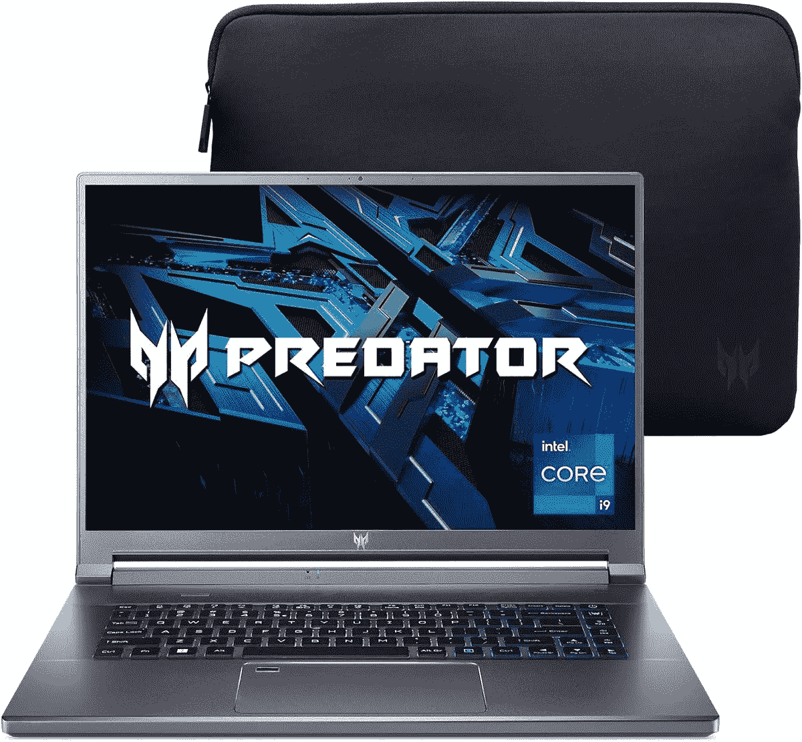

# 宏碁 Nitro 5 笔记本电脑，带 RTX 显卡，仅售 2 天，价格低至 750 美元

> 原文：<https://www.xda-developers.com/acer-nitro-5-laptop-rtx-graphics-amazon-prime-early-access-sale/>

想买一台[新游戏笔记本电脑](https://www.xda-developers.com/best-cheap-gaming-laptops/#:~:text=XDA%20VIDEO%20OF%20THE%20DAY%20Navigate%20this%20article%3A,Gaming%20F17%20Best%20AMD-powered%20laptop%3A%20HP%20Victus%2016z)，但不想花太多钱？嗯，宏碁支持你。该公司的几款笔记本电脑在 10 月 11 日和 10 月 12 日打折，只是作为亚马逊 Prime 早期访问活动的一部分。这些交易包括宏碁 Nitro 5 游戏笔记本电脑和更强大的宏碁 Predator Triton，其他几款办公笔记本电脑也在销售中。

但是请注意，你需要一个亚马逊 Prime 会员才能获得这些价格，而且这是一个只有 2 天的销售。交易从 10 月 11 日星期二开始，到 10 月 12 日星期三结束。

首先从 Acer Nitro 5 游戏笔记本电脑开始，这是一款非常适合入门级或休闲游戏玩家的日常游戏笔记本电脑。它通常定价为 914 美元，但今天的减价使它降到 750 美元。在引擎盖下，该系统由英伟达 RTX 3050Ti GPU 和第 11 代英特尔酷睿 i7-11800H CPU 提供支持。有了这些功能，游戏在这个系统上运行应该没有问题。除此之外，这款笔记本电脑的 15.6 英寸显示屏具有高刷新率，达到 144Hz，非常适合像*使命召唤*这样的射击游戏。请注意，笔记本电脑也是可升级的，因此您可以通过两个 DDR4 RAM 插槽添加高达 32GB 的内存，并通过两个 PCIe M.2 插槽添加更多存储空间。该系统配有 8GB 的内存和 512GB 的 NVMe 固态硬盘。

 <picture></picture> 

Acer Nitro 5 Gaming Laptop

##### Acer Nitro 5 游戏笔记本电脑

Acer Nitro 5 是一款出色的游戏笔记本电脑，配有 144Hz 显示屏和 RTX 3050Ti 显卡。

作为亚马逊 Prime Early Access 销售的一部分，一款更强大的宏碁系统是宏碁 Predator Triton 500 SE Gaming/Creator 笔记本电脑。现在它的售价是 2499 美元，而不是通常的 2930 美元。该系统非常强大，内置英特尔顶级 14 核酷睿 i9-12900H 处理器，以及 GeForce RTX 3080Ti 显卡。该系统的存储容量为 1TB，采用 PCIe Gen 4x4 固态硬盘，内存为 32GB。即使是 16 英寸的显示屏也令人惊叹，因为它采用了新的 16:10 宽高比，具有超快的 240Hz 刷新率。我们认为对于严肃的游戏玩家和内容创作者来说，这是一个很棒的系统。

 <picture></picture> 

Acer Predator Triton 500 SE Gaming/Creator Laptop

##### 宏碁 Predator Triton 500 SE 游戏/创作型笔记本电脑

宏碁 Predator Triton 500 SE 是一款非常强大的笔记本电脑，配有英特尔酷睿 i9 CPU 和 RTX 3080Ti 显卡。

这是我们现在可以在亚马逊找到的前两个宏碁游戏笔记本电脑交易，但还有更多。今天的交易还降低了 Acer Swift X creators 笔记本电脑、Acer Aspire TC-1760-UA93 台式机以及 17 英寸版本的 Acer Nitro 5 的价格。考虑到 GPU 和 CPU，这些都是很棒的系统。我们在下面为您提供了这些交易的链接。

这些是带有 GPU 的游戏系统，但如果你不是游戏玩家或创造者，你仍然会发现宏碁的生产力笔记本电脑也在销售。就连 Chromebooks 都在未来两天打折。下面可以看到其中的两个。

当然，如果你最终购买了一台笔记本电脑或台式机，你可能也会对游戏显示器感兴趣。特别是有一个，正在打折。是[宏碁 Nitro VG271。你可以花 129 美元找到它，而不是 229 美元。这是一款非常棒的入门显示器，它拥有 FHD 1920 x 1080 的分辨率、165Hz 的刷新率和内置扬声器。](https://www.amazon.com/Acer-Sbmiipx-Monitor-FreeSync-Technology/dp/B09TQ5D6PG?tag=xda-3dqkfn1-20&ascsubtag=UUxdaUeUpU44062&asc_refurl=https%3A%2F%2Fwww.xda-developers.com%2Facer-nitro-5-laptop-rtx-graphics-amazon-prime-early-access-sale%2F&asc_campaign=Affiliate)