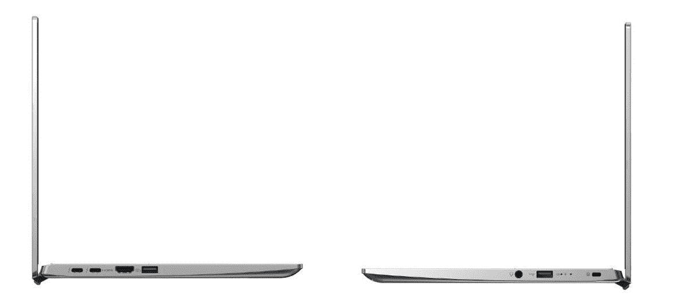
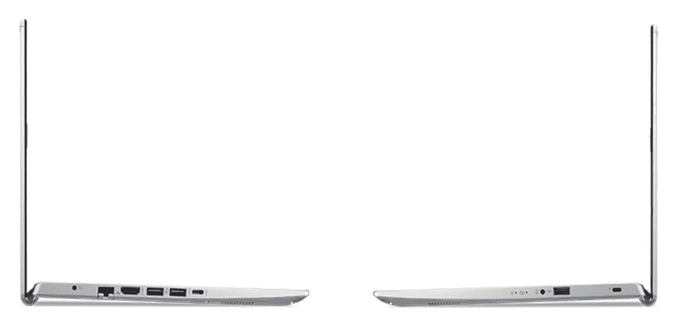

# 宏碁 Swift 3 (2022) vs 宏碁 Aspire 5:哪个更好？

> 原文：<https://www.xda-developers.com/acer-swift-3-2022-vs-acer-aspire-5/>

宏碁最近推出了最新一代的 Swift 3，这是市场上最受欢迎的主流笔记本电脑之一。全新更新的 [Acer Swift 3 (2022)](https://www.xda-developers.com/acer-swift-3-2022) 型号搭载了英特尔第 12 代英特尔酷睿处理器，并有一系列其他改进。您还可以获得高达 2TB 的固态硬盘和一些有趣的颜色可供选择。宏碁 Swift 3 (2022)型号的价格相当合理，与市面上的许多其他经济型笔记本电脑更加一致。我们已经将 Acer Swift 3 (2022)与其他几款价格相近或规格相似的笔记本电脑进行了比较。在本文中，我们将看看新的 Acer Swift 3 与 Acer Aspire 5 的对比，看看哪一个更好。

**浏览本文:**

## 宏碁 Swift 3 (2022)与宏碁 Aspire 5:规格

在我们比较 Acer Swift 3 (2022)和 Acer Aspire 5 之前，让我们先来看看每款笔记本的规格，了解它们各自带来了什么:

| 

规格

 | 

**宏碁 Swift 3 (2022)**

 | 

**宏碁 Aspire 5**

 |
| --- | --- | --- |
| **CPU** | 

*   第 12 代英特尔酷睿 i5-1240P (12 个内核，16 个线程，最高 4.4GHz，12MB 高速缓存)
*   第 12 代英特尔酷睿 i7-1260 处理器(12 个内核，16 个线程，最高 4.7GHz，18MB 高速缓存)

 | 

*   第 12 代英特尔酷睿 i5-1235U 处理器
*   第 12 代英特尔酷睿 i7-1255U 处理器

 |
| **图形** |  |  |
| **闸板** |  |  |
| **存储** |  | 

*   最高 512GB 固态硬盘，可选 1TB 硬盘

 |
| **显示** | 

*   14 英寸 16:9 全高清(1920 x 1080) IPS
*   14 英寸 16:9 四核高清(2560 x 1440) IPS

 | 

*   16:9 14 英寸全高清(1920 x 1080) IPS

 |
| **电池** | 

*   3 芯电池(容量不明)，最长 10.5 小时

 | 

*   3 芯电池(容量不明)，最长 10 小时

 |
| **端口** | 

*   2 个 Thunderbolt 4(USB C 型)
*   2 个 USB 3.2 第 1 代 A 型
*   1 个 HDMI 2.0 接口
*   3.5 毫米耳机插孔

 | 

*   1 个 3.2 代 USB 类端口，Thunderbolt 4
*   3 个 USB 类端口
*   1 个 HDMI 接口
*   1x 以太网
*   1 个 3.5 毫米耳机插孔

 |
| **音频** |  |  |
| **网络摄像头** | 

*   具有瞬时降噪功能的全高清 1080p 网络摄像头

 |  |
| **安全** |  |  |
| **连通性** |  |  |
| **尺寸(WxDxH)** | 

*   320.04 x 210.82 x 16 毫米(12.6 x 8.3 x 0.63 英寸)

 | 

*   363.22 x 238.76 x 17.78 毫米(14.3 x 9.4 x 0.70 英寸)

 |
| **重量** | 

*   起始重量为 1.25 千克(2.76 磅)

 | 

*   起始重量为 1.76 千克(3.90 磅)

 |
| **价格** |  |  |

## 宏碁 Swift 3 (2022)与宏碁 Aspire 5:性能

正如你所看到的，宏碁的新 Swift 3 2022 型号采用了英特尔新的第 12 代酷睿处理器。这可能是新的 Acer Swift 3 机型中最大的升级之一。如果你不知道，新的英特尔芯片混合了高性能(P)和高效(E)内核。总的来说，新的芯片拥有更多的内核和线程，比上一代产品的性能有了显著提升。

新的宏碁 Swift 3 的另一个有趣的事情是，所有型号现在都使用英特尔第 12 代 P 系列的芯片。这意味着它们的 TDP 更高，为 28W，而我们在上一代产品中看到的是 15W。宏碁本来可以为这些笔记本电脑使用低功率的 U 系列芯片，但我们很高兴看到更强大的芯片在这里发挥作用。这将显著提高性能。您可以查看我们的[英特尔 Alder Lake P 系列与 U 系列芯片对比](https://www.xda-developers.com/intel-12th-gen-p-vs-u-series/)，了解这些产品系列之间的差异。

另一方面，宏碁 Aspire 5 配备了英特尔新的第 12 代 Alder Lake U 系列移动芯片。值得指出的是，宏碁目前在其网站上只列出了少数几个变种，所以在不久的将来我们很有可能会看到更多。同样值得一提的是，您会发现许多由相对较老的英特尔和 AMD 芯片驱动的变体，包括第 11 代 Tiger Lake 处理器和锐龙 3000 和 4000 系列。我们建议只购买由英特尔新的 Alder Lake 芯片驱动的较新的 Aspire 5 变种。宏碁尚未确认是否会使用新的 AMD 锐龙 6000 处理器，所以我们可能要等待更长时间。

正如我们在上面的规格表中提到的，您会发现一些由 Alder Lake U 系列芯片供电的 Aspire 5 设备。然而，这些变体可能不如采用 P 系列芯片的宏碁 Swift 3 (2022)型号强大。这是因为与 P 系列处理器相比，U 系列处理器的 TDP 更低。一旦我们有机会并排比较这些笔记本电脑，我们将详细讨论性能差异。

谈到内存，我们看到 Acer Swift 3 (2022)上高达 16GB 的 LPDDR4X 内存。英特尔的新芯片支持 DDR5/LPDDR5 内存，但宏碁决定坚持 LPDDR4X，或许是为了保持笔记本的整体价格低廉。新的 Aspire 5 型号最高可配 16GB DDR4 SDRAM。宏碁网站上列出的所有采用新的第 12 代英特尔处理器的新型号默认情况下都有 16GB 内存，其中一些型号是否可以选择配置更少的内存以节省一些资金仍有待观察。然而，可用的选项仅限于 DDR4，所以请记住这一点。

在存储方面，Acer Swift 3 (2022)也是一个明显的赢家。您可以获得配备高达 2TB PCIe NVMe 固态硬盘的新 Swift 3，而 Aspire 5 仅配备高达 512GB PCIe 固态硬盘。不过，你可以在 Aspire 5 上添加一个可选的硬盘来获得更多存储空间，但它的速度不会像 Swift 3 中的 M.2 驱动器那样快。

最后，在我们进入这一比较的另一部分之前，值得一提的是，我们预计 Swift 3 (2022)将拥有更好的电池寿命。据宏碁称，宏碁 Swift 3 (2022)型号使用的是 56 瓦时的电池，应该足够使用 10.5 小时。根据我们过去评估的笔记本电脑，可以肯定地说，一次充电至少可以使用 7 个小时。不过，你的里程肯定会根据工作量而有所不同。该公司没有提到 Aspire 5 型号的确切电池容量，但它表示一次充电可持续 7 小时。如果宏碁在 Aspire 5 中使用相同的 56 瓦时电池，那么由于低功率 U 系列处理器，这将具有略好的电池寿命。

## 显示

宏碁 Swift 3 (2022)笔记本有两种显示器选项——14 英寸 FHD 或 14 英寸 QHD IPS 面板。两款显示器的长宽比为 16:9，使用相同的显示技术，因此分辨率几乎是唯一的区别。如果我们要选择一个，那么我们会选择 1080p 面板，因为这对于这么小的显示器来说已经足够了。我们已经看到了其他一些长宽比更高的 14 英寸笔记本电脑，尽管宏碁 Swift 3 (2022)没有这样的选项。

 <picture></picture> 

Acer Swift 3 (2022)

另一方面，Aspire 5 笔记本电脑有几种显示器可供选择。你可以买到 14 英寸、15.6 英寸甚至 17.3 英寸的显示屏。然而，所有这些显示器都具有相同的 1080p 分辨率和 16:9 的宽高比。它们之间唯一真正的区别是物理大小，所以一定要选择适合您的用例的那个。值得注意的是，采用第 12 代 Alder Lake 芯片的 Aspire 5 新型号拥有 14 英寸显示屏。

这两款笔记本电脑的显示屏顶部都有网络摄像头，这是网络摄像头的理想位置。但是，宏碁 Swift 3 (2022)型号的摄像头分辨率更高。我们正在寻找所有 Acer Swift 3 2022 型号上的 1080p 摄像头。Aspire 5 清单没有明确提到它是否使用新的 1080p 摄像头作为网络摄像头，所以我们不得不在这里猜测一下。如果宏碁决定在新型号中使用相同的网络摄像头，那么我们将会看到 720p 高清摄像头。更高的分辨率并不总是意味着更好的质量，但 Acer Swift 3 相机还支持时间降噪等功能，以提高整体质量。就整体质量而言，很难说哪个更好，但宏碁 Swift 3 (2022)肯定有更好的网络摄像头，至少在纸面上是这样。

也就是说，这两款笔记本电脑都缺乏红外支持，这意味着你不能用它们来进行 Windows Hello 面部识别。宏碁 Swift 3 在这方面更胜一筹，因为它至少配备了指纹扫描仪进行认证。由于 Aspire 5 笔记本上没有提到生物认证支持，我们倾向于认为即使是新的 Aspire 5 型号也不支持它们。

## 设计和端口

宏碁 Swift 3 (2022)有三种有趣的颜色——Safari 金、雪蓝和纯银。您可以查看下图中的所有三种颜色选项。它们看起来都很棒，但我们认为雪蓝版本看起来更清新，更有吸引力。宏碁没有提到底盘使用的材料，尽管我们认为它是由镁合金制成的，就像旧型号一样。更优质的材料通常是为更昂贵的笔记本保留的，如 Swift X。

宏碁 Aspire 5 也有非常相似的外形，但它的机箱似乎有点过时。无论你选择哪种颜色，键盘上都有黑色的键帽，显示屏周围也有巨大的边框。新的宏碁 Swift 3 绝对是整体上更好看的机器。

如果您查看上面规格表中的尺寸，您会注意到 Acer Swift 3 比 Aspire 5 更薄、更紧凑。与 Aspire 5 的起始重量 1.76 千克相比，Swift 3 的重量也略轻，仅为 1.25 千克。

 <picture></picture> 

Acer Swift 3 (2022) ports selection

然而，说到端口选择，Aspire 5 无疑更好。Swift 3 上只有两个 Thunderbolt 4 (USB Type-C)和两个 USB Type-A 端口，以及一个 HDMI 端口和一个耳机插孔。Aspire 5 提供一个 USB Type-C 端口、多达三个 USB Type-A 端口、一个 HDMI、一个以太网端口和一个 3.5 毫米耳机插孔。值得一提的是，AMD 版本的笔记本电脑上的 USB-C 端口不支持 Thunderbolt，因为 Thunderbolt 是英特尔的技术。

 <picture></picture> 

Acer Aspire 5 ports selection

我们认为 Aspire 5 笔记本电脑增加了一个以太网端口，但你只有一个 USB-C 端口，而 Swift 3 有两个。缺少以太网端口不一定是交易的破坏者，但肯定是要考虑的事情。至于连接，Swift 3 有 WiFi 6E 和蓝牙 5.2，而 Aspire 5 只有 WiFi 5 和蓝牙 5.0。

## 应该买哪个？

综合考虑所有因素，我们认为可以肯定地说，新款 Acer Swift 3 在多个方面胜过 Aspire 5。首先，Aspire 5 运行的是英特尔新的 Alder Lake U 系列芯片，而不是 Swift 3 (2022)等 P 系列处理器。虽然 U 系列芯片将使 Aspire 5 更加节能，但它们在性能方面也将有所欠缺。Swift 3 中的英特尔第 12 代 P 系列处理器将有更好的性能，即使它的成本是电池寿命略短。我们建议您再等一会儿，看看宏碁是否会宣布更多采用英特尔 Alder Lake P 系列芯片或 AMD 新锐龙 6000 系列处理器的 Aspire 5 笔记本电脑型号。

除此之外，Swift 3 也比 Aspire 5 更紧凑、更轻便。更不用说，Swift 3 作为新机，整体看起来也更好，这要归功于可用的有趣的新颜色选项。尽管外形紧凑，但与 Aspire 5 相比，Swift 3 有一个不错的端口选择，缺少一个以太网端口。

宏碁 Swift 3 (2022)击败了 Aspire 5，但你不能忽视一个事实，即 Aspire 5 的基本款价格要低 200 美元。Aspire 5 是一款不错的经济型笔记本电脑，它在价格上做了一些妥协。如果你没有任何预算限制，你肯定可以购买宏碁 Swift 3，但我们认为，等待更多 Aspire 5 型号问世并看看它们的价格可能是值得的。目前只有 Swift 3 可以购买，你可以在下面查看一下。

 <picture></picture> 

Acer Swift 3

##### 宏碁 Swift 3

Acer Swift 3 采用第 12 代英特尔处理器，最高配有四核高清显示屏和新的全高清网络摄像头。

您还可以查看我们收集的[最佳宏碁笔记本电脑](https://www.xda-developers.com/best-acer-laptops/)，看看您是否想购买其他产品，而不是等待。或者，您也可以查看我们的[最佳笔记本电脑](https://www.xda-developers.com/best-laptops/)综述，从其他制造商那里找到更多选项。