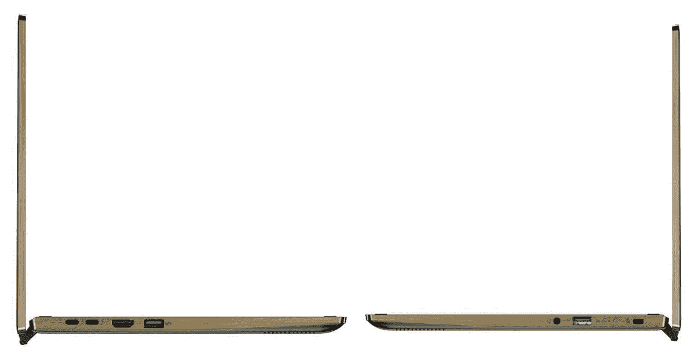
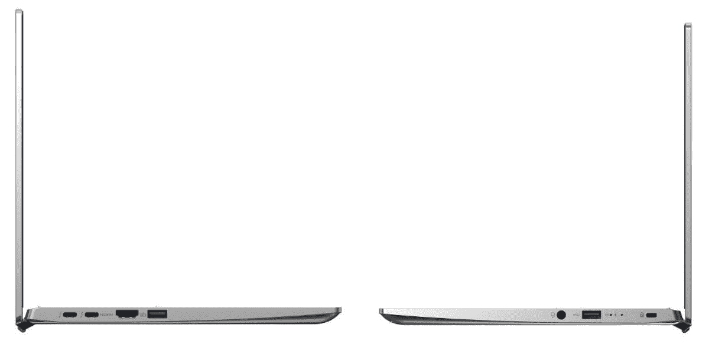
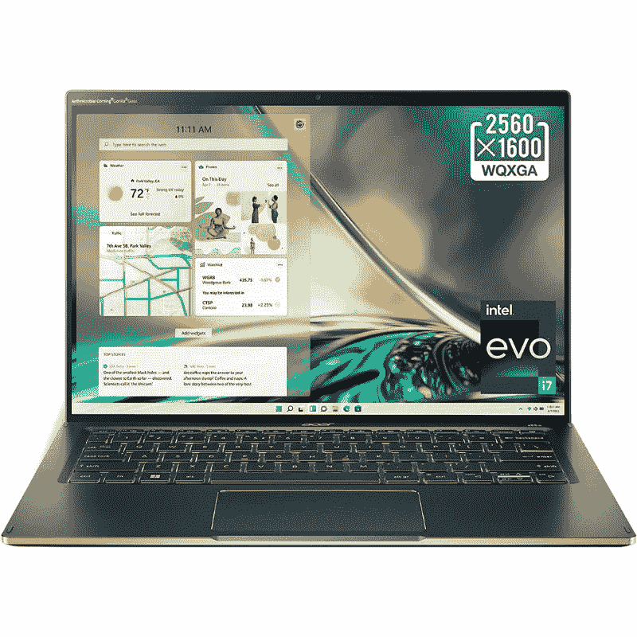

# 宏碁 Swift 3 (2022) vs 宏碁 Swift 5 (2022):哪个更好？

> 原文：<https://www.xda-developers.com/acer-swift-3-2022-vs-acer-swift-5-2022/>

紧随英特尔宣布其新的用于笔记本电脑的第 12 代酷睿处理器之后，宏碁发布了一些采用英特尔新硬件的新笔记本电脑。新的宏碁 Swift 5 和 [Swift 3 (2022)](https://www.xda-developers.com/acer-swift-3-2022) 都配备了英特尔最新的 CPU 和一系列超过去年同类产品的其他改进。在本文中，我们将看看新的 Acer Swift 3 与 Acer Swift 5 的比较，看看哪一个更好。

**浏览这篇文章:**

## 宏基 Swift 3 (2022)与宏基 Swift 5 (2022):规格

在我们开始比较它们之间的差异之前，让我们先来看看每款笔记本的规格，看看它们带来了什么:

| 

规格

 | 

**宏碁 Swift 3 (2022)**

 | 

**宏碁 Swift 5 (2022)**

 |
| --- | --- | --- |
| **CPU** | 

*   第 12 代英特尔酷睿 i5-1240P (12 个内核，16 个线程，最高 4.4GHz，12MB 高速缓存)
*   第 12 代英特尔酷睿 i7-1260 处理器(12 个内核，16 个线程，最高 4.7GHz，18MB 高速缓存)

 | 

*   最高可配第 12 代英特尔酷睿 i7-1260 处理器(12 个内核，16 个线程，最高 4.7GHz，18MB 高速缓存)

 |
| **图形** |  |  |
| **闸板** |  | 

*   高达 16GB LPDDR5 双通道内存

 |
| **存储** |  |  |
| **显示** | 

*   14 英寸 16:9 全高清(1920 x 1080) IPS
*   14 英寸 16:9 四核高清(2560 x 1440) IPS

 | 

*   14 英寸 16:10 WQXG (2560x1600)，触摸屏显示器

 |
| **电池** | 

*   3 芯 56 瓦时电池，续航时间长达 10.5 小时

 | 

*   3 芯电池(容量不明)

 |
| **端口** | 

*   2 个 Thunderbolt 4(USB C 型)
*   2 个 USB 3.2 第 1 代 A 型
*   1 个 HDMI 2.0 接口
*   3.5 毫米耳机插孔

 | 

*   2 个 Thunderbolt 4(USB C 型)
*   2 个 USB 3.2 第 1 代 A 型
*   1 个 HDMI 2.1 接口
*   1 个 3.5 毫米耳机插孔

 |
| **音频** |  |  |
| **网络摄像头** | 

*   具有瞬时降噪功能的全高清 1080p 网络摄像头

 | 

*   具有时间降噪功能的全高清摄像机。

 |
| **安全** |  |  |
| **连通性** |  |  |
| **尺寸(WxDxH)** | 

*   320.04 x 210.82 x 16 毫米(12.6 x 8.3 x 0.63 英寸)

 | 

*   309.88 x 213.36 x 14.986 毫米(12.2 x 8.4 x 0.59 英寸)

 |
| **重量** | 

*   起始重量为 1.25 千克(2.76 磅)

 |  |
| **价格** |  |  |

## 宏基 Swift 3 (2022)与宏基 Swift 5 (2022):性能

Acer Swift 3 (2022)和 Acer Swift 5 笔记本电脑均采用英特尔全新第 12 代酷睿处理器。事实上，他们都在使用新的第 12 代产品系列的 P 系列芯片，这很好。虽然我们知道 Acer Swift 3 将有 Core i5 和 Core i7 两种版本，但我们不完全确定 Swift 5 是否将只提供 Core i7 选项，或者是否还会有 Core i5 等其他版本。

宏碁没有提到它在 Swift 5 中使用的处理器，但我们能够发现这款笔记本电脑的一个变种，由酷睿 i7-1260P 驱动。这是 Alder Lake 的 P 系列阵容中最强大的芯片之一。它总共包含 12 个内核，其中 4 个是性能内核，其余 8 个是效率内核。我们还没有拿到这些新芯片进行详细的性能评估，但它们肯定会比英特尔的第 11 代 Tiger Lake 处理器性能更好。我们建议您查看我们的[英特尔第 12 代 Alder Lake](https://www.xda-developers.com/intel-12th-gen-alder-lake/) hub 页面，了解更多关于这些新芯片的信息。

宏碁 Swift 3 和 Swift 5 笔记本电脑的性能完全取决于机箱处理这些新芯片的能力。宏碁表示，Swift 5 配备了升级的 TwinAir 双风扇系统和 D6 热管，以实现更好的散热管理。总体而言，这可能意味着 Swift 5 的性能可能优于 Swift 3。一旦我们有机会对每台笔记本电脑进行了测试和对比，我们将进一步讨论它们的性能。

除了新的第 12 代处理器，这两款笔记本电脑现在还拥有更多内存和存储选项。Acer Swift 3 和 Acer Swift 5 都可以购买高达 16GB 的内存，尽管 Swift 3 使用 LPDDR4X 内存，而 Swift 5 使用 LPDDR5 内存。这可能不会导致显著的性能差异，但 LPDDR5 是首选。至于存储，Swift 3 和 Swift 5 笔记本电脑都配备了高达 2TB 的 PCIe 固态硬盘。

关于 Acer Swift 5 笔记本电脑，需要注意的一点是，它符合英特尔的 Evo 规范，这意味着它承诺提供即时唤醒和超过 10 小时电池续航时间等体验。这是 Swift 3 所缺乏的，所以请记住这一点。我们预计这两款笔记本电脑之间不会有巨大的性能差异，但我们认为 Swift 5 将提供更好的整体体验。

两款笔记本电脑都使用 3 芯锂离子电池，但宏碁没有提到确切的容量。很难评论这些笔记本的电池性能，因为它还取决于显示器、性能等。宏碁承诺这两款笔记本单次充电至少可以使用 10 个小时，但一旦我们拿到笔记本电脑，我们将有更多的时间来谈论它。此外，Swift 3 和 Swift 5 也使用 65W 充电器。

## 显示

就显示器而言，Swift 3 和 Swift 5 笔记本都配备了 14 英寸的面板。但是，分辨率和显示类型会有很大差异。Acer Swift 3 提供全高清和 QHD 16:9 IPS 面板。另一方面，Swift 5 采用了 2560 x 1600 分辨率的 14 英寸显示屏，这意味着它具有 16:10 的宽高比，非常适合生产力。16:10 的宽高比面板并不适合所有人，但它提供了更多的垂直屏幕空间，更适合在线阅读网页和编辑文档。

 <picture></picture> 

Acer Swift 3

值得一提的是，Swift 5 显示屏周围的挡板非常薄。我们预计屏幕与机身的比例为 92.22%，它甚至支持触摸，这是 Swift 3 的非触摸面板的另一个优势。Swift 3 上的 FHD 和 QHD 显示选项绝对物有所值，但如果您想获得最佳体验，我们建议您升级到 Swift 5 笔记本电脑。

这两款笔记本电脑的显示屏顶部都有一个网络摄像头。两款笔记本电脑的网络摄像头都有一个全高清传感器，采用了宏碁的时域降噪技术。我们不能对相机的质量发表评论，因为我们还没有机会使用它们，但我们认为它们应该可以满足大多数视频通话的需求。

## 设计和端口

看一下这两款笔记本电脑，很明显它们的外形非常相似。然而，宏碁 Swift 5 比 Swift 3 更薄，重量约 500 克。Swift 3 的尺寸为 320.04 x 210.82 x 16 毫米，Swift 5 的尺寸为 309.88 x 213.36 x 14.986 毫米。两者都是翻盖笔记本，但 Swift 5 可以说看起来更好。

Swift 5 是两款笔记本电脑中更高端的一款，由 CNC 加工的铝制成，采用绿色和金色双色调设计。与市场上的其他主流笔记本电脑相比，Swift 3 的外观也很好，它有有趣的新颜色选择，但它没有 Swift 5 那么高端。

 <picture></picture> 

Acer Swift 5 ports selection

说到端口，Acer Swift 3 和 Swift 5 都有相同的选择。你有两个 Thunderbolt 4 (USB Type-C)端口，两个 USB 3.2 Gen 1 Type-A，一个 HDMI 端口和一个 3.5 毫米耳机插孔。然而，值得指出的是，Swift 3 配备了 HDMI 2.0 端口，而 Acer Swift 5 配备了 HDMI 2.1 端口。但除此之外，我们正在寻找一个相同的端口选择。如果有包括以太网端口在内的其他选项就更好了，但看起来我们必须使用外部坞站。

 <picture></picture> 

Acer Swift 3 ports selection

两台笔记本电脑的连接选项也是相同的。Acer Swift 3 和 Swift 5 均支持 WiFi 6E 和蓝牙 5.2。

## 应该买哪个？

宏碁 Swift 3 和 Swift 5 笔记本电脑的性能预计非常相似。我们正在为这两款笔记本电脑寻找英特尔的新第 12 代 P 系列芯片，因此总体性能应该或多或少是相同的，只是在一些任务上有一些细微的差异。这两款笔记本电脑都有很好的内存和存储选项，但 Swift 5 是更好的选择，因为新的第 12 代英特尔芯片配有 LPDDR5 双通道内存。

在显示和制造质量方面，我们认为宏碁 Swift 5 胜过 Swift 3。两款笔记本电脑都有相同尺寸的 14 英寸显示屏，但 Swift 5 有一个 16:10 触摸屏选项，提供更多功能。宏碁 Swift 5 的铝合金表面和双色设计也让它看起来更高档。Swift 3 有趣的颜色选择看起来也不错，但不是一个级别的。最后，两台笔记本电脑都有相同的端口和连接选项，所以没有区别。

总的来说，可以肯定地说，Acer Swift 3 和 Swift 5 是两款出色的笔记本电脑，将为您提供多年的良好服务。如果您不想在高级构建质量、触摸屏选项和 16:10 宽高比面板等花哨的附加功能上花太多钱，我们建议您选择 Swift 3 而不是 Swift 5。但是，如果你是一个超级用户，不介意花更多的钱来获得绝对最佳的性能和时尚的笔记本电脑，那么 Swift 5 是一个不错的选择。

 <picture></picture> 

Acer Swift X

##### 宏碁 Swift 5 (2022)

Acer Swift 5 (2022)由英特尔新的第 12 代 Alder Lake 处理器提供支持，并采用 16:10 显示屏。

 <picture></picture> 

Acer Swift 3

##### 宏碁 Swift 3

Acer Swift 3 采用第 12 代英特尔处理器，最高配有四核高清显示屏和新的全高清网络摄像头。

如果你对这些都不感兴趣，你可以看看我们收集的[最好的宏碁笔记本电脑](https://www.xda-developers.com/best-acer-laptops/)，看看你是否想买一些其他的宏碁笔记本电脑。或者，如果你不介意看看其他制造商的笔记本，你也可以看看我们收集的[最佳笔记本电脑](https://www.xda-developers.com/best-laptops/)。