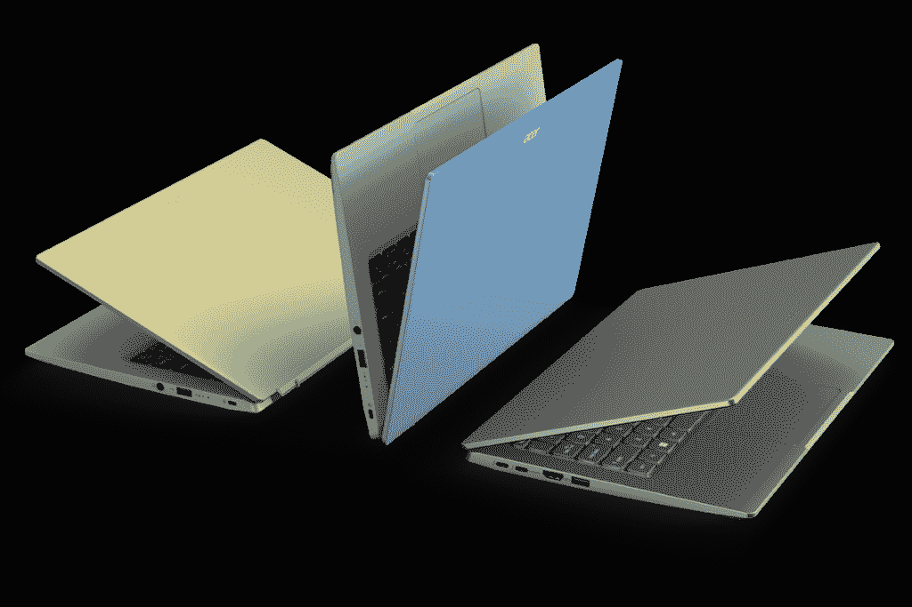
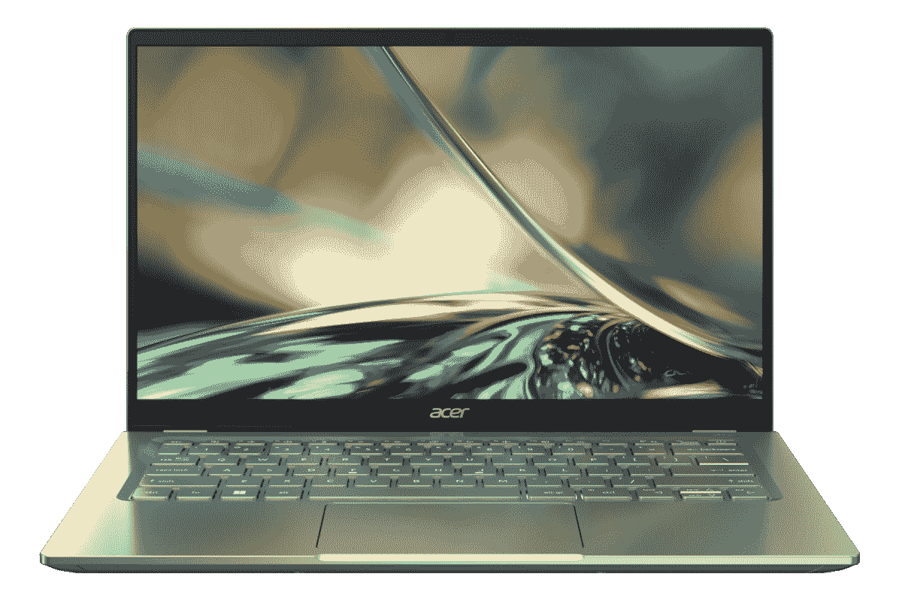

# 宏碁 Swift 3 (2022) vs MacBook Air:最适合你的笔记本电脑是什么？

> 原文：<https://www.xda-developers.com/acer-swift-3-2022-vs-macbook-air/>

在过去的几个月里，大量采用英特尔和 AMD 最新处理器的新笔记本电脑已经上市。两家公司都在 2022 年初推出了最新的笔记本电脑 CPU，因此许多受欢迎的笔记本电脑家族都在升级。这包括宏碁 Swift 3，它最近更新了 2022 年的英特尔 P 系列 28W 处理器和更高分辨率的显示器选项，它看起来是一款可靠的主流笔记本电脑。在本文中，我们将对 Acer Swift 3 (2022)和 MacBook Air 进行比较，以便您决定哪一款最适合您。

这两款笔记本电脑的价位有些相似(取决于您的配置)，它们有一些共同点，但也有相当多的差异。或许最值得注意的是操作系统，宏碁 Swift 3 运行 Windows 11，而 MacBook Air 自然运行 macOS。仅凭这一点就可以为您做出决定，但是让我们来看看关于这些笔记本电脑您还应该知道什么。

**浏览这篇文章:**

## 宏碁 Swift 3 (2022)与 MacBook Air:规格

|  | 

宏碁 Swift 3 (2022)

 | 

MacBook Air(2020 年末)

 |
| --- | --- | --- |
| **操作系统** |  |  |
| **CPU** | 

*   第 12 代英特尔酷睿 i5-1240P (12 个内核，16 个线程，最高 4.4GHz，12MB 高速缓存)
*   第 12 代英特尔酷睿 i7-1260 处理器(12 个内核，16 个线程，最高 4.7GHz，18MB 高速缓存)

 | 

*   苹果 M1 (8 核，最高 3.2GHz)

 |
| **图形** | 

*   英特尔 Iris Xe(集成)

 | 

*   7 核 GPU(集成)
*   8 核 GPU(集成)

 |
| **显示** | 

*   14 英寸 16:9 全高清(1920 x 1080) IPS
*   14 英寸 16:9 四核高清(2560 x 1440) IPS

 | 

*   13.3 英寸 16:10 (2560 x 1600) IPS，400 尼特，真实色调，P3 宽色彩

 |
| **存储** |  |  |
| **闸板** |  | 

*   8GB 统一内存
*   16GB 统一内存

 |
| **电池** | 

*   3 芯电池(容量不明)，最长 10.5 小时

 |  |
| **端口** | 

*   2 个 Thunderbolt 4(USB C 型)
*   1 个 USB 3.2 第 1 代 A 型
*   1 个 HDMI 2.0 接口
*   3.5 毫米耳机插孔

 | 

*   2 个 USB 4 / Thunderbolt (USB-C)
*   3.5 毫米耳机插孔

 |
| **音频** |  | 

*   支持杜比全景声的立体声扬声器
*   3 麦克风阵列

 |
| **摄像机** | 

*   具有瞬时降噪功能的全高清 1080p 网络摄像头

 |  |
| **生物认证** |  |  |
| **连通性** | 

*   英特尔无线 6E
*   蓝牙 5.2

 | 

*   英特尔无线网络 6
*   蓝牙 5

 |
| **颜色** | 

*   Safari 黄金
*   雪蓝色
*   纯银

 |  |
| **尺寸(WxDxH)** | 

*   321.35 x 208.69 x 17.27 毫米(12.65 x 8.22 x 0.68 英寸)

 | 

*   304.1 × 212.4 × 16.1 毫米(11.97 × 8.36 × 0.63 英寸)

 |
| **重量** | 

*   起始重量为 1.25 千克(2.76 磅)

 | 

*   起始重量为 1.29 千克(2.8 磅)

 |
| **价格** | 起价 849.99 美元 | 起价 999 美元 |

## 操作系统:Windows vs macOS

对大多数人来说，最大的决定因素可能是操作系统。如果你熟悉 Windows 或 macOS，你可能会坚持使用你已经知道的东西。这完全是个人喜好的问题，但是如果你想知道为什么你会更喜欢其中一个，我们会尽力帮助你。

Windows 是最受欢迎的个人电脑操作系统，你很可能已经对它很熟悉了。你能在网上找到的大多数应用程序都是首先设计并支持 Windows 的，所以在那里可能更容易获得你在 Mac 上得不到的某些功能。具体来说，在 Mac 上玩游戏可能非常困难，因为绝大多数游戏都是专为 Windows 设计的。众所周知，Windows 给用户更多的自由来使用他们的电脑。此外， [Windows 11](https://www.xda-developers.com/windows-11/) 有一个新的更精简的设计，对用户更友好。

与此同时，macOS 总体上并不流行，但它在内容创作者中非常受欢迎。它尤其以可以访问 iMovie 和 Final Cut Pro 等应用程序而闻名，但即使是像 Adobe 的 Creative Cloud 这样的第三方应用程序也往往更关注 macOS。苹果的操作系统也被认为更简单，更容易被新用户掌握。举例来说，如果你有一部 iPhone，你也可以享受设备间的无缝连接，比如 iMessage。

## 性能:英特尔阿尔德湖或苹果 M1

MacBook Air 的最新型号于 2020 年底推出，苹果公司特意将其性能与英特尔当时的处理器进行了比较。事实上，它在许多方面都超过了他们。但现在，宏碁配备了英特尔的第 12 代处理器，特别是具有 28W TDP 的新 P 系列。这与混合了高性能内核和高效内核的新型混合架构相结合，带来了巨大的性能飞跃。

要比较 CPU 性能，可以看看 Geekbench 5 基准测试成绩。对于英特尔的第 12 代处理器来说，现在还为时尚早，所以我们还没有一个合适的平均值，但我们可以通过单独的测试来了解性能的大致情况。

|  | 

英特尔酷睿 i7-1260P( [参见测试](https://browser.geekbench.com/v5/cpu/14132895))

 | 

英特尔酷睿 i5-1240P( [参见测试](https://browser.geekbench.com/v5/cpu/14119919))

 | 

MacBook Air(苹果 M1)(平均)

 |
| --- | --- | --- | --- |
| Geekbench 5(单核/多核) | 1,655 / 9,318 | 1,469 / 8,788 | 1,705 / 7,417 |

根据这些测试，英特尔似乎已经设法赶上了，至少在多核性能方面，但这两款笔记本电脑对于您的日常任务来说应该还是绰绰有余的。这里需要注意的是，苹果 M1 基于 Arm 架构，通常比英特尔的处理器更高效。英特尔的新混合设计可能有助于这一点，但你仍然有可能从 MacBook Air 获得更长的电池寿命——苹果公司宣称可达 18 小时，而宏碁 Swift 3 只有 10.5 小时。

苹果 M1 有一个更强大的内置图形处理器。

不过，CPU 并不是您需要考虑的唯一性能方面。此外还有 GPU，自上一代产品以来，英特尔几乎没有接触过其处理器内部的集成 Iris Xe 显卡。这意味着苹果 M1 仍然提供更高的性能。使用 GFXBench 基准测试的[比较工具，](https://gfxbench.com/compare.jsp?benchmark=gfx50&did1=90754264&os1=OS+X&api1=metal&hwtype1=GPU&hwname1=Apple+M1&D2=Intel%28R%29+Iris%28R%29+Xe+Graphics+RI)你可以看到苹果 M1 在一些 3D 场景中可以提供超过两倍的帧率，所以差异是显著的。当然，无论如何，你不能在 macOS 上运行很多游戏，所以你只需要强大的 GPU 来处理某些创造性的工作负载。

除此之外，这两款笔记本电脑都支持高达 16GB 的内存(尽管由于统一的内存架构，MacBook Air 的速度应该更快)和 2TB 的存储空间。宏碁笔记本电脑在这方面可能有优势，因为固态硬盘通常是可更换的(基于以前的型号)，而 MacBook Air 的固态硬盘是焊接在主板上的。

## 显示器:MacBook Air 的屏幕更高

说到显示器，我们又有了一个你可能更喜欢 MacBook Air 的理由。苹果的笔记本电脑配备了 13.3 英寸的显示屏，但它的长宽比为 16:10，比传统的笔记本电脑显示屏高——就像宏碁 Swift 3 上的显示屏一样。像这样高的屏幕对生产力有很大的好处，因为增加的垂直空间会导致更大的整体表面积。使用更高的屏幕，您可以在文档中获得更多的文本空间，在 Excel 电子表格中获得更多的行，或者最重要的是，在复杂的应用程序(如视频制作软件)中获得更多的 UI 元素空间。

此外，MacBook Air 只有一种配置，但这种配置基本上适合所有人。这是一个四高清+ (2560 x 1600)显示器，所以它超级清晰，加上它的亮度高达 400 尼特，它支持 True Tone 和 P3 宽颜色。无论您的使用情形如何，这都是这个价位的绝佳展示。

另一方面，Acer Swift 3 拥有更大的 14 英寸显示屏，但它采用了更传统的 16:9 宽高比。当然，由于它更大，自然有更多的空间，但也值得注意的是，基本配置是全高清(1920 x 1080)分辨率，所以它不像 MacBook Air 那样清晰。不过，您可以升级到 Quad HD (2560 x 1440)面板，以获得更好的体验。

至于声音，两款笔记本电脑都有双扬声器系统，正如你对它们尺寸的预期。MacBook Air 也有三个麦克风，用于在通话中拾取声音，但宏碁没有透露 Swift 3 上麦克风设置的细节。

Acer Swift 3 拥有全高清 1080p 网络摄像头。

最后，还有网络摄像头，宏碁 Swift 3 在这方面可能有优势。它有一个升级的全高清(1080p)网络摄像头，与以前的型号相比，应该可以提供更好的质量。苹果仍在为 MacBook Air 使用 720p 网络摄像头，但它在苹果 M1 芯片中利用人工智能来提高图像质量，因此这可能会使比较更加公平。

## 设计:两台顶级笔记本电脑

就设计而言，宏碁 Swift 3 和 MacBook Air 都感觉其全金属机箱相当高端。MacBook Air 的厚度为 16.1 毫米，明显比 Acer Swift 3 的 17.27 毫米薄，但却比 Acer Swift 3 略重(分别为 2.8 磅和 2.76 磅)。不过，对于大多数用户来说，这两款手机都足够便携。

在长相方面，差异更明显一些。宏碁 Swift 3 的外观更有棱角，边缘和表面都很平，而 MacBook Air 的曲线更多。然而，宏碁 Swift 3 更有趣一些，因为它有三种颜色。除了基本的纯银，你可以选择 Safari Gold，它有鲜艳的黄色调，或者 Snow Blue，它有蓝色的盖子和绿色的蓝色底座。

 <picture></picture> 

Acer Swift 3 colors

与此同时，MacBook Air 的整体颜色更加沉闷。有银色、太空灰(基本上是暗银色)和金色。这些都是中性色调，诚然，他们觉得溢价。然而，如果你像我一样，这些也是非常安全和无聊的颜色。

## 端口和连接:Acer Swift 3 功能更加丰富

最后，我们来到港口，这是宏碁 Swift 3 大幅战胜 MacBook Air 的地方。苹果的笔记本电脑有一个非常基本的设置——两个 USB4 / Thunderbolt 端口和一个耳机插孔。诚然，你可以使用 Thunderbolt dock 或 USB-C hub 来连接外设，但由于苹果 M1 芯片的限制，无论如何都只支持一个外部显示器，而且你不能连接外部 GPU，所以它没有你想象的那么有用。

与此同时，宏碁 Swift 3 有两个 Thunderbolt 4 端口——支持多显示器、[外部 GPU](https://www.xda-developers.com/best-external-gpus-for-your-laptop/)和其他外设——外加两个 USB Type-A 端口、更容易连接外部显示器的 HDMI 和一个耳机插孔。你可以获得非常完整的开箱设置，此外，如果你有一个 Thunderbolt dock，你甚至可以获得比 MacBook Air 更多的功能。

Acer Swift 3 外部 GPU 和多个显示器。

在无线连接方面，两款笔记本电脑都支持最新版本的蓝牙，但宏碁 Swift 3 支持 Wi-Fi 6E，这意味着它可以使用新的 6GHz 频段，而 MacBook Air 只支持标准的 Wi-Fi 6。

## 宏碁 Swit 3 (2022) vs MacBook Air:最终想法

考虑到这些，你应该选择哪一款笔记本电脑呢？嗯，这最终取决于你，但这两者都有明显的利弊。MacBook Air 拥有更强大的集成 GPU，处理器整体效率更高，因此与 Acer Swift 3 相比，它的电池续航时间明显更长。此外，默认情况下，它的显示屏更高，分辨率也更高。如果你已经是 macOS 的粉丝，这也是一个正确的选择，因为你不会在宏碁的笔记本电脑上得到它。

与此同时，宏碁 Swift 3 有一个潜在的更强大的 CPU，尽管它有一个较弱的集成 GPU，但它实际上可以使用 Thunderbolt 端口来连接外部 GPU，成为真正的游戏 PC。事实上，它只是总体上有更多的端口，包括 USB Type-A 和 HDMI，这对很多人来说仍然很重要。它还支持多个外部显示器，同样，你不能对 MacBook Air 这么说。当然，如果你想运行 Windows 应用程序和游戏，这是你想要的。

就个人而言，在这两者之间，我会选择宏碁 Swift 3，因为它有更多的端口，能够运行 Windows，并且有更多有趣的颜色可供选择。但也有很好的理由来搭配 MacBook Air。

如果你更喜欢 MacBook Air，可以在下面购买。宏碁 Swift 3 目前还不能购买，但如果你想了解更多信息，可以在宏碁的网站上查看，并检查它是否已经发布。否则，你可以查看最好的宏基笔记本电脑或最好的苹果电脑，看看这些公司现在还能为你提供什么。

 <picture></picture> 

Apple MacBook Air 13 (2020)

##### 苹果 MacBook Air (M1，2020 年)

MacBook Air 由苹果 M1 芯片驱动，以低功耗提供出色的性能。它也有一个优质的设计和一个伟大的显示。

 <picture></picture> 

Acer Swift 3 (2022)

##### 宏碁 Swift 3 (2022)

2022 款宏碁 Swift 3 采用英特尔第 12 代 P 系列处理器，最高可配四核高清显示屏，并有一些有趣的颜色。