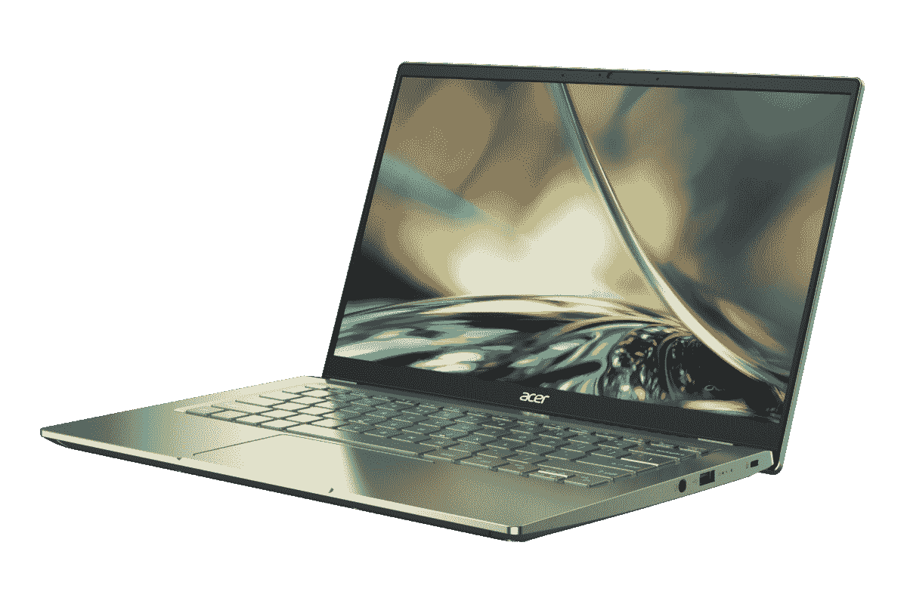

# 宏碁 Swift 3 (2022)回顾:坚固的主流笔记本电脑，配有小电池

> 原文：<https://www.xda-developers.com/acer-swift-3-2022/>

宏碁 Swift 3 是该公司笔记本电脑产品线的支柱之一，2022 款带来了一些非常受欢迎的改进，使其成为大多数人眼中的[伟大笔记本电脑](https://www.xda-developers.com/best-laptops/)。它拥有英特尔 P 系列的强大性能，高达四核高清显示屏，以及一个非常好的网络摄像头，这可能是我最喜欢的方面，使其成为远程学习或工作的理想选择。

它也不是没有缺点，电池寿命是拥有如此强大的 CPU 和清晰显示器的缺点之一，但如果你不需要离开插座太久，它是一个很好的设备。我也希望看到 Windows Hello 面部识别支持，但这远非必要。

就其所提供的而言，Acer Swift 3 的价格极具竞争力，而且它采用了时尚的包装，使它成为一款可以带到任何地方而不会有任何奇怪外观的笔记本电脑。这不是一台会让你大吃一惊的笔记本电脑，但它涵盖了你所期望的所有基本需求，而且做得非常好。

 <picture></picture> 

Acer Swift 3 (2022)

##### 宏碁 Swift 3 (2022)

Acer Swift 3 是一款主流笔记本电脑，配备高性能英特尔处理器和高达四核高清显示屏。

## Acer Swift 3:定价和可用性

*   宏碁 Swift 3 于 6 月在包括美国和欧洲在内的多个市场推出，起价为 849.99 美元
*   本评估中使用的模型的官方价格为 1，129.99 美元

宏碁在 3 月份宣布了 Swift 3 (2022)，但它过了几个月才推出，6 月份才正式推出。这款笔记本电脑的官方起价为 849.99 美元，但如果你四处看看，你实际上可以找到一些价格更低的型号。有些型号可以直接从宏碁买到，但大多数情况下，你也可以在亚马逊和其他零售商那里买到。

宏碁为此次评测提供的型号是高端配置(见下面的规格表)，官方定价为 999.99 美元。你可以通过使用更小的 512GB 固态硬盘来节省一些钱，这仍然是足够的存储空间。

## 宏碁 Swift 3:规格

| 

中央处理器

 | 英特尔酷睿 i7-1260 处理器(12 个内核，16 个线程，最高 4.7GHz，18MB 高速缓存) |
| 

制图法

 | 集成英特尔 Iris Xe 显卡(96 EUs) |
| 

显示

 | 14 英寸 IPS，四核高清(2560 x 1440)，210 DPI，100% sRGB，最高 300 尼特，Acer ComfyView |
| 

身体

 | 321 x 210.8 x 15.9 毫米，1.25 千克 |
| 

记忆

 | 16GB LPDDR4x-4266 |
| 

储存；储备

 | 1TB NVMe PCIe 固态硬盘 |
| 

电池

 | 56Wh 电池 |
| 

港口

 | 

*   2 个 Thunderbolt 4/USB 4 C 类端口(40Gbps)
*   2 个 USB 3.2 Gen 1 Type-A(一个始终打开用于充电)
*   1 个 HDMI 2.1 接口
*   1 个 microSD 读卡器

 |
| 

声音的

 | DTS 音频双立体声扬声器，Acer TrueHarmony 双阵列麦克风，Acer Purified。声音 |
| 

连通性

 | 黑仔 Wi-Fi 6E AX1675i 蓝牙 5.2 |
| 

照相机

 | 1080p 全高清 MIPI 网络摄像头，具有瞬时降噪功能 |
| 

颜色

 | 银 |
| 

材料

 | 铝金属 |
| 

操作系统（Operating System）

 | Windows 11 主页 |
| 

价格

 | $1,129.99 |

## 设计:宏碁 Swift 3 看起来像一台笔记本电脑

*   宏碁 Swift 3 有三种颜色，但银色是最常见的
*   它重约 2.75 磅，对于铝制笔记本电脑来说相当轻

就外观而言，宏碁 Swift 3 是一款非常普通的产品，至少在我得到的版本中是这样。宏碁宣布它将有三种颜色，但银色是我唯一能找到的颜色，而且它似乎是更广泛的选择。这是有道理的，因为银色笔记本电脑是最受欢迎的，但它根本就不突出，这是我发现自己希望更多的笔记本电脑会这样做。

但仅仅因为它看起来不独特，并不意味着它一点也不好。这款笔记本电脑由铝制成，这让它在四周都有一种非常高级的感觉。虽然它是柔和的，但看起来干净而光滑。唯一让它成为廉价设备的是显示屏周围的塑料边框。虽然这款笔记本电脑主要由金属制成，但它仍然非常轻，重量约为 2.75 磅，厚度仅为 15.9 毫米。拿起笔记本电脑感觉毫不费力，我可以很容易地想象把它放在背包里带着到处走，没有太大的问题。

除了从外观上看有点普通之外，我唯一能指出的是这种设计的铰链有点太硬了，用一只手打开盖子很困难。不过，这并不是什么大不了的事情，我怀疑发生这种情况的部分原因是笔记本电脑的设计可以在你打开转轴时抬起底座，将键盘置于更舒适的角度，并改善气流。在我看来，这是一个很好的妥协。

环顾笔记本电脑，你会发现左侧有两个 Thunderbolt 4 端口，以及一个 USB Type-A 端口和一个 HDMI 端口。我真的希望这些端口能更分散一些，因为你可能很难同时用两个 Thunderbolt 端口插入外设，因为它们离得太近了。这是一个旁注，但我的评论单元在到达我之前被撞了，所以这就是为什么看起来盖子在上图的右侧是弯曲的。

左侧只有一个 USB Type-A 端口、一个耳机插孔和一个 Kensington 锁插槽。我只是觉得 Thunderbolt 的一个端口应该在这边，这样会让事情变得更加公平，但这没什么大不了的。

## 显示屏和网络摄像头:1080p 网络摄像头终于成为标准配置

*   显示屏现在达到了四倍高清分辨率，因此更加清晰
*   网络摄像头已经升级到 1080p，看起来很棒

Acer Swift 3 配备了 14 英寸的显示屏，长宽比为 16:9，这是该系列的标准配置。当然，更高的显示器会很好，但在这个价格范围内，这并不意外，16:9 显示器仍然可以很好地完成工作。

2022 型号有一个很大的升级，这是第一次包括一个四高清面板。你仍然可以选择全高清显示屏，我认为你会很好，但如果你想要一些更清晰的东西，很高兴知道你现在有这个选项。我确实认为你必须权衡更高分辨率带来的电池寿命成本。虽然它更清晰，但我认为大多数人不会注意到差异，全高清显示屏将使用更少的电力，这可能是你需要考虑这款笔记本电脑的一些问题，我们将在稍后讨论。

除了分辨率之外，两种面板选项都很相似。它们的亮度高达 300 尼特(据宏碁称)，这对于室内使用来说绰绰有余，尽管在阳光直射下工作可能会有一些问题。宏碁还声称显示器覆盖了 100%的 sRGB 色彩空间，根据我们的测试，这似乎是成立的。它还覆盖了 70%的 NTSC 制式，以及 76%的 Adobe RGB 和 DCI-P3 制式。

实际上，在我使用期间，我觉得显示器可能有点热，但我们的测试实际上显示它有点凉。白点在不同的亮度水平下保持相当一致，对比度达到 1420:1 的峰值，这是一个相当稳定的分数。此外，我们的测试实际上显示亮度可以达到 340 尼特以上，这明显高于宏碁的声明，肯定很高兴看到。

有这么好的网络摄像头真是太棒了。

在声音方面，宏碁使用了一对立体声下射扬声器，这对这个价格范围来说是相当标准的。它们听起来不错，声音也很大，尽管它们并没有因为惊人的音质而特别突出。他们会做得很好，但他们也可以做得更好。

这款笔记本电脑我最喜欢的一点就是它的显示屏上方。现在的笔记本电脑[有一个 1080p 网络摄像头](https://www.xda-developers.com/best-laptops-1080p-webcam/)，在宏碁今年的迭代中可以进行的所有升级中，我很高兴这是它。我总是很高兴在笔记本电脑中看到高质量的网络摄像头，我似乎是在过去两年迫使更多人远程工作之前有这种感觉的少数人之一。我几乎每天都在进行视频通话，有这么好的内置摄像头真是太棒了。你可以在下面的照片中看到一个样本。

当然，它仍然是一个笔记本电脑网络摄像头，所以你不要指望它的世界，它看起来肯定非常柔软。但是在良好的照明条件下，你用这个相机会看起来很好，即使在最差的情况下，与过去的大多数网络摄像头相比，它仍然是坚固的。我甚至更喜欢它，而不是我最近评测的[联想 Yoga 6](https://www.xda-developers.com/lenovo-yoga-6-gen-7-review/)上的 1080p 网络摄像头，这已经很不错了。

## 键盘和触摸板:它可以很好地完成工作

*   在键盘上打字感觉很好，尽管还有更好的键盘
*   触摸板相当大，工作良好

说到键盘，你说得越少，通常越好。宏碁 Swift 3 完全可以打字，我想说这是足够的赞美，但它不是最好的键盘。我花了一些时间来适应我的桌面键盘(当然)，但几个小时后我真的没有任何大问题。然而，当与联想 ThinkBook 13s Gen 4 一起测试时(这是我即将发布的另一个评测)，可以明显看出联想的笔记本电脑在打字时感觉更加舒适。按键只是按起来感觉更舒服，而宏碁 Swift 3 会感觉浅一点，触底时感觉更硬。

但就像我说的，宏碁 Swift 3 上的键盘完全没问题，它也是背光的，如果你经常在黑暗的环境中工作，这当然是受欢迎的。然而，我要说的是，背光有点不均匀，因为它的颜色与按键本身非常相似，有时很难识别某些按键上的某些符号，尤其是在白天。你可以通过关闭背光来解决这个问题，这也可以节省一点电池，所以没什么大不了的。环境光传感器可能会有所帮助，当你周围有更多的光时，关闭背光。

我欣赏的一点是电源按钮与键盘本身融为一体，宏碁将指纹传感器内置于其中。这是对过去型号的重大升级之一，过去的型号在触摸板附近有一个指纹传感器，坦率地说，看起来有点丑。现在，它看起来很棒，只要你按下电源按钮，指纹传感器就会读取你的指纹，所以当你到达锁定屏幕时，它可以立即让你登录到 Windows。

触摸板本身也是你所希望的那样好。我可以确认，我在最初的动手操作单元中听到的恼人的卡嗒声只是生产前硬件的结果，这里一切都很好，使用起来感觉很好。再说一次，这是一种你说得越少，通常越好的事情，在这方面我真的没有什么负面的东西可以指出。

## 性能:英特尔 28W 处理器速度很快，但电池续航时间不是很长

*   得益于英特尔 P 系列处理器，它是一款速度非常快的笔记本电脑
*   电池寿命受到性能提升和四核高清显示屏的影响

虽然我在今年早些时候亲自体验了宏碁 Swift 3 和 Swift 5，但这是我第一次真正开始在采用英特尔 P 系列处理器的设备上测试性能和电池寿命。这些新处理器具有 28W 的 TDP，它们的存在显然让英特尔在性能上优于苹果 M1 和 M2。毕竟，英特尔曾经专门为特定的 MacBook 型号制造 28W 处理器，所以现在苹果已经转移了，Windows 机器上可以使用它们是有意义的。

|  | 

宏基 Swift 3 (2022)英特尔酷睿 i7-1260 处理器

 | 

Surface Pro 8 英特尔酷睿 i7-1185G7

 | 

联想 ThinkPad X1 Yoga Gen 7 英特尔酷睿 i7-1260P

 |
| --- | --- | --- | --- |
| PCMark 10 | 5,318 | 4,988 | 5,168 |
| 3DMark:时间间谍 | 1,830 | 1,852 | 1,458 |
| 电影院长凳 | 1,661 / 9,351 | 1,438 / 5,423 | 1,375 / 6,831 |
| 极客工作台 | 1,729 / 9,594 | 1,431 / 5,505 | 1,419 / 6,915 |
| 十字标记 | 1,795 / 1,690 / 1,897 / 1,824 |  | 1,523 / 1,417 / 1,763 / 1,218 |

我的设备配备了英特尔酷睿 i7-1260P，这意味着它有 12 个内核和 16 个线程，是一款非常快速的笔记本电脑。从下面的图表中，您可以看到与采用上一代 15W 英特尔处理器的笔记本电脑相比，它的性能有了很大的飞跃，而且它的性能似乎也优于采用相同处理器的其他一些笔记本电脑。这一切都与冷却有关，因为许多升级到 28W 处理器的笔记本电脑并没有做出足够的改变来保持这些 CPU 的冷却运行。它们产生的热量比 15W 型号多得多，因此使用相同的散热设计实际上不起作用。

英特尔 P 系列电池消耗速度更快。

这符合我的个人经验，因为我从未发现自己想要更多的性能。一切都运行得如你所愿，多任务处理根本不是问题，至少有 16GB 的内存。8GB 对于大多数人来说还是可以的，但是如果你喜欢打开很多浏览器标签，这是你需要考虑的一件事。

问题是，由于 TDP 接近两倍，英特尔 P 系列消耗电池的速度更快。如果像宏碁 Swift 3 这样的笔记本电脑采用这些新处理器，并且电池尺寸没有随之增加(事实上没有)，电池寿命将会受到影响。对我来说，情况有所不同，但通常情况下，宏碁 Swift 3 的电池续航时间约为 3 个半小时，勉强够我工作一个上午。最好的情况是，在光线较好的一天，我用了 4 小时 11 分钟，最差的情况是，当我长时间将亮度设置为 100%时，我只用了大约 3 小时。如果你需要整天远离一个插座，这真的不太好。

正如我提到的，这也是一个四高清显示屏，这肯定会导致电池寿命更长。如果你想让它持续更长时间，我建议你换成全高清面板。我还应该指出，我确实在英特尔图形命令中心关闭了显示节能。这是一种根据所显示的内容改变显示器亮度的功能，因此对于较暗的图像，显示器会变暗。我把它关掉了，因为当你从一个有黑暗模式的网页切换到一个没有黑暗模式的网页时，它会变得非常明显，需要几秒钟的时间来阅读它。否则，我使用默认的电源设置，打开键盘背光，显示器亮度通常设置为 30%到 50%左右。

## 你应该买宏碁 Swift 3 吗？

有了 2022 版的 Acer Swift 3，我们肯定会从以前的型号中获得一些重大改进，可以选择更清晰的屏幕，更好的网络摄像头和出色的性能，所有这些都包裹在优质和轻便的设计中，即使对我个人来说有点无聊。

**您应该购买 Acer Swift 3，如果:**

*   您想要一台性能卓越、价格适中的笔记本电脑
*   1080p 网络摄像头是你会经常使用的
*   你想要既轻便又结实的东西

**您不应该购买宏碁 Swift 3，如果:**

*   您计划在远离插座的地方使用一整天
*   16:9 的宽高比对你来说已经过时了
*   你在寻找与众不同的东西

它确实在电池寿命方面有所欠缺，这可能会击败笔记本电脑的意义，这取决于你是谁。如果您的使用需要离开插座一整天，这将不是您的笔记本电脑。你要么需要寻找更大的电池，要么需要一台仍在使用 U 系列处理器的电脑，比如我几周前评测的[联想 Yoga 6 Gen 7](https://www.xda-developers.com/lenovo-yoga-6-gen-7-review/) 。

 <picture></picture> 

Acer Swift 3 (2022)

##### 宏碁 Swift 3 (2022)

Acer Swift 3 是一款主流笔记本电脑，配备高性能英特尔处理器和高达四核高清显示屏。