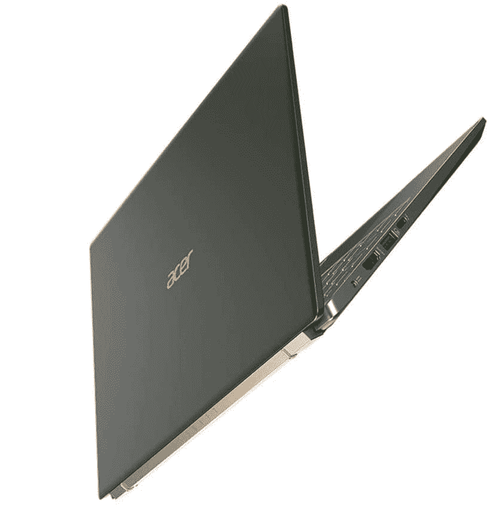

# 黑色星期五之前，宏碁 Swift 5 在亚马逊降至 999 美元

> 原文：<https://www.xda-developers.com/acer-swift-5-999-black-friday/>

黑色星期五还没有到来，但宏碁已经在亚马逊的 Swift 5 笔记本电脑上做了一笔相当不错的交易。这款笔记本电脑的顶级配置包括全高清触摸屏、英特尔酷睿 i7 处理器和 16GB 内存，现在售价为 999 美元，比其官方建议零售价低 301 美元。对于这款轻薄的笔记本电脑来说，这是一个相当大的折扣，是学校和工作的绝佳选择。

 <picture></picture> 

Acer Swift 5 ($300 off)

##### 宏碁 Swift 5

这款 Acer Swift 5 是一款功能强大的轻型笔记本电脑，采用最新的英特尔处理器和高端规格。

为什么您应该考虑这款笔记本电脑？首先，它搭载了英特尔酷睿 i7-1165G7 处理器，这是目前你能买到的最好的笔记本电脑处理器之一。它有四个内核，可以提升到 4.6GHz，因此对于各种工作和网络浏览来说都非常快。它还包括英特尔的 Iris Xe 显卡，因此您可以在这台电脑上玩一些旧游戏或简单的游戏。这款笔记本电脑还配有 16GB 的内存，非常适合多任务处理，1TB 的大固态硬盘几乎可以确保你有足够的空间长时间存储所有文件。

屏幕是 14 英寸的面板，也支持触摸输入。这可能是一种更直观的方式来使用您的电脑，所以有这个选项总是好的。还有一个很好的功能是 Windows Hello 支持，你有一个指纹识别器可以做到这一点，所以很容易解锁这台笔记本电脑。我们更喜欢面部识别，但这仍然很棒。

在设计方面，Acer Swit 5 的厚度仅为 14.99 毫米，重量仅为 2.31 磅，因此这是一款可以随身携带的舒适笔记本电脑。此外，笔记本电脑的表面覆盖有抗菌溶液，因此随着时间的推移，细菌不会像您使用笔记本电脑那样容易滋生。您还可以通过 Thunderbolt 4、HDMI 和两个 USB Type-A 端口获得大量端口，满足您的所有需求。

Acer Swift 5 是一款非常棒的笔记本电脑，由于黑色星期五，您可以在它身上获得一笔不错的交易。但是，如果你想看看其他选择，看看我们的[黑色星期五 PC 交易](https://www.xda-developers.com/best-black-friday-pc-gaming-deals/)页面，看看更多的笔记本电脑，配件，等等。我们还收集了所有移动技术产品的最佳黑色星期五交易，如果你也感兴趣的话，就来看看吧。