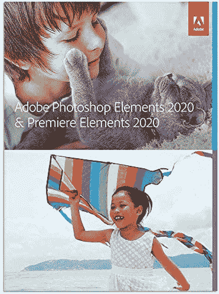
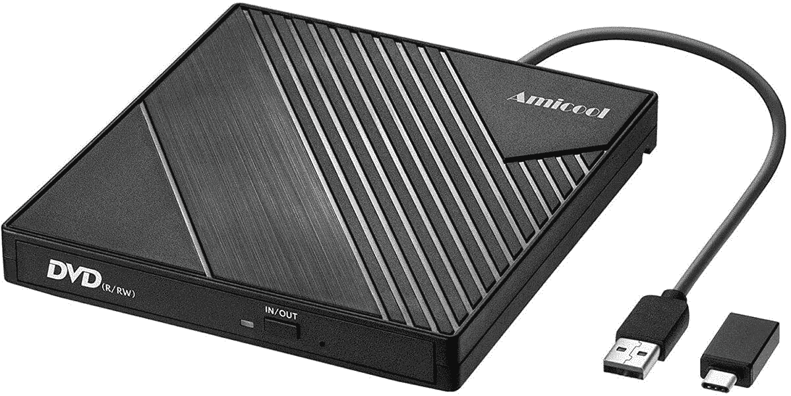

# 仅今天，在 Woot 享受 Adobe Photoshop 和 Premiere Elements 优惠！

> 原文：<https://www.xda-developers.com/adobe-photoshop-premiere-elements-woot/>

Adobe 产品可能真的很贵。无论你是决定订阅他们的创意云服务，还是直接购买应用程序，这真的会花掉你一大笔钱。肯定有节省应用程序的方法，但经销商网站可能是一个骰子滚动，有时你最终得到一个糟糕的代码，没有办法获得退款。但是，今天只在伍特！，您可以在 Adobe Photoshop Elements 和 Adobe Premiere Elements 上轻松省钱。

在这次销售中，你有三个选择——Adobe Photoshop Elements 2020 本身，Adobe Premiere Elements 2020 本身，或者两者的组合。单个应用程序的价格为 50 美元，而套装为 75 美元。这比他们的 MSRPs 低了一半！此外，如果你有亚马逊 Prime(如果你注册了 Prime Day 的 30 天免费服务，你仍然可能会有)，你将获得该商品的免费运输。

这就是这个 Woot 的陷阱！不过，成交——这些是光盘，不仅仅是产品代码。因此，您的计算机需要一个光盘驱动器来运行安装程序。我知道我用的是比大多数更小的电脑，所以为了节省空间，我决定不用 DVD-ROM 驱动器。如果你有一个内置的光盘驱动器或者有一个[外部 DVD-ROM 阅读器](https://www.amazon.com/External-Amicool-Portable-Rewriter-Duplicator/dp/B07V67STBD?tag=xda-7huv551-20&ascsubtag=UUxdaUeUpU30636&asc_refurl=https%3A%2F%2Fwww.xda-developers.com%2Fadobe-photoshop-premiere-elements-woot%2F&asc_campaign=Short-Term)(这非常有用)，那么你就可以开始了！事实上，您可以购买您选择的应用程序和一个外部阅读器，只为光盘和仍然保存！

但是，就像 Woot 通常的情况一样！，这笔交易只持续到今天结束，或者直到他们卖完为止。如果你感兴趣的话，一定要赶快抓住它！

 <picture></picture> 

Adobe Photoshop Elements and Premiere Elements 2020

##### Adobe Photoshop Elements

仅在今天，购买 Adobe 产品即可享受五折优惠！你可以得到 Photoshop Elements 2020，Premiere Elements 2020，或者两者都有。在它没了之前抓住你想要的！

如果你对外置 DVD-ROM 驱动器感兴趣，亚马逊上有一款，价格略高于 20 美元，评价也不错:

 <picture></picture> 

Amicool External DVD Drive

##### 微型外置 DVD 驱动器

你在你的电脑设置中去掉你的 DVD 驱动器了吗？大多数人都有，但有时您需要一个驱动器来安装应用程序和旧版本。这个 DVD-ROM 阅读器既可靠又便宜，所以你可以确保在需要的时候有一个光盘阅读器。