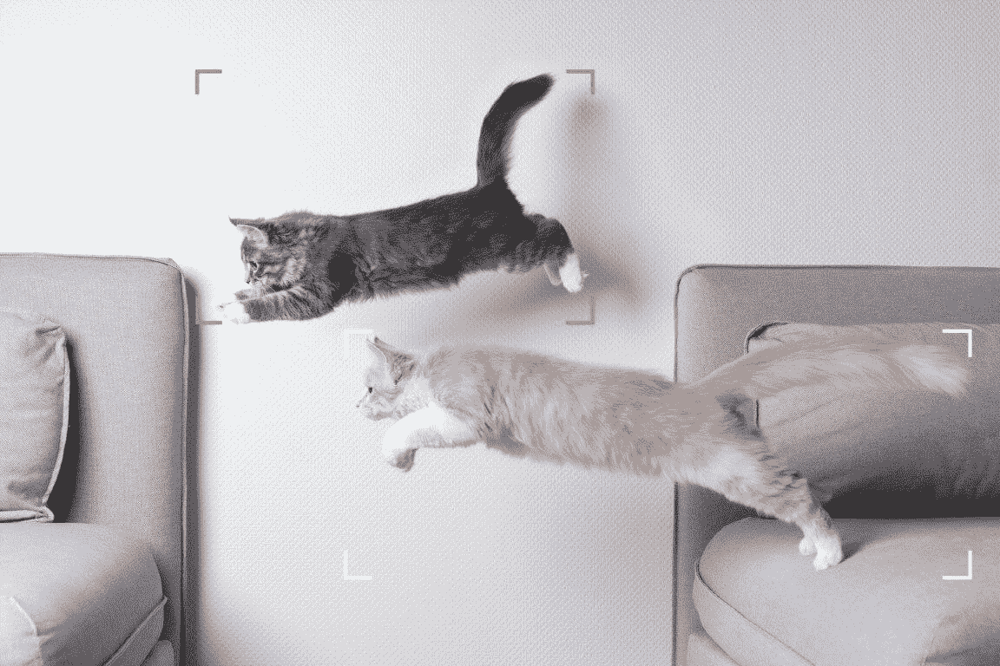
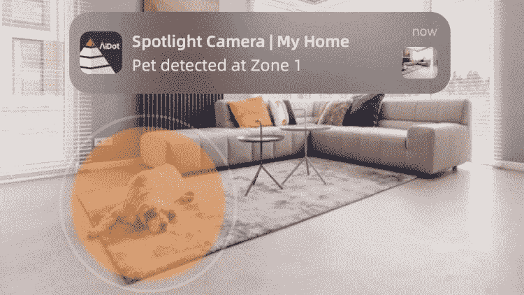

# AiDot 云服务:家庭安全变得智能

> 原文：<https://www.xda-developers.com/aidot-cloud-service-smart-home-security/>

曾经有一段时间，在你的房子里安装一个安全摄像头系统是一项非常昂贵和乏味的任务。除了在房子周围架设电线，还包括安装 DVR 和提供互联网——所有这些都相当昂贵和耗时。

然而，由于技术的进步，家庭安全系统现在变得更好更容易安装。有大量智能安全解决方案可供选择。从亚马逊到谷歌，有很多公司提供这些服务。不过大部分都挺贵的。

在今天的文章中，我们将了解 AiDot 及其提供的家庭安全解决方案。AiDot 的产品不仅是最好的功能丰富的解决方案之一，而且价格也相当实惠。所以，事不宜迟，让我们开始，看看你能为你的房子得到的最好的智能家居安全解决方案。

## 谁是 AiDot？他们提供什么产品？

AiDot 旨在通过可持续解决方案打造未来智能家居。该公司不仅提供经济实惠的智能家居安全解决方案，还提供智能灯、厨房电器甚至智能健身产品等产品。AiDot 是您的设备、助理、虚拟助理和日常规划的枢纽，可以创建您的理想环境。

## AiDot 2K WiFi 摄像头

AiDot 2K WiFi 摄像头是您家中需要的一件安全物品。它不仅具有 2K 视频录制功能，还具有夜视和双向音频功能，是一款理想的安全摄像机。

这款相机可以通过该公司的 AiDot 应用程序(苹果应用商店和谷歌 Play 商店都有)进行控制，但你也可以使用亚马逊 Alexa 和谷歌 Home 设备直接在你的智能家居设备上访问提要。

但最棒的是，AiDot 2K 摄像机具有运动跟踪功能。该相机可以准确地检测和跟踪人类，宠物，包裹，甚至车辆。使用此功能，您可以在外出、工作或度假时密切关注您所爱的人。当摄像头检测到潜在的危险时，它甚至会向您发送实时通知。

虽然你可以使用 SD 卡来录制和存储视频，但最好订阅该公司名为 AiDot Cloud Service 的云服务，因为它可以以极低的成本实现大量有用的功能。

## 为什么您应该将 AiDot 云服务与 AiDot 相机配合使用

AiDot 应用程序与 [AiDot 云服务](https://www.aidot.com/18-month-cloud-service.html?utm_source=PR&utm_medium=xda-developers&utm_campaign=talia)相结合，将用户体验提升到了一个新的水平，实现了全天候监控、人工智能检测、推送通知、24 小时直播等功能。您想了解更多关于这些功能的信息吗？让我们来看看 AiDot 应用程序和云服务的一些功能:

### 全天候监控

 <picture></picture> 

Source: AiDot

如果安保摄像头无法全天候监控你的家，那它们就毫无用处。AiDot 2K WiFi 具有 24/7 监控功能，因此您可以在一天中的任何时间监控您的家庭。您可以从任何地方访问提要，因为它被上传到了云中。此外，如果应用程序发现可疑情况，它会立即通知你，这样你就可以无忧无虑地度过一天。

### 强大的人工智能检测

如上所述，AiDot 2K WiFi 摄像头可以自动检测人类、宠物、包裹，甚至是停在你车道上的陌生车辆。它采用专业级人工智能技术，可以自动区分不同对象的运动及其形状。

 <picture></picture> 

Source: AiDot

所以，如果你想检查你的宠物的活动，或者看看你的包裹是否已经送达，那么我们建议你使用 AiDot 强大的 AI 检测工具。值得注意的是，该功能只有在与 AiDot 云服务配合使用时才能正常工作。

### 宠物看护的数据分析和推送通知

AiDot 不仅为您提供您的家庭直播，还为您提供数据分析，让您更深入地了解您的宠物和家庭成员。它对视频进行分析，从而实现其他智能家庭安全摄像机无法提供的功能。

 <picture></picture> 

Source: AiDot

更详细地描述宠物检测功能，由于数据分析功能，AiDot 可以为您提供宠物行为的详细分析。您可以在房间中定义区域，并检查宠物是否进入或离开该区域。

如果你的宠物长时间不在某个区域，它会向你发送推送通知。此外，这项功能可以帮助您监控宠物的奇怪行为或情绪波动，这些行为或情绪波动表明宠物生病了。

### 家庭监控

与宠物看护类似，AiDot 摄像头系统具有家庭监控功能。使用此功能，您可以在工作时查看您的孩子。摄像机可以专门聚焦在孩子花费大部分时间的地方，如托儿所、游戏围栏和其他地方。

 <picture></picture> 

Source: AiDot

如果你的孩子长时间离开房间的特定区域，它会在你的手机上给你发送一个警报。此外，它可以让您以任何传统婴儿监视器都无法做到的方式来监控宝宝的睡眠模式。得益于双向音频，你甚至可以只使用 AiDot 应用程序与家人通话，确保一切正常。

总的来说，AIDot 云服务和摄像头物超所值。它以合理的价格提供了许多功能，尤其是与竞争对手相比——而且往往比竞争对手更胜一筹。

## 以极低的价格获得 AiDot 云服务和 2K WiFi 摄像头

AiDot 云服务的 18 个月订阅费通常为 95.81 美元，目前价格非常低，仅为 35.29 美元。还有呢？购买 18 个月云订阅的用户还将免费获得价值 60 美元的 AiDot 2K WiFi 相机**。**

 **别忘了去看看 [AiDot 的优惠网站](https://www.aidot.com/?utm_source=KOL&utm_medium=subscribe&utm_campaign=Talia)，那里充斥着每日优惠和闪购。购买该公司的智能照明产品，您可以节省高达 50%的费用。

该公司甚至在脸书创建了一个互动的 AiDot 智能生活小组，你可以在上面与 AiDot 相机的其他用户联系。

我们感谢 AiDot 赞助这篇文章。我们的赞助商帮助我们支付与经营 XDA 相关的许多费用。虽然您可能会在标准 XDA 内容旁边看到赞助内容，但它们将始终被标记为赞助内容，并不一定反映编辑团队的观点。XDA 绝不会通过接受金钱来赞扬一家公司，或以任何方式改变我们的观点或看法，从而损害其新闻诚信。**