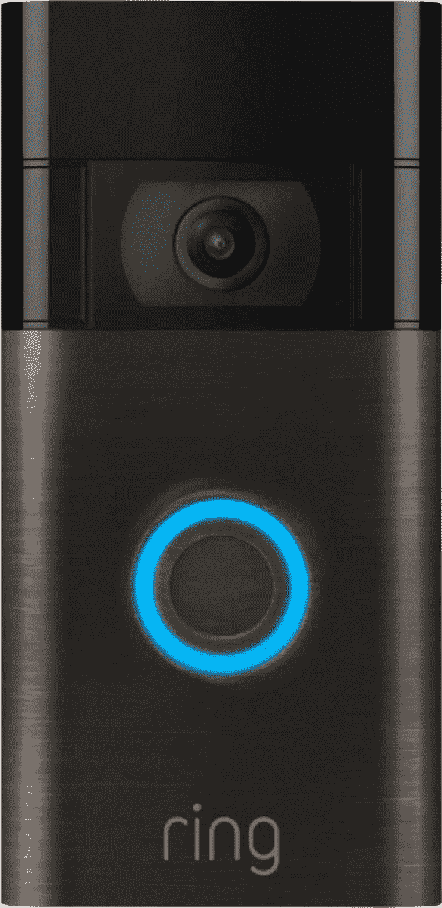

# Alexa 现在会告诉你送上门的人和包裹

> 原文：<https://www.xda-developers.com/alexa-people-package-detection-doorbells-cameras/>

能够在你的[门铃](https://www.xda-developers.com/ring-video-doorbell-pro-2-price-release-date/)上使用亚马逊 Echo 并不是什么新鲜事。但 Alexa 的这一最新功能更进了一步。目前，如果你有任何类型的环形摄像机和亚马逊 Echo Show，你就可以收到警报并在显示器上观看视频。这些摄像头显然具有运动检测功能，现在，你可以将它与配备 Alexa 的[最佳智能扬声器](https://www.xda-developers.com/best-smart-speakers/)结合使用。而且不仅仅是来自 Ring。

亚马逊宣布的新功能将允许 Alexa 在检测到人和包裹时具体通知你。例如，从汽车到猫，任何东西都可以触发 Ring 上的运动检测。这种最新的集成将使用人工智能将它与人类和纸板盒隔离开来。相当整洁。

这项功能将适用于亚马逊旗下 Ring 的摄像头和门铃，以及住所和谷歌巢。偶尔能看到一点跨平台的合作真好。以后添加的人员检测设备包括 Google Nest Cam Outdoor、Nest Cam Indoor、Nest Cam 泛光灯、Nest 门铃(电池)、蜗居 IOTA 和蜗居户外摄像机。但是最初，如果你使用 Ring，你可以立刻启动它。

包检测稍微有限一点，支持通过住所加入的环，但不支持 Google Nest。即使在 Ring front 上，最初也只在 Ring Video 门铃 Pro 2 和 Ring Video 门铃 2020 上使用。

这都要归功于亚马逊的[新 API，这意味着该功能没有理由不能扩展到这三个品牌之外。同样值得强调的是，如果你的相机附带订阅，你就必须付费。谷歌目前对人物检测不收费，但 Ring 和 dode 收费。你还可以将新功能与你的 Alexa 程序挂钩。你所要做的就是在 Alexa 应用中启用相机事件，并确保在你的相机上启用相关的检测功能。](https://developer.amazon.com/en-US/blogs/alexa/device-makers/2022/04/Alexa-object-detection-sensor-api-april-2022)

 <picture></picture> 

Ring Video Doorbell

##### 响视频门铃 3

经济实惠、易于使用的视频门铃和安全摄像头让您高枕无忧。它可以与 Alexa 设备无缝配合。

**via**濒临