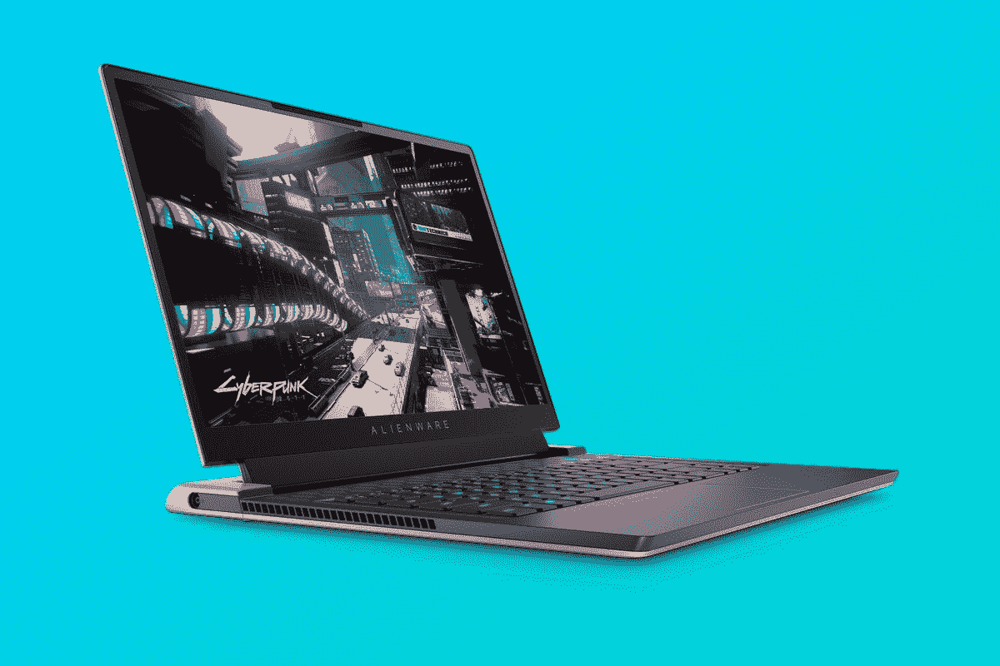

# 外星人 x15 R2 评论:在一个小包装中的大量游戏能力

> 原文：<https://www.xda-developers.com/alienware-x15-r2-review/>

如果你正在寻找一台功能强大、轻薄的游戏笔记本电脑，那么外星人 x15 R2 就是不二之选。它采用了新的四风扇散热设计，重量为 5 磅，厚度不到三分之二英寸，但它仍然配备了最高可达 Core i9 和 Nvidia GeForce RTX 3080 Ti。

有几个缺点，其中之一是它在重负载一段时间后会变得足够热，从而影响性能。此外，虽然我喜欢这个设计，但我不喜欢端口的布局方式，因为在周围有照明的情况下，很难在背面看到它们。

但是我喜欢这个设计。这款笔记本电脑感觉现代而独特，这是我喜欢在游戏笔记本电脑中看到的。如果你想要游戏的便携性，这似乎是[的最佳选择](https://www.xda-developers.com/best-laptops/)。

 <picture></picture> 

Alienware x15 R2

##### 戴尔外星人 x15 R2

外星人 x15 R2 在一个纤薄的封装中使用顶级英特尔处理器和 Nvidia 显卡，将功能和便携性融为一体。

**浏览此评论:**

## 外星人 x15 R2 定价和供货情况

*   外星人 x15 R2 现已上市，起价 2149.99 美元

外星人 x15 R2 现在可以买到，你可以在通常的地方找到它。显然，Dell.com 正在提供它，而且它也可以在百思买和亚马逊上买到。然而，百思买和亚马逊在 SKU 的选择都比戴尔有限得多。

它的起价为 2149.99 美元，将为你提供英特尔酷睿 i7-12700H、16GB LPDDR5 内存、512GB 固态硬盘、15.6 英寸 FHD 165Hz 显示屏和 Nvidia GeForce RTX 3060。虽然基本模型相当昂贵，但它仍然很结实，这很好。其他游戏笔记本电脑将从 8GB 内存、256GB 存储和 GTX 1660 开始，但这款不是。

戴尔发给我的型号配备了酷睿 i7、32GB LPSSR5、2TB 固态硬盘、15.6 英寸 QHD 240Hz 显示屏和 RTX 3070 Ti。这款产品在 Dell.com 的定价为 2909.99 美元。

## 外星人 x15 R2 规格

| 

处理器

 | 第 12 代英特尔酷睿 i7-12700H (24 MB 高速缓存，14 个内核，20 个线程，最高 4.70 GHz 睿频) |
| 

制图法

 | 英伟达 GeForce RTX 3070 Ti，8 GB GDDR6 |
| 

显示

 | 15.6 英寸，QHD 2560x1440，240 赫兹，非触摸，2 毫秒，高级 Optimus，ComfortView Plus，NVIDIA G-SYNC |
| 

身体

 | 359.7 x 277.33 x 15.9 毫米，2.27 千克 |
| 

记忆

 | 32 GB、LPDDR5、5200 MHz、集成式双通道 |
| 

储存；储备

 | 2 TB，M.2，PCIe NVMe，固态硬盘 |
| 

港口

 | 1 个带 PowerShare 的 USB 3.2 第 1 代端口 1 个带 DisplayPort 和电源传输的 USB 3.2 第 2 代 Type-C 端口 1 个带 DisplayPort 和电源传输的 Thunderbolt 4 端口 1 个通用音频插孔 1 个 HDMI 2.1 端口 1 个电源适配器端口 1 个 microSD 卡插槽 |
| 

电池

 | 6 芯 87 瓦时锂离子电池外星人电池卫士 |
| 

照相机

 | 外星人高清(1280x720 分辨率)摄像头，配有双阵列麦克风和 Windows Hello IR 支持 |
| 

声音的

 | 立体声扬声器，立体声高音扬声器 2 W x 2 = 4 W 总计 |
| 

AlienFX 照明区域

 | 可编程多达 1680 万种不同的颜色 |
| 

投入

 | 外星人 xSeries 键盘，带每键 RGB LED AlienFX 照明，包括 N 键翻转技术、多点触控手势和集成滚动功能的高级精密玻璃触摸板 |
| 

连通性

 | 黑仔 Wi-Fi 6 (6E*预认证)AX1675 802.11ax 2x2 无线局域网和蓝牙 5.2 |
| 

案例和颜色

 | 带有高耐久性透明涂层的月光灯，专为防污设计 |
| 

操作系统（Operating System）

 | Windows 11 主页 |
| 

价格

 | $2,909.99 |

这些是戴尔发给我的设备规格。基本款为 2149.99 美元。

## 设计:厚度不到三分之二英寸

*   外星人 x15 被设计得又薄又轻
*   它在后端口周围有 RGB 照明框

像大多数外星人系列一样，x15 R2 具有独特的未来感。它有一种叫做月光的颜色，米色的盖子和黑色的边。在盖子的右下角有一个印刷的“15”，你会在中间找到一个用 RGB 灯光照亮的外星人标志。

它的设计也考虑到了热量。这个东西只有 0.63 英寸薄，重量只有 5 磅，而且这一切都没有牺牲功率。在引擎盖下，它实际上有四个风扇，使用双相对出口设计，所以空气是通过内部通过机箱。还有一种新的元素 31 热化合物，这意味着提供 25%的热阻提升。

联想 2.0 的设计看起来时尚、前卫、独特。

到目前为止，我们已经谈论了它如何时尚，如何轻薄，以及如何为创新的热量设计，这就剩下两件事:端口和照明。正如你所想象的，这款游戏笔记本电脑上有很多 RGB 照明——尽管这并不夸张，这很好——但端口也很重要。

除了右边的电源插孔和左边的耳机插孔，所有的端口都在背面。只有一个 USB Type-A 端口，有两个 USB Type-C 端口(其中一个是 Thunderbolt)，HDMI 2.1，和一个 microSD 卡插槽。整个面板周围环绕着一条 RGB 光带。

老实说，我讨厌这一切。RGB 照明肯定很漂亮，但从功能上来说，它很乱。我们跟着名单下去吧。如果您一直插着电源，例如外接显示器，那么后面的端口就很有意义。大多数公司都这样做，在旁边留一两个端口，这样你就可以偶尔插入外围设备，如控制器、耳机或其他你可能不会经常使用的东西。我完全不明白的是电源接口在旁边。它会碍事，如果端口在背面，这个问题就不会存在了。

回到后面的端口，RGB 灯光虽然漂亮，但却是个问题。笔记本电脑背面有端口的一个问题是，你必须知道它们在哪里。联想通过在端口上贴标签解决了这个问题。不仅没有可见的标签，而且光线使得端口很难看到。你只需要在后面摸摸，就能找到你要找的那个形状的洞。

除此之外，我非常喜欢这个设计。这只是一种体验的乐趣，拥有一台如此轻薄的游戏笔记本电脑真是太棒了。

## 显示器:QHD，240 赫兹，质量

*   这款显示器非常适合游戏笔记本电脑
*   不幸的是，网络摄像头是 720 像素的

15.6 英寸 16:9 显示屏有三种选择。可以在 1080p 165Hz，1440p 240Hz，或者 1080p 360Hz 得到。戴尔送给我 1440p 240Hz 的型号，我真的很喜欢它。我觉得 1440p 是 15.6 英寸屏幕的最佳选择。在这个尺寸下，你会看到 1080p 分辨率的像素；然而，有两个原因你可能仍然得到 FHD。一是它是最便宜的型号，刷新率为 165 赫兹。另一个是它在 360Hz 刷新率的模型中。事实上，许多严肃的游戏玩家可能会为了帧率而牺牲分辨率，这是完全可以理解的。

就我个人而言，我喜欢看起来漂亮的显示器，以及提供您想要的游戏性能。这是我从这台电脑的屏幕上发现的，也是我发现游戏笔记本电脑中罕见的东西。游戏笔记本电脑通常以性能和响应速度的名义牺牲一切，但这实际上是一个非常好的显示器，即使你根本不玩游戏。

根据我的测试，它支持 100%的 sRGB、90%的 NTSC、92%的 Adobe RGB 和 97%的 P3。即使对于非游戏笔记本电脑来说，这也是非常好的结果。这意味着这是一台优秀的电脑，适合可能正在进行照片或视频编辑的创作者，至少就显示器而言是如此。

亮度最大值为 417.9，这是可靠的，尽管对比度仅最大值为 860:1，这肯定看起来很低。

外星人 x15 在游戏和其他方面都有出色的显示。

屏幕三面有窄边框，不幸的是，网络摄像头仍然是 720p。如果你打算做大量的流媒体，或者甚至你可能会使用这款笔记本电脑进行视频通话，这将是一个问题。毕竟，你可能不会有单独的笔记本电脑用于游戏和工作。在笔记本电脑中看到 720p 网络摄像头仍然是一种耻辱。然而，它有一个红外摄像头用于面部识别，这太棒了。任何种类的生物认证似乎永远不会进入游戏笔记本电脑，所以很高兴看到这一点。

## 键盘:它有所有的 RGB 照明

*   键盘配有每个键的 RGB 照明

键盘使用标准的 1.5 毫米 Chiclet 风格的按键，这很好。感觉它不像是为打字而设计的，更像是游戏，当然，尽管我是在上面打这篇评论。感觉很好。关于键盘，最值得注意的是每个键的 RGB 照明。

就像我之前说的，真的感觉 RGB 照明只是在足够的地方感觉良好，但它并没有过度。盖子上有外星人的标志，后端口的周长，还有键盘。你可以通过外星人指挥中心应用程序来控制这一切，奇怪的是它并没有预装。我不得不从微软商店买到它。

你还可以使用外星人指挥中心定制电源配置文件，在玩耗电游戏时超频 CPU 和 GPU。

可点击的触摸板有点小，对于这么大的笔记本电脑来说，它实际上感觉太小了。我是触摸板的忠实粉丝，它利用了所有可用的空间，而这并不能真正做到这一点。这是一个很好的触摸板，它很好。

## 性能:它是如此的薄，如此的强大

*   戴尔发给我的设备装有酷睿 i7-12700H、RTX 3070 Ti 和 32GB RAM，但它的最大容量是酷睿 i9 和 RTX 3080 Ti

这台笔记本电脑性能强劲。正如我之前所说，您可以通过外星人指挥中心进一步提升性能。我还要说，这款笔记本电脑的性能实际上比其他类似规格的笔记本电脑要好。

正如你所料，虽然照片和视频编辑很棒，但我还是要谈谈游戏。我在这个单元上玩的主要游戏是 *Forza Horizon 5* 及其新的*风火轮*扩展包(明确地说，它很棒，你应该玩它)。我的主要问题是持续的表现。在第一次推出 *Forza Horizon 5* 时，它暗示了极致的图形，考虑到这款笔记本电脑的强大，这并不奇怪，当我第一次开始玩时，它太棒了。

大约半小时后，我遇到了重要的问题。游戏死机，并表示它没有 CPU 资源来玩，这是游戏笔记本电脑的一个主要问题。毕竟，如果你想赢，你最不想要的就是这种破坏。在大约 30 秒的冻结屏幕后，我可以在短时间内再次驾驶，但一旦开始，就不会停止。此时，触摸笔记本电脑后部的任何部分都非常清楚这东西是热的。

强大的性能，您还可以通过外星人指挥中心提升性能。

有一些变通办法。就像我说的，你可以提高外星人指挥中心的性能。另一个是你可以把游戏中的图形调低到一个较低的设置。

虽然我可以很容易地在 *Forza* 中复制这个问题，但我在其他游戏中没有经历过，因为我随机决定再次玩遍*Halo:The Master Chief Collection*中的所有战役。

性能的底线是它是惊人的，但在一段时间的高负荷下，您可能需要做一些调整。

|  | 

外星人 x15 R2 酷睿 i7-12700H，RTX 3070 Ti

 | 

[联想军团 5i Pro](https://www.xda-developers.com/lenovo-legion-5i-pro-2022-review/) 酷睿 i7-12700H，RTX 3070 Ti

 | 

[微星攻略 GE76](https://www.xda-developers.com/intel-core-i9-12900hk-review/) 酷睿 i9-12900HK，RTX 3080 Ti

 |
| --- | --- | --- | --- |
| 

PCMark 10

 | 7,141 | 7,076 | 7,820 |
| 

3DMark 时间间谍

 | 10,443 | 10,391 | 12,287 |
| 

Geekbench 5 单/多

 | 1,768 / 13,200 | 1,787 / 9,209 | 1,774 / 12,630 |
| 

Cinebench R23 单/多

 | 1,776 / 16,182 | 1,714 / 9,549 | 1,833 / 14,675 |
| 

VRMark 橙色/青色/蓝色

 | 11,066 / 8,834 / 3,073 | 13,593 / 9,480 / 3,176 | 11,452 / 11,542 / 3,815 |
| 

交叉标记整体/生产力/创造力/响应能力

 | 1,830 / 1,670 / 2,123 / 1,543 | 1,817 / 1,738 / 1,943 / 1,702 |  |

正如你所看到的，它比类似规格的联想军团 5i 略胜一筹。

从 CrystalDiskMark 测试来看，Micron 3400 固态硬盘的读取速度比我在笔记本电脑上见过的其他 PCIe 4.0 固态硬盘稍慢，写入速度正好在中间。不管怎样，有了 PCIe 4.0，你真的不会出错。这比我们过去看到的 PCIe 3.0 要快得多，你可以期待更短的加载时间。

## 你应该买外星人 x15 R2 吗？

如果您正在寻找轻薄的产品，外星人 x15 R2 是一款非常棒的游戏笔记本电脑。

**谁应该买外星人 x15 R2:**

*   想要强大功能，但又经常在旅途中的游戏玩家
*   想要一台具有独特未来设计的笔记本电脑的游戏玩家

**谁不应该购买外星人 x15 R2:**

*   希望在电脑上玩游戏，但不会经常带着电脑外出的人
*   任何不需要这种力量的人

外星人 x15 R2 的主要好处是，你可以在轻薄的包装中获得强大的功能。这意味着这款笔记本电脑适合在旅途中玩游戏。如果你一直在一个地方玩游戏，你可能会更倾向于一个塔或者建筑。