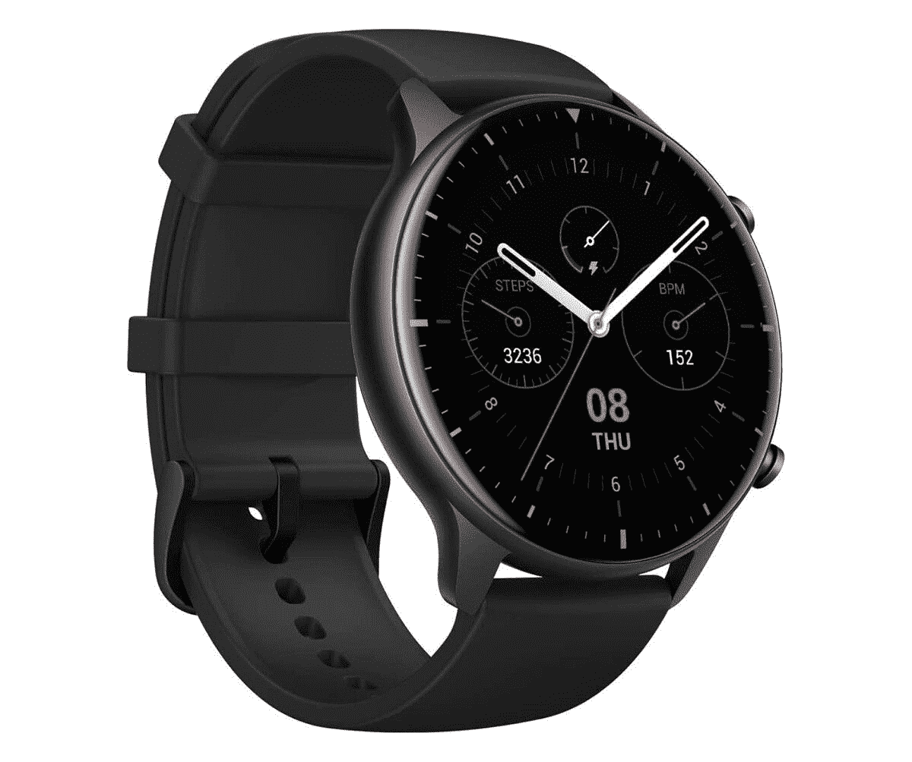

# Amazfit GTR 2 智能手表评论:多功能和诱惑

> 原文：<https://www.xda-developers.com/amazfit-gtr-2-review/>

Amazfit 是一个相当受欢迎的可穿戴品牌，由华米支持，华米是一家生产超受欢迎的 Mi Band 健身追踪器的公司，由小米及其联合创始人雷军部分拥有。尽管与小米等主要品牌有这种联系，但华米和 Amazfit 品牌一直以来都是自主运营的，并推出了一些最优秀的性价比健身产品。今年 10 月，华米在全球发布了 Amazfit GTR 2 和 GTS 2。这些高端智能手表在设计上比 [Amazfit GTR](https://www.xda-developers.com/huami-amazfit-gtr-review-affordable-smart-watch/) 和 [Amazfit GTS](https://www.xda-developers.com/huami-amazfit-gts-review-surprisingly-different-apple-watch-fitness-tracker-smartwatch/) 略胜一筹，解决了过去几代产品的主要痛点。继任者还配备了 Alexa 集成、板载存储、SpO2 监控等更多功能。

本月早些时候, [Amazfit GTR 2](https://www.xda-developers.com/amazfit-gtr-2-amoled-display-blood-oxygen-monitoring-pre-order-india/) 和 [GTS 2 在印度](https://www.xda-developers.com/amazfit-gts-2-amoled-display-blood-oxygen-monitoring-pre-order-india/)上市，该公司将 Amazfit GTR 2 发给我们进行评估。这篇评论讨论了从第一代延续下来的现有功能的改进以及使 Amazfit GTR 2 成为更智能手表的新功能。这些结论是在使用了近两周之后得出的。

## Amazfit GTR 2 规格

### Amazfit GTR 2 规格:点击/单击以展开

| 

规范

 | 

Amazfit GTR 2

 |
| --- | --- |
| 尺寸和重量 | 

*   46.4 x 46.4 x 10.7mm 毫米
*   运动版:31.5 克(不带表带)
*   经典版:39g(无表带)

 |
| 材料 | 运动版:铝合金外壳，聚碳酸酯背面经典版:精钢外壳，聚碳酸酯背面 |
| 腕带 | 运动版:硅胶带经典版:硅胶加固皮革可互换，22 毫米 |
| 和睦相处 | 安卓、iPhone |
| 社会学 | 未指明的 |
| RAM/存储 | 未指明的 |
| 网络 | 用于文件传输的 2.4GHz 无线局域网 |
| 显示 | 1.39 英寸 AMOLED (454 x 454 像素) |
| 连通性 | 蓝牙 v5 BLE |
| 全球（卫星）定位系统 | GPS + GLONASS |
| 传感器 | 

*   PPG 心率传感器
*   六轴加速度计
*   三轴地磁传感器
*   晴雨表
*   电子罗盘
*   环境光传感器

 |
| NFC 支付 | 不 |
| 电池 | 471 毫安时 |
| IP 等级 | 无官方 IP 评级；在淡水中防水深度可达 50 米 |

* * *

## 设计

Amazfit GTR 2 带有第一代 GTR 的许多遗传特征。圆形设计在许多方面都是 Amazfit GTR 的标志，在 GTR 2 上得以保留。两个表冠按钮——其中一个带有红色标记——位于表盘右侧，与上一代型号完全相同。然而，顶部按钮的功能已经改变，不再像 Home 按钮一样，它现在可以打开菜单；我们将在后面专门讨论用户体验的部分中详细讨论它。

与使用陶瓷的第一代 Amazfit GTR 不同，GTR 2 的边框由玻璃制成，并与显示屏的防护玻璃融为一体。边框的外围是弯曲的，而不是尖锐的设计。尽管显示屏尺寸与上次相同，但集成在显示屏内的表圈使表盘看起来更大，尤其是在使用深色背景的表盘时。曲面玻璃设计与华米阵营的另一款智能手表惊人地相似——Zepp E Circle——也是最近推出的。该设计看起来也类似于三星 Galaxy Watch Active 和 Active 2，但不支持边框上的触摸手势。显示器与铝机身相接处的一条薄带是透明的，给人一种玻璃漂浮的错觉。

这款腕表的变体表身由铝合金制成，表面经过金属拉丝处理。还有另一种不锈钢的变体，但在印度需要₹1,000 额外的费用。两种型号的底板均由聚碳酸酯制成。Amazfit 通过将铝合金型号称为“运动版”，将不锈钢型号称为“经典版”，帮助买家更容易区分型号。顾名思义，前者更适合运动，因为运动版的重量只有~31 克(不含表带)。经典版也没有明显变重，仅重 8g。除了重量优势之外，铝合金型号不太可能比更亮的不锈钢型号更好地隐藏划痕。

[sc name = " pull-quote-right " quote = "铝合金使得 GTR 2 非常轻，戴在手腕上几乎看不到。"]

从长远来看，我更喜欢使用健身带而不是智能手表，因为它们没有干扰，不会让我的手腕负重，而且在健身和睡觉时特别方便。得益于它的轻便，同样的道理也适用于 Amazfit GTR 2，它温和低调，不会让你在想要休息一天的时候就想摘下它。

Amazfit GTR 2 没有 IP 等级，但你可以在淡水中获得高达 5 个大气压或 50 米(约 164 英尺)的防水性能。这意味着你可以在淡水池里游泳，或者在淋浴时戴着手表，而不用担心会损坏它。但是，不建议在海里或任何其他盐水体中游泳时佩戴手表。

运动版配有硅胶表带，而经典版配有硅胶加固的皮革表带，就像去年的型号一样——尽管是黑色而不是棕色。表带上的带扣也采用了与两款表盘相同的金属制成。虽然这一举措可能不会被所有用户接受，但 Amazfit GTR 2 使用标准的 22 毫米表带，您可以使用自己选择的配件表带。值得注意的是，衣服上的纤维或汗渍比皮革更容易沉积在硅胶带上。

还有一点需要注意的是，与第一代 Amazfit GTR 不同，它有 42 毫米和 47 毫米两种型号，Amazfit GTR 2 只有一种尺寸——46 毫米。

在底部，Amazfit GTR 2 底部有一个扬声器和麦克风。这些都是 Amazfit 产品线的新成员，当与智能手机配对时，用户可以从手表上接听电话。扬声器也可以用来听智能手表上存储的音乐，而麦克风可以用于语音命令，显然是由 Alexa 驱动的。

总的来说，考虑到其简单而优雅的设计，Amazfit GTR 2 感觉非常合适。由于其轻量级的构建，可用性得到了进一步增强。

* * *

## 显示

Amazfit GTR 2 表盘的可用部分包括一个 1.39 英寸的 AMOLED 显示屏，就像上一代一样。显示屏不仅尺寸相同，而且分辨率也是 454 x 454 像素，像素密度为 326ppi。这是智能手表上像素密度最高的显示屏之一，考虑到 Amazfit GTR 2 的价格，这既令人印象深刻又令人惊讶。由于内置了控制自动亮度的环境光传感器，显示器相当明亮，在室内和室外都一样好。作为 AMOLED 显示器，深黑色使黑色边框能够轻松融入显示器。

该显示器在玻璃顶部有一层防指纹涂层。Amazfit GTR 2 上的顶部玻璃没有选择大猩猩玻璃等相对受欢迎的电阻功能，而是受到 oDLC ( **o** 光学**D**iamond-**L**ike**C**carbon)涂层的保护。顾名思义，这种技术利用磁控溅射等复杂技术在玻璃上沉积一层类金刚石碳膜，提高了玻璃的硬度和抗划伤性。

[sc name = " pull-quote-left " quote = " amaz fit GTR 2 上的 AMOLED 显示屏非常令人满意。"]

由于采用了 AMOLED 面板，显示屏的色彩强烈而饱和，包括深黑色。Amazfit GTR 2 的显示屏在户外和强光下都很容易阅读。此外，智能手表配有环境光线传感器，允许根据外部光线调整显示器亮度。像许多其他流行的智能手表一样，显示屏可以通过用手掌覆盖来锁定。也可以通过轻弹手腕、轻击手腕或按下带有红色强调的菜单按钮来打开显示屏。

如果您希望手表显示基本信息，如时间、步数、日期和时间等，AMOLED 显示屏还支持 AOD(常亮显示)。，一整天。为此，你可以选择预设的数字或模拟 AOD 设计，这种设计从去年的 Amazfit GTR 开始提供，或者根据表盘设置的定制 AOD 屏幕。

Amazfit GTR 2 上的 AMOLED 显示屏在质量和可用性方面都令人垂涎。防指纹涂层感觉不仅仅是一个营销噱头，你不会觉得需要非常频繁地擦拭显示屏。与此同时，显示器的触摸反应感觉很好，比第一代 Amazfit GTR 更好。最后，弯曲的边框允许手指在与显示屏互动时有更多的空间移动，即使它的大小与上一代产品相比没有变化。

* * *

## 五金器具

华米没有公布 Amazfit GTR 2 内部硬件的任何细节，包括其 CPU 或 RAM。然而，它确实透露了智能手表配有 3GB 的内部存储空间，专门用于存储车载音乐。这意味着实际总存储量大于 3GB，但 Amazfit 没有提到这一点。Amazfit GTR 2 支持 2.4GHz Wi-Fi，用于将音乐文件从手机传输到智能手表，而蓝牙用于较小的文件传输，如系统更新和 watchfaces。与 Amazfit Stratos 和 Verge 不同，GTR 2 不像 USB 大容量存储那样连接到 PC。

对于健身跟踪，Amazfit GTR 2 号配备了华米自主研发的第二代“生物跟踪器 2”PPG(光电容积描记术)传感器。该传感器用于测量心率和血液中的氧饱和度(通常称为 SpO2)。除了 PPG 传感器和上述环境传感器，手表还配有加速计、陀螺仪、3 轴地磁传感器和气压传感器。这款手表还内置了 GPS 和 GLONASS 支持，这样你就可以跟踪你的健身路径，而不必一直随身携带智能手机。

## 用户体验

与第一代 GTR 和 GTS 相比，Amazfit GTR 2 用户界面进行了一系列外观升级。首先，新的智能手表有一系列新的、更清晰、更有活力的图标。

[sc name = " pull-quote " quote = " amaz fit GTR 2 通过新图标、鲜艳的颜色、详细的指标和对应用程序的快速访问获得了改进的 UX。"]

除了图标，Amazfit GTR 2 还获得了类似于 Android 's Wear OS 的新磁贴，用户可以通过在主屏幕上左右滑动来快速访问不同菜单项的重要信息。这些磁贴包括 PAI、活动目标状态、心率详情、天气、车载音乐控制。您还可以在其中一个磁贴上添加多达五个名为“快捷卡”的小部件，用于快速操作，如警报、心率、天气、SpO2、PAI 和活动目标监控。您可以通过按顶部的皇冠按钮来访问菜单，而底部的按钮是预先分配的，用于启动活动索引，您可以在其中选择要跟踪的活动。菜单按钮也可以作为主屏幕按钮。

你可以从主屏幕向上滚动打开通知，并选择可以从 Amazfit(现在称为 Zepp)配套应用程序向你发送通知的应用程序。这些通知中的每一个都以卡片的形式出现，你可以通过点击它们从列表中展开它们。您不能清除手表上的通知，它们将保留在通知面板中，直到您从 smartphone 中清除它们。此外，您不能直接从智能手表回复通知。

此外，您可以在显示屏上向下滚动以启动主屏幕，从而启动以下快速操作切换:

*   显示亮度，
*   请勿打扰选项，
*   手电筒模式，在这种模式下，屏幕以全亮度亮起，白色背景模拟手电筒
*   屏幕锁定，
*   音量控制，
*   节电模式，
*   查找电话，
*   唤醒模式——激活后，显示屏会持续显示 20 分钟
*   剧院模式——将显示屏亮度保持在最低，并使通知静音

除了新的和改进的用户界面，Amazfit GTR 2 还获得了一些以前型号中没有的功能。其中包括新的压力管理功能，可以在没有任何运动的情况下检测任何异常的心脏活动。

[sc name = " pull-quote-right " quote = " amaz fit GTR 2 具备 Mi Band 5 的压力管理功能，但缺乏引导式呼吸练习。"]

你的压力水平由 0 到 100 之间的数值表示，0-39 表示放松，40-59 表示正常，60-79 表示中度，80-100 表示高度压力。该应用程序的功能描述还指出，一定程度的压力或紧张实际上对你的表现和精神刺激是健康的，因此，他们在这里使用了“正常”一词。中等压力可能是担心的原因，而高压力可能表明有高血压或任何心脏病的风险。然而，与[小米 Mi Band 5](https://www.xda-developers.com/xiaomi-mi-band-5-review/) 不同的是，Amazfit GTR 2 上的压力功能之后没有引导呼吸运动功能。

正如我上面提到的，车载音乐是 Amazfit GTR 2 支持的另一个重要功能。这款智能手表配有 3GB 的音乐专用存储空间。有了储存在手表上的音乐，您可以将曲目添加到收藏夹或创建播放列表。音乐可以通过内置扬声器或任何其他通过蓝牙直接连接到手表的音频设备播放。为此，你甚至不需要依赖你的智能手机，当你踏上健身之路时，可以方便地把它留在身后。虽然华米没有指定 Amazfit GTR 2 支持的蓝牙音频编解码器，但音频质量表明它只支持 SBC 连接，而不支持 AAC，这可能会让发烧友失望。因此，如果用户喜欢携带智能手机听音乐，或者出于其他任何原因，他们也可以使用智能手表来控制连接的智能手机上的音乐播放。

[sc name = " pull-quote-left " quote = "用 Amazfit GTR 2 打电话很刺耳。语音命令也不会做得更好。”]

Amazfit GTR 上的扬声器也可用于接听电话。您可以启用 Zepp 应用程序选项，然后将智能手表作为蓝牙音频附件连接。该功能允许你直接从智能手表上接听电话，而无需伸手拿起手机，但你必须确保手机不要太远。在我的使用中，当手机和智能手表之间的距离小于 2 米(约 6.5 英尺)时，我会接到电话，如果距离增加，通话中断的可能性很大。请记住，您不能从智能手表上拨号或呼叫联系人。

最后，除了听音乐和打电话，Amazfit GTR 2 还支持语音命令。华米表示，Alexa 为这些语音命令提供了动力，但你可以扭动手腕一次，然后说出类似“开放天气”、“我的心率是多少”的命令，而不是说“Alexa”来启动语音命令。或者“开始跟踪我的锻炼”等。虽然该功能在理论上听起来很酷很有用，但它可能不会完全按照营销的方式执行。在我的使用过程中，只有在安静的环境下，手表才能理解语音命令，这意味着当你在外面或嘈杂的健身房内时，它很少会起作用。此外，虽然该特征被设计成便于以“打开”开始的命令...”，您需要手动关闭应用程序，并使用手表的菜单/主屏幕按钮返回主屏幕，以确认您的下一个命令。

我在使用智能手表时遇到了一个值得注意的问题，那就是它无法自动将天气与准确位置同步，尽管它可以毫无问题地跟踪我的户外活动。所以，我必须在 Zep 应用程序中手动输入我的位置，它有一个相当短的城市简介。我不确定这是 Amazfit GTR 2 的普遍问题还是我的单位特有的问题，但这值得一提。

即使承认它的缺点，Amzafit GTR 2 的用户体验非常方便，比旧的 GTR 和这个价格段的大多数其他设备都好。除了改进的用户体验和新功能，Amazfit GTR 2 还获得了更好的健身跟踪功能，这将在下一节中讨论。

* * *

## Zepp(原 Amazfit)配套应用

Amazfit 应用程序，就像 Amazfit GTR 2 上的用户界面一样，也经过了彻底的改革，现在被称为 Zepp。这似乎让这个品牌在西方世界更容易发音和记忆。今年早些时候，华米还为美国推出了 Zepp E Circle 智能手表。该应用程序的变化主要是新的颜色和图标，但呈现的信息与以前几乎一样。在主页上，Zepp 应用程序为您提供了与健身相关的数据概览，如每天的步数、睡眠、燃烧的卡路里、心率、PAI 和身体活动的详细信息。如果你有华米或小米的另一款智能工具——像小米数字体重秤，概览页面也会显示你的体重、身体成分、身体质量指数等。您可以通过点击主屏幕上的相关项目来查看与身体活动或睡眠相关的详细信息。

[sc name = " pull-quote-right " quote = " Zepp 应用程序看起来比 Amazfit 应用程序更好，但功能几乎相同。"]

接下来，你可以前往享受页面，在那里你会发现诸如闹钟，提醒，语音命令教程，手表脸，目标设置，通话设置等选项。

然后，在配置文件页面上，您可以找到您的活动设备，并可以进入特定设备的设置菜单。在这个页面上，你可以看到各种选项来改变表盘，应用程序或快捷卡的顺序等。您还可以搜索系统更新，通过选择哪些应用程序在智能手表上显示通知以及何时显示其他提醒来选择通知设置。

总的来说，Zepp 应用程序看起来比 Amazfit 应用程序有所改进，视觉整容是主要原因之一。有一些多余的选项，但我实际上很欣赏华米为同一设置提供多个选项，以便用户可以很容易地从一组功能中找出不同的选项。

* * *

## 健身追踪

Amazfit GTR 2 支持 12 个类别的全面活动跟踪:跑步和越野跑，跑步机，步行，游泳池和公开水域游泳，徒步旅行，椭圆训练机，室内或室外自行车运动，以及免费训练或滑雪。但是，它并不局限于这些活动，还可以用于跟踪各种各样的其他活动。在我看来，一些最令人兴奋(和/或有趣)的运动包括竞走、自行车越野赛、钓鱼、跑酷、健美操、普拉提、瑜伽、各种舞蹈形式、太极、跆拳道、呼啦圈、雪橇等等。在“其他”类别中还有很多其他的活动。有理由相信，Amazfit GTR 2 只测量这些活动的主要指标(如心率和足部运动)，可能不如更高级的智能手表准确，后者也使用其他传感器的数据。

智能手表能够测量连续的心率。虽然 Zepp 应用程序只允许你将最小间隔设置为 1 分钟，但手表测量心率和检测心率变化所需的时间要少得多，几乎每 15-20 秒钟一次。这些数据可以由任何第三方配套应用程序读取和呈现，如[Notify&Fitness for amaz fit](https://play.google.com/store/apps/details?id=com.mc.amazfit1&hl=en_IN&gl=US)。

### 个人事故保险（Personal Accident Insurance 的缩写）

和其他 Amazfit 设备一样，Amazfit GTR 2 也支持个人活动智能(PAI ),这是一种注册商标的健康指标，它结合了来自所有不同传感器的数据，并根据你的日常活动给你评分。分数是根据每个人的年龄、静息心率、性别等不同而计算出来的。，因此对每个用户都是个性化的。

PAI 由一个数值表示，该数值是根据您在过去七天内的所有身体活动计算得出的。随着你每天的努力，你会获得一些积分，并增加这个值。华米建议，为了健康的生活方式，用户必须保持 100 或以上的 PAI 值。由于 PAI 是基于过去七天的活动，如果你退出体育活动(就像我在假期期间所做的那样)，这个数字也可能会下降。

虽然 PAI 是一个有用的增长指标，并且是针对每个用户单独计算的，但华米的 Zepp 应用程序也提出了用户可以提高这一价值的方法。

### 睡眠

除了详细的健身跟踪，Amazfit GTR 2 可以很好地跟踪睡眠。与旧型号相比，Amazfit GTR 2 还可以跟踪夜间浅睡和深睡期间的快速眼动睡眠。除了监测你的睡眠质量，智能手表还可以测量你整晚的心率。如果你喜欢白天小睡，Amazfit GTR 2 可以跟踪白天上午 11 点至下午 6 点之间的小睡。然而，在此期间，它只记录浅度和深度睡眠，而不记录快速眼动睡眠。Zepp 应用程序通过将你的睡眠和清醒时间以及你的浅度、深度或快速眼动睡眠值与理想值进行比较，为你提供改善睡眠质量的建议，并给你一个最高 100 分的分数，100 分代表理想睡眠。

除了跟踪不同睡眠模式的周期，Zepp 应用程序还会记录你醒来的次数或睡觉时翻身的次数。另一个功能是利用血氧浓度，也就是 SpO2 值，来监测夜间的呼吸质量。这项功能目前处于测试阶段，但可能会给你一些建议，告诉你如何在晚上睡得更舒服。

### SpO2

Amazfit GTR 2 配备了一个专用传感器来测量血红蛋白中的氧浓度，这个值通常被称为 SpO2，以百分比形式测量。对于任何肺部健康的人来说，SpO2 值在 95%和 100%之间被认为是理想的，任何低于 95%的值都可能令人担忧。患有慢性肺部疾病的患者，如 [COPD](https://en.wikipedia.org/wiki/Chronic_obstructive_pulmonary_disease) 的患者，其血氧浓度值要低得多。SpO2 值也随着海拔的升高而降低，因为随着我们远离海平面，空气变得越来越稀薄。目前，低于正常的 SpO2 值也可能是新冠肺炎的早期症状。当然，每个感染新冠肺炎病毒的人可能都不会出现呼吸困难或任何症状；因此，仅仅 SpO2 不能作为致命病毒的明确诊断。

Amazfit GTR 2 上的 SpO2 测量命中较少，未命中较多。

当谈到 Amazfit GTR 2 的 SpO2 测量时，它低于预期。测量大约需要一分钟，在此期间，您必须将智能手表紧紧地绑在手腕上。测量还需要你保持静止，并保持前臂在一个平坦的表面上，如桌子。尽管做出了这些努力，智能手表平均只能测量三分之一的 SpO2 值。

Amazfit GTR 2 无法有效记录 SpO2 值，这也让我怀疑它在夜间测量呼吸统计数据的能力。

* * *

## 电池

Amazfit GTR 配备了 471 毫安时的电池，比第一代 GTR 大 15%左右。凭借最低限度的功能，这款智能手表据称可持续使用 38 天。另一方面，我考虑了每一个可能的特征来确定最小的备用电池。在过去两周的使用中，我开启的功能包括:

*   一直在展出，
*   全天候心率监测，
*   睡眠追踪，
*   睡眠呼吸分析(即夜间连续 SpO2 测量)，
*   全天压力监测，
*   活动检测，这意味着在身体活动期间心率检测的间隔更短，以及
*   每天至少一个小时的室外定位 GPS。

[sc name = " pull-quote-right " quote = " amaz fit GTR 2 上的备用电池令人欣喜。"]

打开所有这些功能后，我每次充满电可以使用 4 天。最近从需要每天充电的 OPPO 手表上换下来，这确实令人愉快。此外，电池节电功能可以通过测量步数和睡眠数据来延长电池寿命。在使用电池保护程序时，我可以在剩余 7%电池的情况下获得近 10 个小时的备用电池，在此期间，手表还可以跟踪五个小时的睡眠。遗憾的是，在模式下没有办法关闭睡眠追踪；否则，备份时间可能会更长。

Amazfit GTR 2 的包装盒中有一个充电底座，可从 USB 获取电源，并通过 pogo 引脚连接器向智能手表供电，这些连接器与手表背面的电极对齐。使用内置充电器，Amazfit GTR 2 需要大约 2 小时才能充满电，这与官方声称的 2.5 小时充电时间相符。

* * *

## 结论

在我去年的 [Amazfit GTR](https://www.xda-developers.com/huami-amazfit-gtr-review-affordable-smart-watch/) 评测中，我强调了智能手表是最具视觉吸引力的智能手表之一——主要是因为它明亮的显示屏和皮革表带。今年，Amazfit GTR 2 继承了它的优点，同时也解决了上一代产品的大多数问题。设计上的微小改进至关重要，但最大的影响是用户界面现在更加流畅，智能手表现在支持板载存储。除了这些特性，新的 SpO2 传感器可能会安抚一些有耐心处理它的统计爱好者。

尽管有这么多改进和新功能，Amazfit GTR 2 可能不是完美的智能手表。一些用户甚至可能会争论将其称为智能手表，因为它缺乏对第三方应用的支持。但当我们看智能手表的价格时，所有这些期望都被抵消了。Amazfit GTR 在美国的售价为 179 美元，在英国为 159 美元，在印度的₹12,999 为 177 美元左右，物超所值。

它缺少一些软件功能，特别是引导呼吸和跟踪月经周期——这两项功能在便宜得多的 Mi Band 5 上都有——但这些功能可以随着时间的推移通过软件更新来添加。在硬件方面，Amazfit GTR 2 是廉价智能手表市场的有力竞争者，对于那些寻求更多存储空间和更好的社区支持的人来说，它可能是一个很好的选择，以对抗像 [Honor Magic Watch 2](https://www.xda-developers.com/honor-magic-watch-2-review/) 这样的产品。如果你想要一个方形表盘，你可以看看 Amazfit GTS 2，它也与 Amazfit GTR 2 一起在全球和印度推出。

 <picture></picture> 

Amazfit GTR 2

##### Amazfit GTR 2

Amazfit GTR 2 是华米推出的两款新智能手表之一，尽管价格不高，但具有高级功能和广泛的健身跟踪功能。