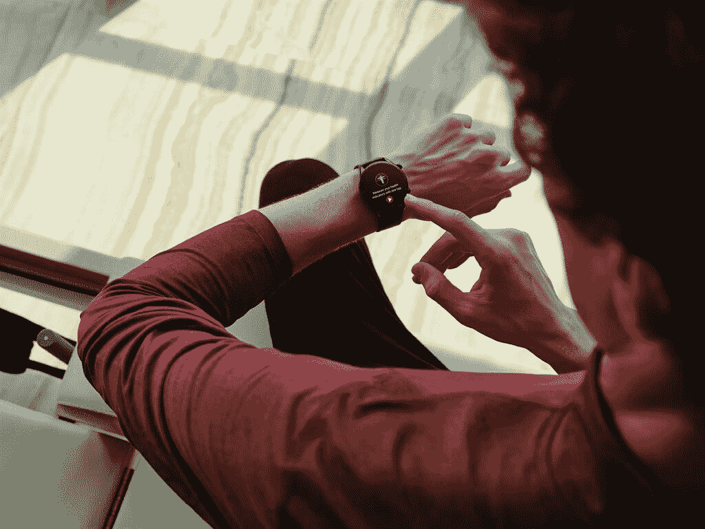

# Amazfit GTR 3 和 GTS 3 智能手表采用了优质的硬件和时尚的设计

> 原文：<https://www.xda-developers.com/amazfit-gtr-3-gts-3-launch/>

中国可穿戴设备制造商 Amazfit 今天发布了三款高端智能手表——amaz fit GTR 3 Pro、GTR 3 和 GTS 3。该公司的最新产品对去年的 Amazfit GTS 2 和 GTR 2 进行了多项升级，包括更时尚的设计和更强大的硬件。这里是你需要知道的关于最新的 Amazfit 智能手表的一切。

## Amazfit GTR 3 Pro、GTR 3 和 GTS 3:规格

| 

规格

 | 

亚马逊飞度 GTR 3 专业版

 | 

亚马逊飞度 GTR 3

 | 

亚马逊飞度 GTS 3

 |
| --- | --- | --- | --- |
| **建造** | 

*   飞机级铝合金外壳
*   硅胶表带

 | 

*   飞机级铝合金外壳
*   硅胶表带

 | 

*   飞机级铝合金外壳
*   硅胶表带

 |
| **重量** | 32g | 32g | 24.4 克 |
| **显示** | 

*   1.45 英寸 AMOLED 超高清(圆形)
*   70.6%的屏幕与机身比例
*   331PPI

 | 

*   1.39 英寸 AMOLED 高清显示屏(圆形)
*   66%的屏幕与机身比例
*   326PPI

 | 

*   1.75 英寸 AMOLED 超高清(方形)
*   72.4%的屏幕与机身比例
*   341PPI

 |
| **健身功能** | 

*   150 多种运动模式
*   自动运动识别
*   持续心率监测
*   血氧监测
*   压力水平监控
*   呼吸率检测
*   睡眠追踪
*   月经周期跟踪

 | 

*   150 多种运动模式
*   自动运动识别
*   持续心率监测
*   血氧监测
*   压力水平监控
*   呼吸率检测
*   睡眠追踪
*   月经周期跟踪

 | 

*   150 多种运动模式
*   自动运动识别
*   持续心率监测
*   血氧监测
*   压力水平监控
*   呼吸率检测
*   睡眠追踪
*   月经周期跟踪

 |
| **存储** | 2.3GB | 钠 | 钠 |
| **电池** | 

*   450 毫安时
*   额定使用时间长达 12 天

 | 

*   450 毫安时
*   额定使用时间长达 21 天

 | 

*   250 毫安时
*   额定使用时间长达 12 天

 |
| **NFC 支持** | 钠 | 钠 | 钠 |
| **连通性&位置** | 

*   无线保真
*   蓝牙(通话支持)
*   全球（卫星）定位系统

 |  |  |
| **内置扬声器** | 是 | 不 | 不 |
| **兼容性** | Android 和 iOS | Android 和 iOS | Android 和 iOS |

* * *

新的 Amazfit GTR 3 Pro、GTR 3 和 GTS 3 具有你对 Amazfit 智能手表的所有健身跟踪功能。这些手表运行 Amazfit 的 Zepp 操作系统，用户可以访问大量可定制的手表表面(发布时有超过 150 种)，4 合 1 健康测量，用于心率、血氧、压力水平和呼吸频率跟踪，以及使用配套应用程序进行简单的 24/7 健康管理。

 <picture></picture> 

Amazfit GTR 3

新款 Amazfit 智能手表还提供睡眠跟踪功能，包括支持白天小睡，高级月经周期跟踪，内置 Alexa 的语音控制，以及 GPS 支持。此外，新的 Amazfit GTR 3 和 GTS 3 车型支持 150 多种运动模式，具有自动运动检测功能。

 <picture></picture> 

Amazfit GTS 3

Amazfit GTR 3 Pro 是三款智能手表中最优质的，它有 2.3GB 的板载存储空间，用于音乐文件和蓝牙通话支持。这些功能在其他两种型号上不可用。

 <picture></picture> 

Amazfit GTR 3 Pro

在硬件方面，Amazfit GTR 3 Pro 配备了 1.45 英寸超高清 AMOLED 显示屏和 450 毫安时电池，额定连续使用时间长达 12 天。另一方面，普通的 GTR 3 配备了 1.39 英寸高清 AMOLED 显示屏和 450 毫安时电池，一次充电可使用长达 21 天。最后，Amazfit GTS 3 采用了 1.75 英寸超高清 AMOLED 显示屏，配有更小的 250 毫安时电池，额定连续使用时间长达 12 天。

## 定价和可用性

新的 Amazfit GTR 3 和 GTS 3 智能手表将于今天开始在欧洲销售。普通型号的€售价为 149.99 英镑，而 GTR 3 Pro 的€售价为 199.99 英镑。在美国，Amazfit GTR 3 和 GTR 3 Pro 也将从今天开始[发售，而 GTS 3 将在晚些时候发售。非专业型号在该地区的零售价为 179.99 美元，GTR 3 专业版的售价为 229.99 美元。](https://us.amazfit.com/)