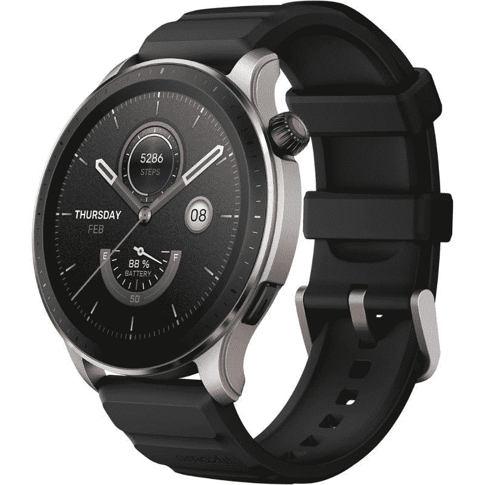

# Amazfit GTR 4 评论:具有良好电池寿命的时尚手表

> 原文：<https://www.xda-developers.com/amazfit-gtr-4-review/>

对于许多购物者来说，智能手表的选择取决于两大巨头——苹果和三星。一方面，苹果手表和 Galaxy 手表占据了智能手表市场的一半以上。而另一边，有 Amazfit 这样的品牌。诚然，Amazfit 在过去并没有完美的运行，但他们最近的几款智能手表都很棒，尤其是价格。该公司的新 amaz fit GTR 4——我已经花了几天时间——也不例外。它是市面上一些[最好的智能手表](https://www.xda-developers.com/best-smartwatches/)的绝佳替代品，也是一款让这个品牌备受瞩目的伟大手表。

Amazfit GTR 4 确实缺乏适当的应用程序支持，也不能让你很好地与收到的通知互动。然而，它凭借出色的设计、良好的电池续航时间和可靠的活动跟踪功能弥补了这些缺点。你还可以获得一些其他周到的附加功能，如直接在手表上拨打和接听电话的能力，Alexa 支持等等。而这一切都是以不倾家荡产的价格完成的。如果所有这些特征听起来都很有说服力，那么我建议你继续阅读，因为在这篇 GTR 4 评论中，我已经为你提供了更多的细节。让我们开始吧！

**浏览此评论:**

## Amazfit GTR 4:定价和供货情况

Amazfit GTR 4 现在在美国售价 200 美元，比苹果和三星的最新产品便宜。在美国，在这个价格范围内，Amazfit GTR 4 有一些可靠的替代产品，但我们将在这篇评论的末尾讨论这些产品。GTR 4 也可以在亚洲市场购买，包括在印度，在印度只有₹16,999 有售(约 201 美元)。这使得它在这个特定的市场上比顶级的 Galaxies 和苹果手表便宜得多。

## 规范

以下是 Amazfit GTR 4 智能手表的规格:

| 

规格

 | 

亚马逊飞度 GTR 4

 |
| --- | --- |
| **打造** | 

*   显示器上的钢化玻璃
*   铝合金中框
*   光面 PC 底壳

 |
| **尺寸&重量** |  |
| **显示** | 

*   1.43 英寸 AMOLED
*   466 x 466 像素，326PPI

 |
| **传感器** | 

*   健康
    *   生物跟踪器 4.0 PPG 生物传感器，支持血氧。

*   活动
    *   加速度传感器、陀螺仪、地磁、气压和环境光传感器

*   关系
    *   无线局域网 2.4GHz，蓝牙 5.0

*   配置
    *   双频带定位
    *   圆极化天线技术

 |
| **支持的平台** | 

*   安卓 7.0 及以上
*   iOS 12.0 及以上

 |
| **电池&充电** | 

*   475 毫安时电池
*   磁性充电器

 |
| **应用** | Zepp 应用程序 |
| **其他功能** | 

*   防水性高达 5 个大气压
*   蓝牙通话
*   内置扬声器
*   麦克风

 |

***关于本次评测:** Amazfit 借给我这台 GTR 4 样品单元进行测试。这篇评论是在使用手表大约两周之后写的。Amazfit 在这次审查中没有任何投入。*

* * *

## 设计和展示

*   Amazfit GTR 4 拥有漂亮的设计，给人一种高级的外观和感觉。
*   它前面有一个反应灵敏、外观简洁的 AMOLED 面板。它还支持始终显示。
*   如果你喜欢矩形手表而不是圆形手表，Amazfit GTS 4 是相同的手表，只是形状不同，电池略小。

Amazfit GTR 4 硬件非常出色。它看起来和感觉上都像是为了与市场上更昂贵的智能手表竞争而制造的。它还拥有轻薄的机身，佩戴起来比我不久前评测的 [Amazfit T-Rex 2](https://www.xda-developers.com/amazfit-t-rex-2-review/) 更舒适。可悲的是，我不能说同样的舒适性，包括橡皮筋，虽然。在一两天内，我的手腕开始感到不舒服。现在，我每隔几个小时就取下手表，让我的皮肤呼吸一下，然后再戴上。我注意到，它也很快就会沾上汗渍，所以你可能需要经常清洗。

Amazfit GTR 4 硬件非常出色。

Amazfit T-Rex 2 的带子就不是这种情况，所以这一次它很可能是我的单位的一个问题。令人欣慰的是，表带可以通过标准的手表弹簧杆机构轻松更换，您可以连接任何您喜欢的 22 毫米表带。手表的背面是放置所有传感器的地方。这款智能手表上有很多这样的传感器，所以传感器和两个用于充电的微小金属触点会稍微凸出一些。侧面的按钮和 Apple Watch 风格的数字表冠可以帮助你通过微妙的触觉反馈来导航 UI。

GTR 4 的机身是由铝合金制成的，这使得它非常适合和完成。这款手表有两种外观，都比上一代 GTR 3 智能手表更好看。至于耐用性，Amazfit GTR 4 具有 5 个大气压的防水等级。显示器顶部还有钢化玻璃，支撑力很好。

GTR 4 的显示屏让人感觉你在使用一块高端手表。

手表的表面有一个 AMOLED 面板，看起来非常棒。事实上，这款手表的显示屏让你感觉像是在使用一款高端设备。它显示清晰的视觉效果，而且它和我过去用过的许多其他高级智能手表一样灵敏。它还变得足够亮，可以在阳光直射下在户外使用，如果你长时间呆在户外，你会喜欢这一点。

GTR 4 还支持永远在线显示功能，可以显示时间和其他一些复杂的手表功能，同时保持显示屏的其他部分为黑色。开启此功能会触发电池耗尽警告，但在下面的章节中会有更多关于该主题的内容。我最喜欢这款手表的是它的唤醒功能的响应速度和准确性。这是一个被低估的功能，只有当它运行良好时才感觉正确。我只在一些高级智能手表上看到过它可靠地工作，但 GTR 4 得到了它的权利。

你不喜欢圆形手表吗？Amazfit 也用长方形的 GTS 4 把你盖住了。这里的风格很容易让人联想到 [Apple Watch](https://www.xda-developers.com/best-apple-watch/) ，尤其是无限的黑色配色。有了 GTS 4，你可以获得相同的传感器、运动跟踪和软件。但是电池大小和电池寿命有所下降，容量为 300 毫安时，而不是 GTR 4 的 475 毫安时。如果这更符合你的风格，那么你可以在亚马逊买到同样的[199.99 美元。](https://www.amazon.com/Amazfit-Dual-Band-Bluetooth-Monitor-Display/dp/B0B8XNZQLP?tag=xda-7c4cf7c-20&ascsubtag=UUxdaUeUpU43771&asc_refurl=https%3A%2F%2Fwww.xda-developers.com%2Famazfit-gtr-4-review%2F&asc_campaign=Authority)

* * *

## 软件和跟踪功能

*   Amazfit GTR 4 运行 Zepp 操作系统，并连接到 Android 和 iOS 上的 Zepp 应用程序。
*   Zepp 操作系统提供了很多功能，但它对应用程序的支持非常有限。
*   GTR 4 可以跟踪许多活动和健康指标，包括心率、睡眠、压力和血氧水平。

Amazfit GTR 4 运行的是谷歌自己的 Zepp OS 2.0，而不是谷歌的 Wear OS。我在使用 T-Rex 2 的时候体验了一下这个特别的操作系统，它非常简单但是很实用。我最喜欢 Zepp OS 的一点是它使用起来非常简单。如果你来自不同的智能手表，你会很快习惯这个软件。

我最喜欢 Zepp OS 的一点是它使用起来非常简单。

它没有其他 Wear OS 选项的所有花哨功能，但它提供了许多有用的功能，并能很好地处理基本任务，不会让你寻求替代方案。这款手表通过“Zepp”应用程序与智能手机连接并同步。这个特殊的应用程序既喜欢 iPhones 也喜欢 Android 手机，这意味着你不会错过任何选择的功能。在我使用期间，GTR 4 没有出现连接 Galaxy S22 和 iPhone 12 的问题。

Amazfit GTR 4 同样喜欢 iPhones 和 Android 手机。

连接的应用程序可让您选择哪些应用程序可以向您的手表发送通知。所有的通知几乎立刻就被镜像到我的手表上，而且我在整个使用过程中也没有遇到连接问题。不过，这款手表没有给你很多与通知互动的选项。在我看来，这是 Zepp OS 最大的缺点之一。例如，对消息的回复依赖于预设的消息，这是不直观的。

无法键入或指定自定义响应，这非常不方便。我总是发现自己只是简单地点击“删除”按钮来清除通知，或者拿出手机来回复。这也是我对 T-Rex 2 智能手表最大的不满之一，遗憾的是，在这里也没有什么不同。同样，在 Zepp OS 上，应用程序的选择再次变得相当黯淡。谷歌支持的缺乏在这里真正表现出来，因为你只能在你的智能手表上安装和使用少量的应用程序。Zepp OS 提供了完成工作的所有基本应用程序，但由于应用程序支持薄弱，这对于高级用户来说显然是一个退步。

Zepp OS 提供了完成工作的所有基本应用程序，但由于应用程序支持薄弱，这对于高级用户来说显然是一个退步。

GTR 4 的其他一些值得注意的功能包括支持 Alexa 和蓝牙通话，这两项我在使用过程中并没有使用太多。值得一提的是，蓝牙通话功能使用了手表的内置扬声器，所以你不能在公共场合打电话或接电话，除非你对此感到舒服。当我们试图将一些耳机与蓝牙耳机配对时，GTR 4 无法连接蓝牙耳机。

Amazfit GTR 4 支持 150 多种活动，这使它与许多健身追踪器不相上下。如果你是那种喜欢健身和跟踪自己活动的人，那么 GTR 4 肯定能满足你的需求。此外，这款手表还可以记录睡眠、心率、血氧和压力水平等其他指标。Amazfit 在 GTR 4 号上使用了 BioTracker 4.0 PPG 生物传感器，这比 T-Rex 2 上使用的传感器要好。

步数跟踪本身在很大程度上是准确的，我没有注意到任何被记录的幽灵步数。手表还可以检测活动，并开始将其记录为锻炼。在记录为锻炼之前，它会给你一个带计时器的警告，只是为了让你控制拒绝，如果它最终错误地检测或标记为其他东西。

然而，我觉得不可靠的是它能够记录我一天站了多少次。这也可能很快变得令人讨厌，因为它不断发送通知，要求你在白天站起来，而你刚刚站了起来。让这种方法正常工作的关键是站起来，实际上走一走，让手表检测到一个活动。

智能手机上的配套应用程序充当了一个中枢，让你可以访问所有数据。在这款应用中导航就像在手表上一样简单。该应用程序本身有一个非常干净的用户界面，给你一个详细的每项活动和健康指标的细目分类。您还可以使用该应用来调整手表设置、下载新应用、更改手表外观等。对于那些关心的人来说，Amazfit 还可以让你与阿迪达斯 Running 和 Strava 等应用程序同步锻炼数据。

* * *

## 电池寿命

*   GTR 4 有一块 475 毫安时的电池，一次充电可以轻松使用两周左右。
*   使用随附的磁性充电器将电池充满电需要 1 小时 45 分钟。

Amazfit GTR 4 在其机箱内装有 475 毫安时的电池，一次充电可持续使用约 10 天。这并不是 Amazfit 向我承诺的 14 天电池寿命，但我不得不承认，我也一直在大量使用它。我已经将 GTR 4 设定为每五分钟记录一次我的心率和压力水平。此外，我还启用了高/低心率警告、辅助睡眠监测和减压提醒。正如我之前提到的，我也是 GTR 4 的永远显示功能，这可能是电池消耗的最大催化剂。

事实上，在启用所有这些功能的情况下，GTR 4 每天只下降约 10%的电池电量，这是非常值得称赞的。T-Rex 2 的电池续航时间肯定更长，但 GTR 4 相对更薄，外观也更传统。它也比其他任何 Galaxy 手表或 Apple Watch 更耐用，这在我看来是一个巨大的优势。不必每天给 GTR 4 充电会让你开始认为它是一块永远不用充电的普通手表。太棒了。充满电大约需要 1 小时 45 分钟。对于一个月只需要做两到三次的事情，你真的没有太多时间去做。更不用说，如果你不像我一样大量使用它，你总是可以获得更多的用法。

* * *

## 你应该买亚马逊 GTR 4 吗？

Amazfit GTR 4 在很多方面都做得很好，尤其是它的要价，这使得它比市场上的顶级产品更便宜。对于那些预算严格、想要一款不用每天充电的智能手表的人来说，这是显而易见的。它可能不会像 [Galaxy Watch 5](https://www.xda-developers.com/samsung-galaxy-watch-5-review/) 和 [Apple Watch Series 8](https://www.xda-developers.com/apple-watch-series-8-launch/) 那样提供所有的功能，但 GTR 4 足以让你保持活跃，并监控重要的指标，包括血氧、睡眠、心率等。

缺乏谷歌的支持和一个好的应用程序家族可能会让高级用户感到头疼。尽管如此，Amazfit 通过专注于智能手表的核心功能和基本功能，成功地让 GTR 4 在两次充电之间的续航时间更长。我认为这对于那些只需要智能手表进行被动使用的人来说很有效，比如健身跟踪和检查通知。

**如果符合以下条件，您应该购买亚马逊 GTR 4:**

*   你想要一个好看的智能手表，而不必花大价钱。
*   你想要一块不用每天充电的智能手表。
*   你预算紧张，想要一个能在 Android 和 iOS 设备上都能很好工作的东西。

**你不应该买亚马逊 GTR 4 如果:**

*   您希望直接在手表上回复收到的通知并与之交互。
*   你想要一款拥有良好应用生态系统的智能手表。

 <picture></picture> 

Amazfit GTR 4

##### 亚马逊飞度 GTR 4

Amazfit GTR 4 在美国要价 199 美元，有很多好处。它可能没有所有的花哨功能，但它提供了所有值得考虑的要素。

总的来说，我不会将 GTR 4 作为一款高级智能手表来取代更昂贵的产品。然而，它很好地完成了大部分工作，值得考虑。三星 Galaxy Watch 4 是一个值得考虑的可靠替代产品，但它没有 GTR 4 持久，也不能与 iOS 设备兼容。类似地，Apple Watch SE 仅限于单一平台，没有像永远在线显示屏这样的东西。

Amazfit 从早期开始已经走过了漫长的道路。GTR 4 无疑是该品牌有史以来最好的手表之一，它表明了其智能手表多年来的发展。这些智能手表肯定会随着每次迭代而变得更好，我很高兴看到他们的下一款智能手表会带来什么。