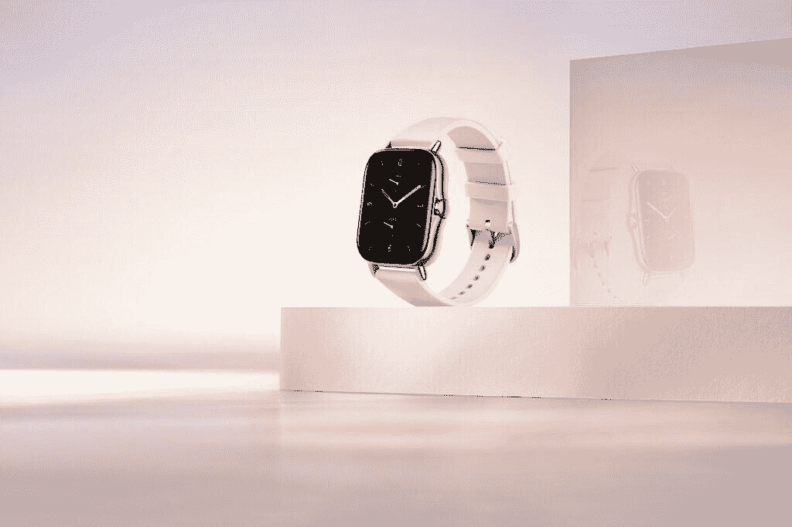

# Amazfit GTS 2 在印度开始接受₹12,999 的预购

> 原文：<https://www.xda-developers.com/amazfit-gts-2-amoled-display-blood-oxygen-monitoring-pre-order-india/>

**更新(****12/21/2020****@ 02****:35****ET):**你现在可以在亚马逊上抢 Amazfit GTS 2。滚动到底部了解更多信息。下面保留了 2020 年 12 月 18 日发表的文章。

10 月，Amazfit [更新了其智能手表系列](https://www.xda-developers.com/amazfit-gts-2-gtr-2-premium-smartwatches-amazon-alexa-integration/)，推出了两款新品:Amazfit GTS 2 和 GTR 2。该公司昨天在印度发布了 Amazfit GTR 2。现在，它正准备推出 Amazfit GTS 2，并确定于 12 月 21 日举行在线发布会。

但在正式发布之前，该公司现已开放 Amazfit GTS 2 的预购。你可以买到₹12,999 的方形智能手表(176 美元)。与拥有经典版和运动版的 GTR 2 不同，GTS 2 只有单一版本。感兴趣的用户可以从今天开始在 Amazfit 印度网站和 Amazon.in 上预购。你只能预订午夜黑色的手表，但是，当手表上市时，应该会有更多的颜色可供选择。

## Aamzfit GTS 2:规格

| 

规格

 | 

Amazfit GTS 2

 |
| --- | --- |
| **构建** | 

*   铝合金+塑料
*   硅胶表带

 |
| **尺寸&重量** | 

*   42.8 x 35.6 x 9.7mm 毫米
*   24.7 克(不含表带)

 |
| **显示** | 

*   1.65 英寸 AMOLED
*   348 x 442 像素
*   341ppi
*   450 尼特
*   ODLC 涂层具有抗划伤性

 |
| **传感器** | 

*   华米生物跟踪器 2 PPG 传感器
*   气压传感器
*   加速计
*   三轴陀螺仪
*   地磁传感器
*   环境光传感器

 |
| **储存** |  |
| **电池** | 

*   246 毫安时
*   7 天备份
*   2.5 小时充电时间

 |
| **连通性** | 

*   蓝牙 5.0
*   无线局域网 2.4GHz
*   全球（卫星）定位系统
*   GLONASS

 |
| **耐水性** |  |
| **兼容性** | 

*   Android 5.0 或 iOS 10.0 及以上

 |

作为一个更新，GTS 2 是去年的亚马逊 GTS 的直接继承者。与 Amazfit GTR 2 不同，GTS 2 采用了类似于 Apple Watch 系列的方形表盘。它配备了 1.65 英寸 AMOLED 显示屏，屏幕分辨率为 348 x 442，峰值亮度为 450 尼特。该公司声称这款新手表比其前身更薄更轻。这款智能手表的一大亮点包括实时血氧监测、24 小时心率监测、防水、呼叫支持、内置 GPS 和睡眠跟踪。它还配备了 3GB 的闪存和 246 mAh 的电池，该公司声称可持续使用 7 天。

* * *

## 更新:Amazfit GTS 2 现已在亚马逊上市

全新的 Amazfit GTS 2 现在终于可以在亚马逊上购买了。这款手表的价格为₹12,999，有三种颜色可供选择——午夜黑、都市灰和沙漠金。如果你有兴趣为自己买一个，或者作为礼物送给朋友或家人，你可以点击下面的链接购买一个。

 <picture></picture> 

Amazfit GTS 2

##### Amazfit GTS 2

Amazfit GTS 2 是中国可穿戴设备制造商华米的最新智能手表。它配备了 1.65 英寸的 AMOLED 显示屏，大量的健身跟踪功能，以及亚马逊 Alexa 支持。