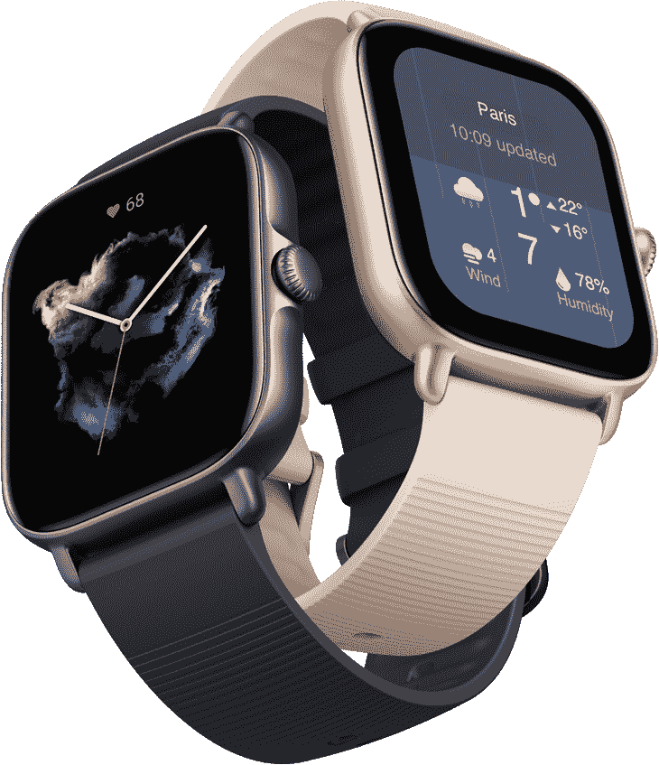

# Amazfit GTS 3 评论:健身为重点和时尚前沿

> 原文：<https://www.xda-developers.com/amazfit-gts-3-review/>

谈到可穿戴设备，三星(Samsung)和 Fossil 等品牌的旗舰智能手表往往会抢尽风头。但事实是，并不是每个人都希望在配套设备上挥霍 200 美元以上。对于预算购物者来说，天涯何处无芳草，这就是 Amazfit 的用武之地。

在 Amazfit 的旗帜下，你会发现大量的选择，其中大多数都标有可接受的价格标签。是的，你在这里放弃了 Wear OS，但是所提供的功能与你所支付的费用达到了恰到好处的平衡。有了 Amazfit 智能手表，基本功能都有了。

Amazfit 于 2021 年 10 月推出了 GTR 和 GTS 系列的最新版本。这是方形的亚马逊 GTS 3 智能手表首次亮相，旁边是更高端的亚马逊 GTR 3 和 GTR 3 专业版。Amazfit GTS 3 面向手腕纤细的观众。它本质上是作为上层 GTR 3 系列的“精简”版本。

## Amazfit GTS 3:规格

| 

规格

 | 

亚马逊飞度 GTS 3

 |
| --- | --- |
| **建造** | 

*   飞机级铝合金外壳
*   硅胶表带

 |
| **显示** | 

*   1.75 英寸 AMOLED(方形)
*   72.4%的屏幕与机身比例
*   341 PPI

 |
| **耐水性** | 5 ATM |
| **重量** | 24.4 克 |
| **尺寸** | 42.4 毫米 x 36mm 毫米 x 8.8mm 毫米 |
| **皮带宽度** | 20 毫米 |
| **操作系统** |  |
| **存储** | 2.34GB |
| **电池** | 

*   250 毫安时
*   额定使用时间长达 12 天
*   额定充电时间为 2.5 小时
*   磁性充电底座

 |
| **NFC 支持** | 不适用的 |
| **连通性&位置** | 

*   无线保真
*   蓝牙 5.1 BLE
*   全球（卫星）定位系统

 |
| **内置扬声器** | 不适用的 |
| **兼容性** | 

*   安卓 7.0 及以上
*   iOS 12.0 及以上

 |
| **健身功能** | 

*   *   150 多种运动模式
    *   自动运动识别
    *   持续心率监测
    *   血氧监测

*   压力水平监控
*   呼吸率检测
*   睡眠追踪
*   月经周期跟踪

 |

***关于本次评审:*** *我们于 2022 年 1 月 27 日收到 Amazfit 发来的 Amazfit GTS 3 进行评审。Amazfit 没有参与此次审查的内容。*

* * *

## Amazfit GTS 3:展示与设计

正如上一代 Amazfit GTS 2 一样，GTS 3 也采用了方形显示屏。即使在大白天，漂亮的 1.75 英寸 AMOLED 面板也会变得异常明亮，色彩效果也非常出色。有一个总是显示功能，允许你一直保持屏幕上，所以它总是显示时间和其他一些指标。有了合适的表盘(有数百种可供选择)，它可以复制普通腕表的外观和手感。

Amazfit GTS 3 由于其轻薄的特性，长期穿着非常舒适。

Amazfit GTS 3 生动的显示屏装在飞机级铝合金框架中。这款智能手表有三种颜色可供选择:玫瑰红、石墨黑和象牙白。每种颜色的金属框架分别采用玫瑰金、金属黑和软金饰面。令人高兴的是，侧面有一个皇冠按钮，可以用来导航可穿戴设备。总的来说，GTS 3 长期佩戴非常舒适。它的轻便和苗条的性质感觉很棒，有时你甚至会忘记你正穿着它。

就设计而言，智能手表与前代相比没有太大变化，我喜欢这一点，因为它不需要彻底的重新设计。它已经很时尚了，在我测试它的时候，我收到了很多赞美。许多评论者第一眼就认为这是苹果手表，所以如果你想要一个安卓友好的外观，那么 GTS 3 是一个很好的选择。5 个大气压的防水性让人们对其精致和光滑的本质充满信心。

每种颜色都有配套的硅胶表带。皮带宽 20 毫米，你可以很容易地把它们换出来。我在表带上遇到的一个小问题是，我只能把它们设置得太紧或太松。夹子的针孔没有放在我小手腕的理想位置。这很讽刺，因为这正是 GTS 3 所迎合的人群。最后，我在测试几天后换了一个第三方的金属表带来保证舒适度。不过我的手腕确实很小，所以我不确定大多数人会面临类似的问题。

## Amazfit GTS 3:电池和充电

保持 Amazfit GTS 3 正常运行的是一块不起眼的 250 毫安时电池。虽然这是额定长达 12 天的使用，实际运行时间是一个相当不同的故事。GTS 3 的平均续航时间约为 4 到 5 天，其所有功能都得到了充分利用，包括 AOD。随着亮度水平降低，这可以很容易地延长到一周。由于这款智能手表采用 AMOLED 显示屏，因此在较低的亮度水平下，您仍然可以获得令人满意的色彩还原效果。然而，在明亮的阳光下，你可能会被迫超过 50%，自动迫使其电池消耗更多。

这里没有无线充电，所以唯一的充电选择是通过盒子里的专有磁性充电器。充值过程通常需要大约两个小时。显然，电池寿命部门没有什么东西能给人留下深刻印象。它只是让你通过。我多么希望 Amazfit 能更进一步，包括至少 10W 的无线充电支持。这对 Amazfit GTS 3 来说是一个巨大的加分项。

## Amazfit GTS 3 评论:Zepp OS

大多数中国智能手表最大的警告之一是缺乏 Wear OS。Amazfit 的 GTS 3 可以在同一类别下归档。它运行该公司自己的软件 Zepp OS，配套的移动应用程序也有相同的名字。让我们考虑一下 Zepp 如何对 Amazfit 有利。

Zepp OS 流畅、轻便、高效，并带有大量令人印象深刻的健康和健身功能。

Zepp OS 流畅、轻巧、高效。它没有延迟和故障，并且与 Zepp 应用程序无缝连接。设置手表很容易，你可以通过手机控制和定制 Amazfit 智能手表中的几乎所有东西。除了数量惊人的运动模式，还有其他伟大的功能。您可以控制音乐播放、查看信息和通话、查看天气、跟踪您的血氧水平、监控您的心率，以及记录您的睡眠和呼吸质量。

实惠的 Amazfit GTS 3 内置了大量健康和健身功能，令人印象深刻。最重要的是，智能手表内置了 Alexa，还支持选择离线语音命令。同样，你可以通过智能手机进行设置。从 150 多种运动模式和各种健康追踪器中记录的所有数据都会自动与您的手机同步。然后它会被保存到云端，所以无论你何时从另一个设备登录 Zepp 应用程序，它都会保留数据。

在大多数情况下，ECG 和 SpO2 传感器工作正常。我使用了医用脉搏血氧仪来实时比较读数。虽然这些数字差别很小，但没有什么大的不同，这让我确信它是安全的。当然，Amazfit GTS 3 并不意味着取代你的医疗设备，但它可以帮助注重健身的人获得一些见解。

Amazfit GTS 3 的健康和健身功能一定会让生活方式积极的人感到满意。运动跟踪是准确的，你可以安装补充的健身应用程序，如谷歌健身，斯特拉发和重温。GTS 3 看起来不像成熟的运动手表或健身手环那样大而喧闹，这增加了智能手表的吸引力。然而，我真的希望我能在手表内回复信息。也不能接电话，也不能拒接电话，比较可笑。

就我个人而言，我不是一个非常活跃的人，但我喜欢定期散步。我带着 Amazfit GTS 3 进行了一次轻松的散步，它记下了我散步的每一个细节。当你出去跑步或进行任何户外运动时，你的手机必须有移动互联网，蓝牙和全球定位系统需要保持开启。智能手表记录你的心率、速度、平均速度、位置、消耗的卡路里以及每次锻炼的更多信息。这种深入的分析对那些遵循严格养生和健身计划的人非常有帮助。我可以看到，当涉及到更高要求的锻炼时，这种分解是多么有用。

外出散步时，我非常怀念的一些功能是 Amazfit GTS 3 智能手表缺乏 LTE 功能。我的手机电池已经快没电了，我非常担心它会很快没电。有了健身跟踪智能手表，简化锻炼过程的功能非常重要。你能想象开着 GTS 3 去跑步，然后接到一个电话吗？你必须暂停，拿出手机，然后在继续之前接听或拒绝。

我非常怀念的特点是缺乏用于非接触式支付的 LTE 和 NFC。

Zepp OS 提供了一些额外的应用，但可用的应用数量非常有限。当然，你可以用 GTS 3 控制 Spotify，但前提是你的手表要和手机相连。因为你不能访问本地存储器，所以也没有离线的方法在你的手表上存储音乐。NFC 等其他关键规范也不见了，所以你不能进行非接触式支付，也不能不带手机出门。

## Amazfit GTS 3 审查:结论

Amazfit GTS 3 模糊了健身带和传统智能手表之间的界限。在我看来，你从硬币的两面都得到相当多的好处。你在这里得不到一个成熟的 LTE 智能手表，但这没关系。160 美元的价格标签允许一些误差。紧缩你的预算肯定伴随着妥协，这是一个普遍的真理。

看看竞争对手，如果你想访问 Wear OS，在你的手表上本地存储文件的能力，LTE，以及介于两者之间的一切，你的显而易见的选择将是顶级玩家，如 [Galaxy Watch 4](https://www.xda-developers.com/samsung-galaxy-watch-4-classic-review/) ， [TicWatch Pro 3](https://www.xda-developers.com/mobvoi-ticwatch-pro-3-review/) ，或 Fossil Gen 5。追逐明星需要成本，在这种情况下，我们谈论的是比 Amazfit GTS 3 高出 100 美元以上的价格。把你的眼光放低一点，你将不得不满足于像 Fitbit Versa 2 和 Garmin Vivoactive 3 这样的老型号。虽然更便宜的替代品给了你非接触式支付和更长的正常运行时间，但你不会发现 Wear OS 或明亮的显示屏。在这个低于 160 美元的价格范围内，目前没有什么可以与 GTS 3 相提并论。

Amazfit 不能为你提供像 Google Pay 这样的旗舰功能和大量的应用程序选择。然而，GTS 3 配备了大量的健身跟踪功能、运动模式、健康监测器、现代传感器等等。智能手表标榜漂亮的设计，在小手腕上看起来很优雅——这是几乎所有最好的智能手表的一个主要问题。明亮多彩的显示屏令人赏心悦目，将这一切结合在一起，成为这款可穿戴设备。

 <picture></picture> 

Amazfit GTS 3

##### 亚马逊飞度 GTS 3

Amazfit GTS 3 是典型智能手表和健身手环的结合。这里有很多值得喜爱的东西，但你可以期望在这里或那里做出一些取舍。