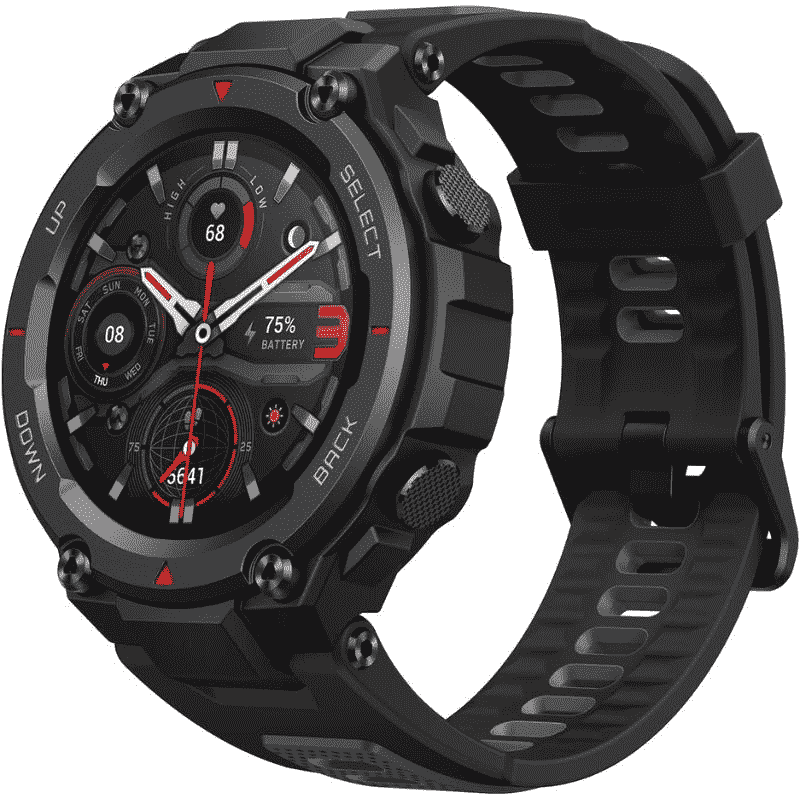

# 在 Prime 早期访问销售期间，在 Amazfit 智能手表上获得这些优惠

> 原文：<https://www.xda-developers.com/amazfit-smartwatch-prime-early-access-sale/>

# 在 Prime Early Access 销售期间以折扣价购买这些 Amazfit 智能手表

亚马逊的 Prime Early Access 销售正在进行，有一些很棒的交易。以下是一些 Amazfit 智能手表交易的快速浏览。

Amazfit 在过去几年中推出了许多优秀的智能手表，并在亚马逊的 Prime Early Access 销售中以折扣价提供其中两款。在有限的时间内，你可以分别花 170 美元和 130 美元购买 Amazfit GTR 4 和 T-Rex Pro 智能手表。我们并没有看到大幅度的降价，但这些手表的价格已经很不错了，所以我们认为即使是微小的折扣也能增加更多的价值。

*   <picture></picture>

    amaz fit T-Rex Pro

    ##### amaz fit T-Rex Pro

    amaz fit T-Rex Pro 是一款坚固耐用的智能手表，非常适合那些生活方式活跃的人。你只需花 130 美元就可以在有限的时间内买到它。

Amazfit GTR 4 对市场来说相对较新，所以现在购买它可以节省 30 美元，这是一个值得考虑的好选择。不过，只有这款手表的“超高速黑色”版本可以打折出售。这是我们在 Amazfit GTR 4 评测中展示的那款手表，所以如果你想看看这款手表在媒体之外是什么样子，一定要去看看。

Amazfit T-Rex Pro 与 GTR 4 相比略显老旧。你现在只需花 130 美元就能买到它，低于它通常 180 美元的价格。正如你所看到的，T-Rex Pro 是一款坚固的智能手表，非常适合那些生活方式积极的人。T-Rex Pro 智能手表有很多令人喜欢的地方，包括它的 1.3 英寸高清 AMOLED 面板和长效电池。我们无法评论 T-Rex Pro，但它与我们最近评论的新 [T-Rex 2 智能手表](https://www.xda-developers.com/amazfit-t-rex-2-review/)非常相似，所以一定要看看。

总的来说，我们认为 Amazfit GTR 4 和 T-Rex Pro 都是很好的智能手表，可以与 Android 和 iOS 设备兼容。如果你不想花很多钱试图购买 Apple Watch 或 Galaxy Watch 5 Pro，那么这些将很好地为你服务。Amazfit 还对其产品组合中的其他一些智能手表提供折扣，所以别忘了看看。