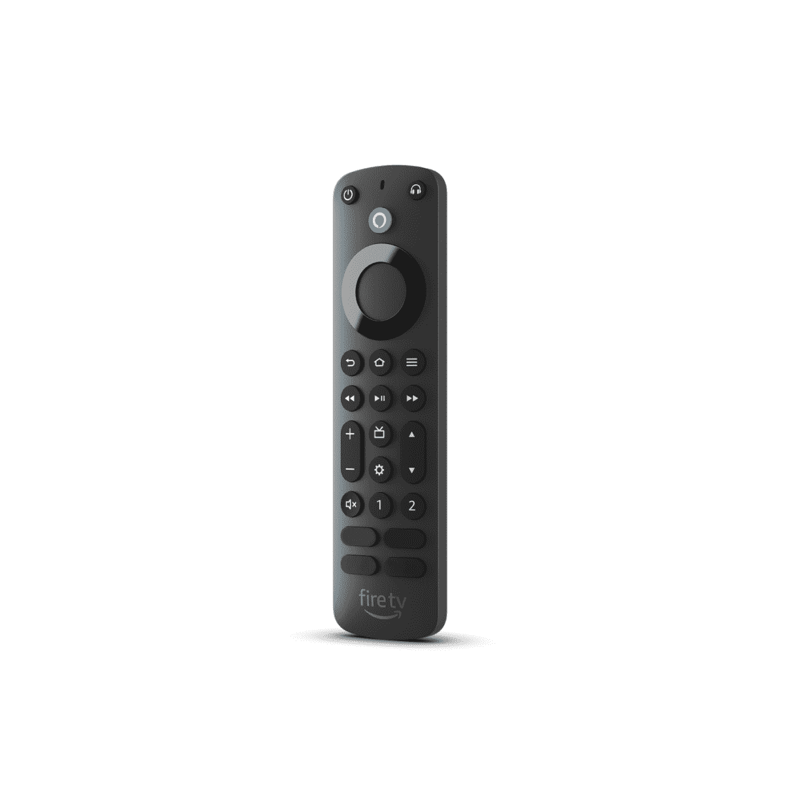

# 亚马逊宣布 Alexa 语音遥控专业版，带背光和可编程按钮

> 原文：<https://www.xda-developers.com/amazon-announces-alexa-voice-remote-pro-with-backlighting-and-programmable-buttons/>

在今天的发布会上，亚马逊推出了一系列令人兴奋的产品，包括新的 [Kindle Scribe](https://www.xda-developers.com/amazon-kindle-scribe-with-pen-launch/) ，带有手写笔和 Halo Rise 智能灯，可以跟踪你的睡眠并叫醒你。Fire TV 用户社区有值得欢呼的事情，亚马逊也推出了一款名为 Alexa Voice Remote Pro 的全新遥控器。

Alexa Voice Remote Pro 是一款高级遥控器，配有多项升级和增强功能。首先，遥控器现在有背光，在较暗的设置下更容易看到按钮。当您在光线较暗的情况下拿起遥控器时，运动激活背光会自动点亮按钮。其次，新的遥控器有两个可编程按钮，可以映射到你最喜欢的应用程序、频道或你选择的 Alexa 命令。例如，你可以编程一个按钮打开卧室的灯，另一个按钮启动 Alexa 程序。

> “Alexa Voice Remote Pro 是一款新的高级遥控器，旨在帮助客户花更多时间进行流媒体播放，而不是花更少时间搜索遥控器。”

Alexa Voice Remote Pro 还带有一个简洁的远程查找功能，当它被放错位置时，可以更容易地找回它。你可以直接问遥控器在哪里，说:“Alexa，找到我的遥控器。”这将在遥控器上播放一个声音铃声，然后您可以按照声音的指示来取回它。

Alexa Voice Remote Pro 售价 34.99 美元，将于 11 月上市。它与大多数 Fire TV 设备兼容，包括亚马逊 Fire TV 智能电视、Fire TV Stick 型号和内置 Fire TV 的智能电视。

 <picture></picture> 

Alexa Voice Remote Pro

##### 亚马逊 Alexa 语音远程专业版

Alexa Voice Pro 遥控器具有运动激活背光和远程搜索功能。

除了新的遥控器，亚马逊还宣布了 Fire TV Cube 第三代，它具有更快的芯片组、超分辨率升级、HDMI 输入端口和 Wi-Fi 6E 连接。