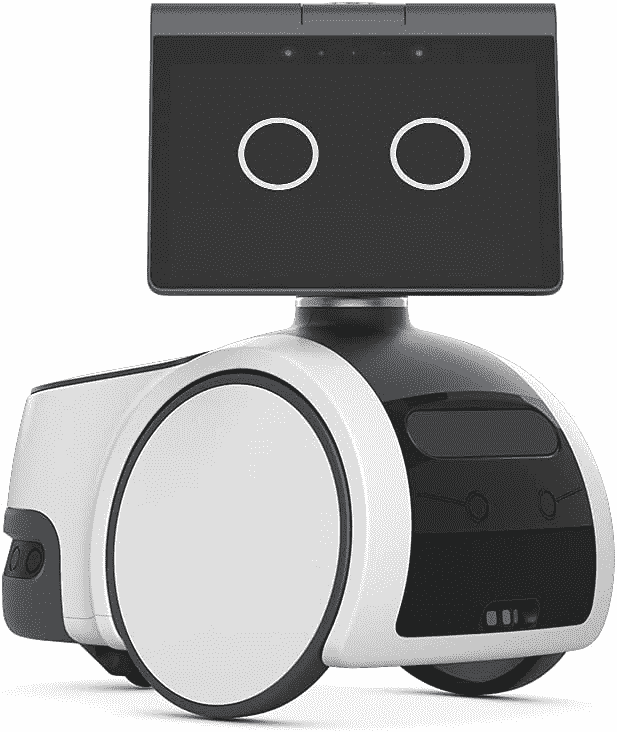

# 瓦力用亚马逊的新 Astro 家用机器人会见了 Alexa

> 原文：<https://www.xda-developers.com/amazon-astro-announced/>

传闻已久的亚马逊将推出某种家用机器人，现在我们终于看到了。遇见亚马逊 Astro，你用 Alexa 穿越迪士尼的 WALL-E 得到的结果。Astro 作为“第一天版本”的一部分出售，该计划允许消费者在开始发货时注册请求邀请。如果 Astro 销售不佳，它有效地将该公司从另一场灾难性的 Fire Phone 中拯救出来，并意味着将只生产足够的利益水平。不过，最有意思的是，Astro 最初售价为 999 美元。一旦完全发布，价格为 1449.99 美元。

 <picture></picture> 

Amazon Astro

##### 亚马逊 Astro

亚马逊 Astro 在亚马逊上以第一天版本程序邀请赛的形式提供，预购价格为 999.99 美元。

Astro 有许多隐私和安全的安全功能，这是很重要的，因为它将进入你的家。它可以检测楼梯和障碍物，还会尽量避开你家里的宠物。几乎所有数据都是在设备上处理的，例如您家中的图像和原始传感器数据。一旦 Astro 绘制出你的家，你也可以指定禁区，你还可以通过一个按钮禁用所有的摄像头，麦克风和运动探测器。当它向云端传输音频或视频时，它的顶部会有一个清晰的 LED，会显示视频的画中画视图或其他指示器。

Astro 还有一些其他功能。例如，当你不在家时，Astro 可以在你的房子周围移动，并将房间的实时视图传输到你的智能手机，或者如果它检测到未识别的人，甚至会向你的手机发送警报。它可以检查你是否有稍后制作食物所需的配料，或者检查你是否不小心忘了关炉子。Alexa guard 还可以检测烟雾警报、一氧化碳警报或玻璃破碎的声音。它可以与 Ring 和 [Ring Protect Pro](https://www.xda-developers.com/ring-alarm-pro-announced/) 集成，甚至可以将视频剪辑保存到您的 Ring 云存储中。最后，Astro 作为一个便携式 Alexa 设备工作，可以播放你最喜欢的节目，播客或音乐，同时在房子里跟着你。

Astro 将限量发售，邀请函将于今年晚些时候发出。此后不久，设备将开始出货。