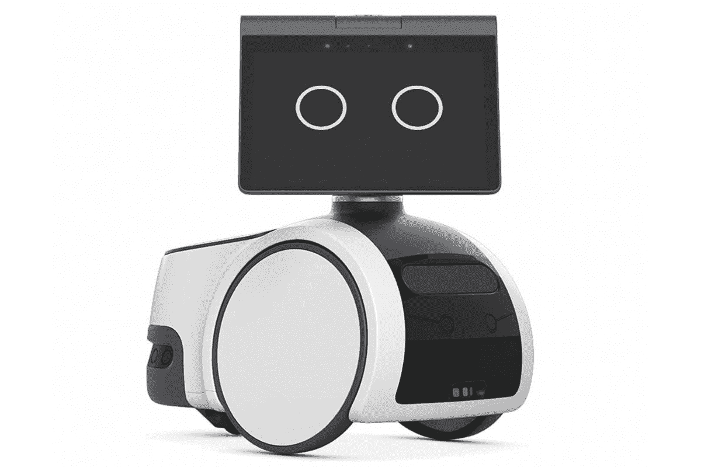

# 亚马逊的 Astro 通过新的宠物检测技能、SDK 等变得更加智能

> 原文：<https://www.xda-developers.com/amazon-astro-gains-new-abilities-and-sdk/>

如果你不知道，亚马逊有一个机器人部门，它的第一批产品之一于去年推出，名为 [Astro](https://www.xda-developers.com/amazon-astro-announced/) 。h ousehold 机器人是为家庭监控而制造的，但也提供了大量其他功能，如能够协助日常任务或为老年人提供远程护理。如今，该公司通过引入建立在其强大基础上的新功能来扩展 Astro 的技能组合。

虽然 Alexa 已经提供了大量不同的选项和功能，但亚马逊现在将扩展这项服务，允许为一名护理对象支持多达 10 名护理人员。此外，亚马逊现在增加了远程协助，允许主要护理人员远程设置 Alexa 例程。此外，Alexa Together 将拥有更多可定制和个性化的每日提醒，同时还会在连接设备上发生特定活动时向护理人员发送通知。Astro 将能够更好地了解周围的世界，了解物体及其在环境中的位置。它还可以学习门和窗，当有东西开着或半开着时提醒主人。

 <picture></picture> 

Amazon Astro

##### 亚马逊 Astro

亚马逊 Astro 是一个强大而友好的家用机器人，可用于家庭监控。

展望未来，Astro 还将在与宠物互动时带来个性化的触摸。最初，它将能够识别猫和狗，让主人在屋外时安心。它甚至会自动发送宠物的图片和视频。当然，这些只是亚马逊提出的一些想法，但它认为还有更多。为了让这些想法成真，亚马逊推出了一个新的软件开发工具包(SDK)。该 SDK 将首先提供给佐治亚理工学院、马里兰大学和密歇根大学的学生，看看他们能为 Astro 开发出什么样的东西。没有消息表明 SDK 将于何时向公众发布。

虽然 Astro 主要用于家庭，但它也可以用于各种不同的商业应用，比如让它在办公室巡逻。与环形虚拟安全警卫配合使用，它可以通过检查正在发生的事情来为闯入提供支持。虚拟保安也可以通过 Astro 监控情况，甚至与入侵者交流。如果这一切听起来很有趣，你可以去亚马逊的 Astro 产品页面请求购买邀请。除了新的更新，亚马逊还推出了一系列新产品，包括 [Fire TV Cube](https://www.xda-developers.com/amazon-new-fire-tv-cube/) 、 [Fire TV](https://www.xda-developers.com/fire-tv-omni-qled-series-launch/) 等等