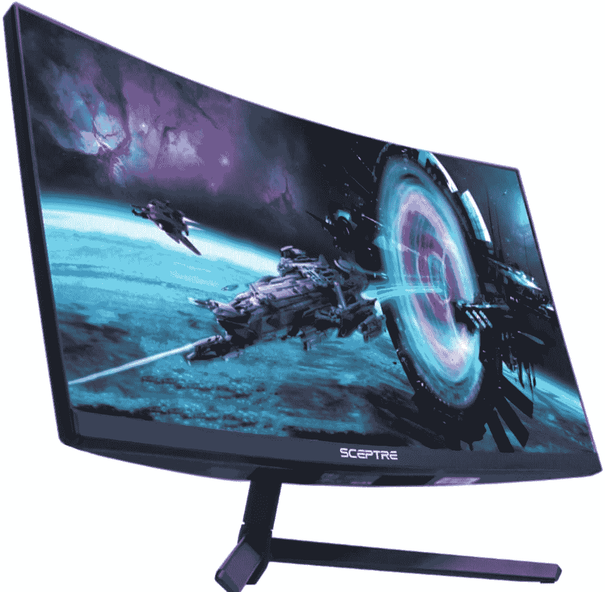
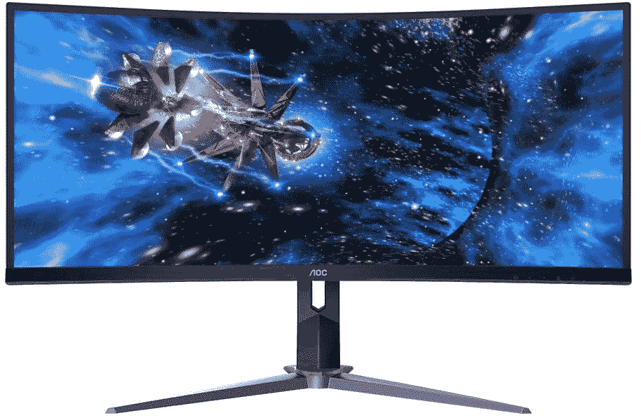
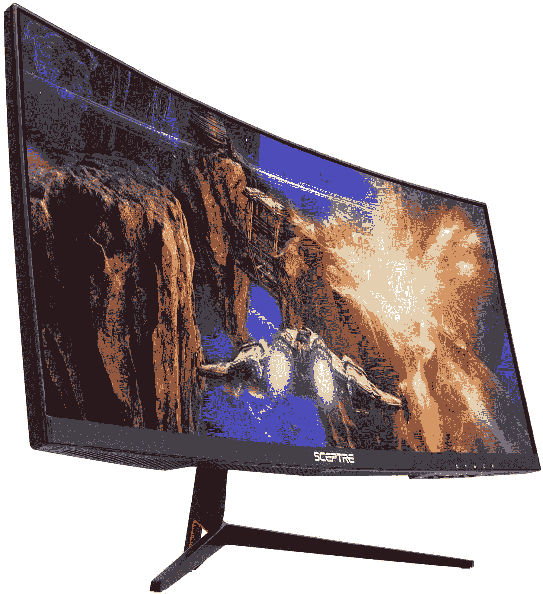
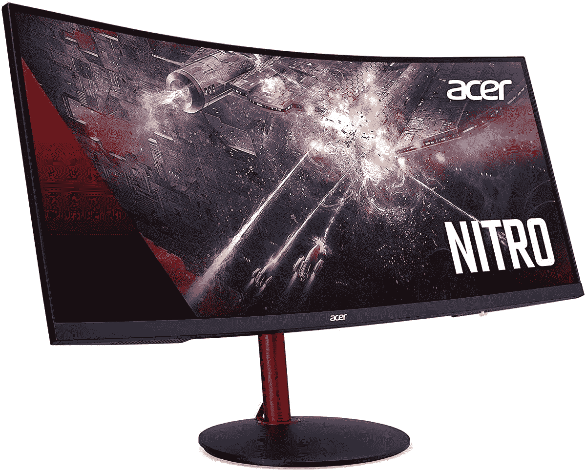
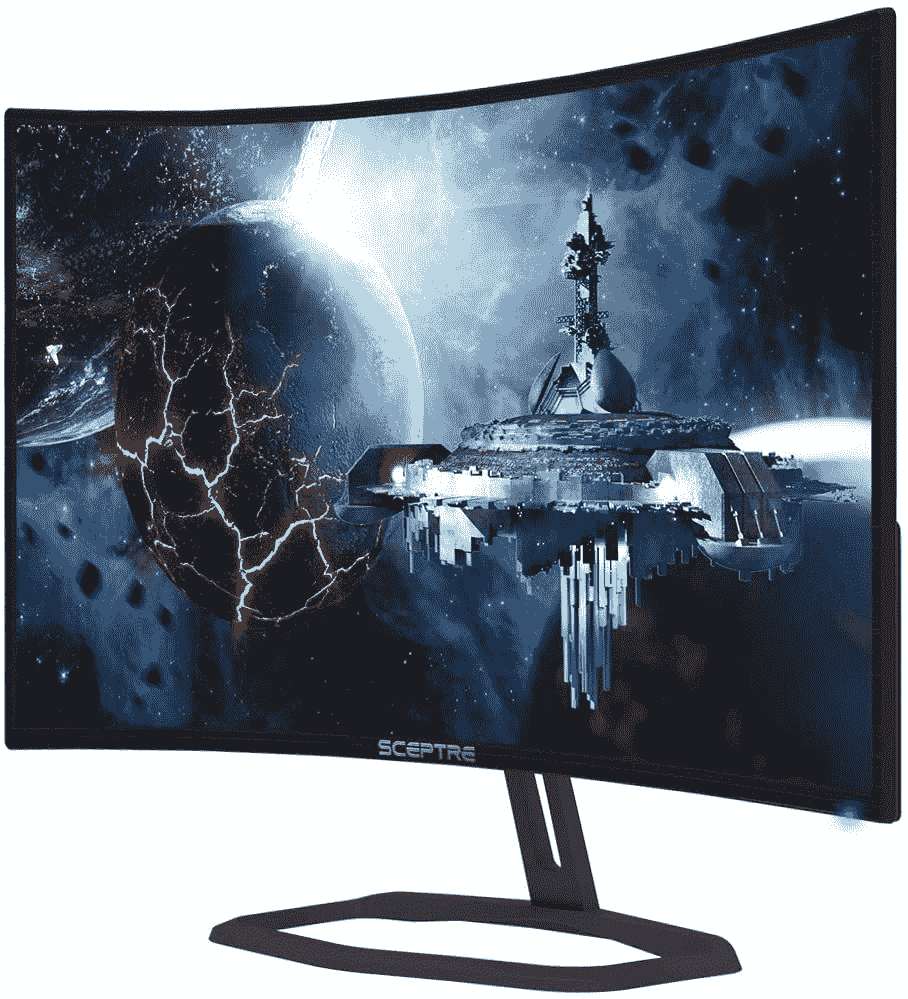

# 亚马逊在曲面游戏显示器上有一些很棒的黑色星期五交易

> 原文：<https://www.xda-developers.com/amazon-curved-gaming-monitors-black-friday/>

# 亚马逊在曲面游戏显示器上有一些很棒的黑色星期五交易

如果你正在寻找一个新的显示器来搭配你的游戏装备，亚马逊的黑色星期五交易可能会有你需要的价格。

在黑色星期五期间，你可以在几乎任何东西上找到很好的交易，如果你想在市场上买一台新的游戏显示器，亚马逊今天为你提供了一些不错的交易。一些相对实惠的显示器正在打折，这使得它们的价格从 190 美元降至略低于 380 美元。

这些游戏显示器都具有高刷新率，但每一款都有一些独特的功能。它们都是弯曲的游戏显示器，让您不必过多转头就能获得更舒适的观看体验。以下是我们发现的一些最划算的交易:

 <picture></picture> 

Sceptre Curved 27 Gaming Monitor ($50 off)

##### 权杖弯曲 27 度

27 英寸全高清显示器，刷新率为 165Hz，支持 AMD FreeSync Premium。它有 3 毫秒的响应时间和内置扬声器。

 <picture></picture> 

AOC CU34G2X 34 Ultrawide Gaming Monitor ($92 off)

##### AOC CU34G2X

这款 34 英寸显示器采用超宽 21:9 显示屏，分辨率为 WQHD，刷新率为 144Hz。它还具有 1 毫秒的响应时间和 98%的 Adobe RGB 覆盖率。

 <picture></picture> 

Sceptre C305B-200UN1 30 Ultrawide Gaming Monitor ($80 off)

##### Sceptre C305B-200UN1 30 超宽

宽高比为 21:9、全高清分辨率和 200 赫兹刷新率的 30 英寸显示器。它有 5 毫秒的响应时间和内置扬声器。

 <picture></picture> 

Acer Nitro XZ342CK 34 Gaming Monitor ($73 off)

##### 宏碁 Nitro XZ342CK 34 英寸曲面 WQHD 显示器

这款 34 英寸 Acer 显示器具有 21:9 的宽高比、WQHD 分辨率和 144Hz 刷新率，支持 FreeSync。此外，它有 1 毫秒的响应时间和 HDR 400 认证。

 <picture></picture> 

Sceptre C325B-FWD240 32 Gaming Monitor ($110 off)

##### 权杖 C325B-FWD240 32

32 英寸全高清显示器，刷新率为 240Hz，支持 AMD FreeSync Premium。它有 1 毫秒的响应时间和内置扬声器。

这里有相当广泛的功能和价位选择，如果你想要最优质的体验，宏碁和 AOC 型号是突出的。这两款显示器都采用 WQHD 显示屏，为您提供更清晰的图像，而且它们都超宽，这是游戏玩家喜欢的功能。

Sceptre 游戏显示器，尤其是列表中的第一款，是预算有限的初露头角的游戏玩家的理想选择，这些亚马逊黑色星期五交易对它们更有吸引力。

如果这些都不适合你，你可以随时访问我们的[黑色星期五电脑交易](https://www.xda-developers.com/best-black-friday-pc-gaming-deals/)中心，查看目前黑色星期五打折的显示器列表。你甚至可以找到一些游戏装备和其他升级来搭配你闪亮的新屏幕。如果你的目光不局限于个人电脑，我们还有一个大型中心，提供移动技术上的各种[黑色星期五交易](https://www.xda-developers.com/black-friday/)，以及电视和音频上的黑色星期五交易列表。