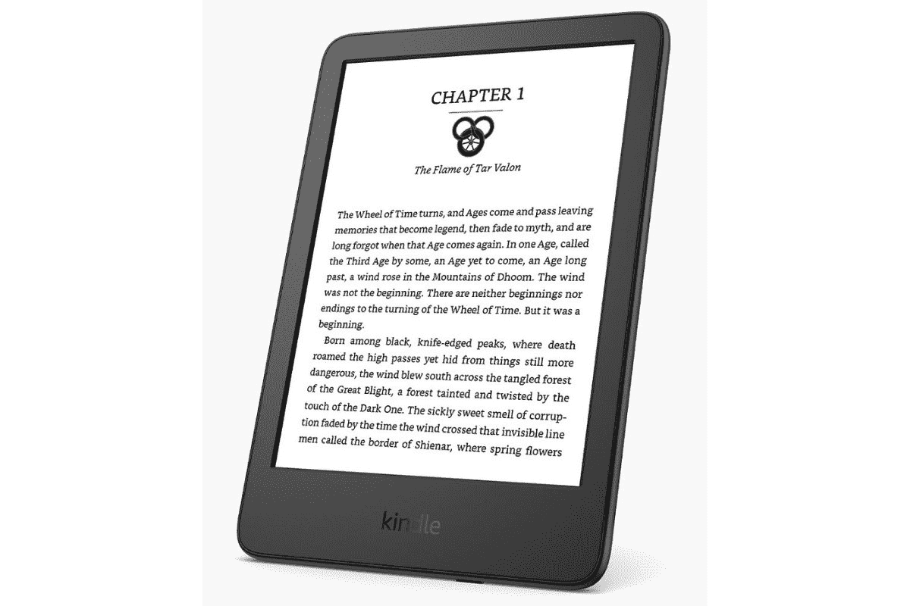

# 亚马逊用新的显示屏、更大的存储空间和 USB-C 更新了它的基本型号 Kindle

> 原文：<https://www.xda-developers.com/amazon-debuts-new-kindle-for-2022/>

# 亚马逊用新的显示屏、更大的存储空间和 USB-C 更新了它的基本型号 Kindle

亚马逊宣布了一款新的 Kindle，将配备 300ppi 显示屏，USB-C，价格从 99.99 美元起。

亚马逊刚刚宣布了其 2022 年的最新 Kindle。该公司首次推出了其最实惠型号的替代品，带来了大量新的增强功能，同时将价格稳定在 99.99 美元。新型号将采用 300ppi 的高分辨率屏幕，USB-C 充电端口和 16GB 存储空间。

新发布的 Kindle 是亚马逊 Kindle 产品线中最实惠的选择。与 2019 年发布的上一代产品相比，新款 Kindle 有了巨大的改进。旧型号的屏幕分辨率为 167ppi，存储容量为 8GB 的一半。也许最新型号的最大变化是它可以使用 USB-C 充电。随着新屏幕以 300ppi 的速度出现，文本将更加清晰，并且通过可调的前置灯，你甚至可以在光线不足的地方阅读。虽然有一个由四个 led 组成的前置灯，但屏幕不会有温度调节。此外，请记住，这种型号是不防水的，所以你要让它远离雨水和其他潮湿的地区。新型号将有两种颜色:黑色和牛仔布。

与之前的型号类似，亚马逊也将推出 Kindle Kids 版本，该版本将带有保护套、一年的亚马逊 Kids+和两年的保修。亚马逊 Kids+服务将包括访问数千本书籍、游戏、视频和应用程序。延长保修也将涵盖大多数问题，并将包括维修或更换。虽然基本款售价为 99.99 美元，但它将是支持广告的版本。如果你想没有广告，Kindle 的价格将是 119.99 美元。这两个版本目前都可以从亚马逊预购，它们将于 10 月 12 日正式发布。

 <picture></picture> 

Amazon Kindle (2022)

##### 亚马逊 Kindle(第十代)

2022 年新款亚马逊 Kindle

* * *

**来源** : [亚马逊](https://press.aboutamazon.com/news-releases/news-release-details/introducing-all-new-kindle-and-kindle-kids-now-300-ppi-high)