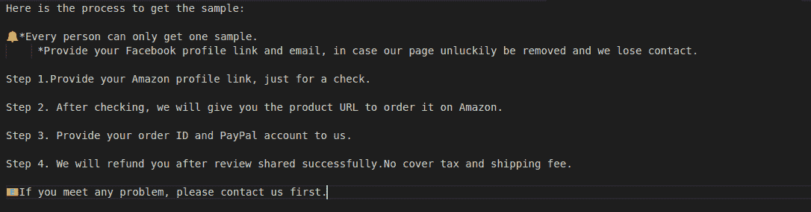

# 亚马逊打击虚假评论打击了热门科技配件品牌

> 原文：<https://www.xda-developers.com/amazon-delists-aukey-mpow-products-alleged-fake-reviews/>

像大多数其他在线零售商一样，亚马逊多年来一直在与虚假产品评论作斗争。该公司对虚假评论有严格的指导方针，阻止卖家和产品制造商付钱给人发布对某一特定产品的评论，但许多卖家能够避开雷达。多个科技品牌现已从亚马逊下架，似乎是打击虚假评论的一部分。

亚马逊的卖家政策包括针对虚假评论的严格指导方针。供应商不得为产品评论提供退款或报销，不得使用提供与评论相关的免费/折扣产品的第三方服务，也不得创建客户帐户来评论自己的产品。然而，这些指导方针并不总是得到执行，这导致了像 [Fakespot](https://www.fakespot.com/) 和 [ReviewMeta](https://reviewmeta.com/) 这样识别虚假评论的工具的流行。

上周，安全侦探[发布了一份关于其发现的包含亚马逊卖家和顾客之间信息的大型数据库的报告。泄露的数据突出了要求产品评论的卖家消息的例子，包括用于避免亚马逊自动检测的方法(添加视频，购买后等待几天等。).](https://www.safetydetectives.com/blog/amazon-reviews-leak-report/)

 <picture></picture> 

Example of vendor message (Credit: SafetyDetectives)

亚马逊现在已经从几个主要的科技品牌下架了产品(通过 [*DigitalTrends*](https://www.digitaltrends.com/mobile/amazon-removing-popular-accessory-companies-fake-product-reviews/) ),似乎与虚假评论的泄露有关。Aukey 和 Mpow 是产品从亚马逊上消失的公司之一——剩下的清单大多来自第三方。虽然其与泄漏的联系尚未得到证实，但至少已经发现 Aukey 的许多产品的包装盒中都有一张纸条，承诺 100 美元的“诚实审查”。

尚不清楚 Aukey、Mpow 和其他受影响的品牌何时(如果有的话)会恢复在亚马逊上的销售。一位亚马逊发言人向 [*ReviewGeek*](https://www.reviewgeek.com/81928/aukey-is-in-trouble-with-amazon-has-all-of-its-products-removed/) 提供了以下关于这一情况的声明:

> #### “我们努力为顾客和卖家营造良好的体验，并采取措施保护他们免受威胁他们在我们商店体验的威胁。我们有检测可疑行为的系统和流程，我们有团队进行调查并迅速采取行动。
> 
> #### 我们有长期的政策来保护我们商店的完整性，包括产品的真实性，真实的评论，以及满足顾客期望的产品。我们会对违反者采取迅速行动，包括暂停或取消销售特权。我们认真对待这一责任，监控我们的决策准确性，并保持高标准。我们有一个上诉程序，卖家可以解释他们将如何防止违规行为在未来发生，或者让我们知道他们是否认为他们是合规的。我们的团队位于西雅图总部和全球各地，以超过 15 种语言通过电子邮件、电话和聊天为卖家提供 24/7 支持。"

很高兴看到亚马逊对支付虚假评论的卖家采取行动，即使这次打击是公开泄露的结果。现在，如果亚马逊能够停止参与自己的黑幕战术，那就更好了。