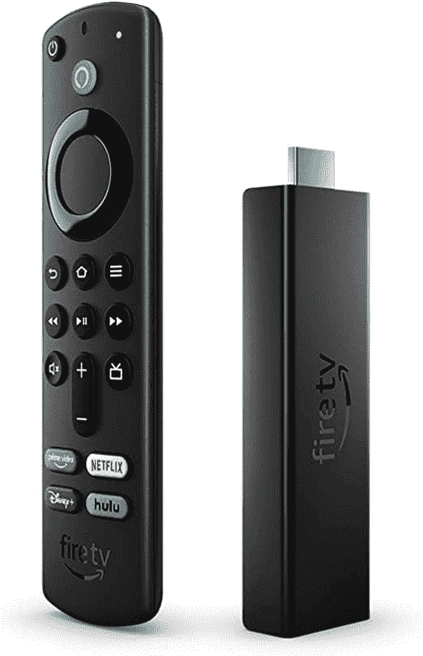
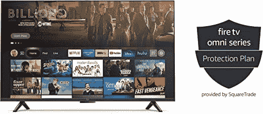

# 通过这些早期的黄金日优惠，在 Fire 电视设备和平板电脑上节省大量费用

> 原文：<https://www.xda-developers.com/amazon-early-prime-day-deals-fire-tv-tablets/>

虽然亚马逊通常每年只举办一次 Prime Day(T1)活动，但这家电子商务巨头今年做了一些改变。它将在本月晚些时候专门为 Prime 会员举办第二次销售活动，在 48 小时的活动中，你可以看到许多产品的惊人交易。如果你不能等到 10 月 11 日再购物，你会很高兴知道亚马逊已经提供了一些优惠活动。这篇文章涵盖了 Fire TV 设备和平板电脑上一些最好的早期黄金日交易。

### 只需 40 美元，您就可以获得一个带 2 年延保的消防电视棒 4K Max

亚马逊最强大的流媒体棒，Fire TV Stick 4K Max，目前以大幅折扣出售。流媒体棒通常售价 55 美元，但你现在只需 35 美元就能买到。只需额外支付 5 美元，你就可以获得亚马逊对 Fire 电视棒 4K Max 的 2 年延长保修。

 <picture></picture> 

Fire TV Stick 4K Max with 2-year extended warranty

##### 带 2 年延保的 Fire 电视棒 4K Max

现在只需 40 美元，拥有 2 年延保的 Fire TV Stick 4K Max 就可以成为你的了。

### 体验 85 美元的 Fire HD 8 平板电脑和 Luna 控制器的云游戏

如果你一直渴望尝试亚马逊的云游戏服务，现在你可以只花 85 美元(优惠 75 美元)获得一台 Fire HD 8 平板电脑和 Luna 控制器。该套装包括 Luna 的 7 天免费试用，因此您可以立即在您的新平板电脑上试用游戏，如 Control、Metro Exodus 等。

 <picture></picture> 

Fire HD 8 tablet and Luna controller

##### Fire HD 8 平板和 Luna 控制器

仅售 85 美元，使用 Fire HD 8 平板电脑和 Luna 控制器启动您的云游戏之旅

### 购买新的 55 英寸 Omni 系列 4K 消防电视，享受 4 年保护计划的优惠

55 英寸的 Omni 系列 4K Fire 电视通常零售价为 560 美元，没有扩展保护计划，SquareTrade 的 4 年保护计划需要额外支付 70 美元。但 Prime 会员现在只需 563 美元就可以获得捆绑包，享受他们的新电视，而不用担心它会坏。保护计划涵盖正常使用期间的故障，以及机械和电气故障。它还包括全天候支持和 2 天更换服务。

 <picture></picture> 

55-inch Omni Series Fire TV 4K with 4-year protection plan

##### 55 英寸 Omni 系列消防电视 4K，带 4 年保护计划

使用 55 英寸 Omni 系列消防电视 4K，享受 4 年保护计划的优惠。

### 杂项交易

除了上面提到的交易，您还可以通过下面的链接以有吸引力的折扣购买一些其他 Fire TV 产品:

寻找新的 Echo 智能扬声器或显示器？在 Echo 设备上查看这些[早黄金日交易](https://www.xda-developers.com/amazon-prime-day-deals-echo-devices/)。