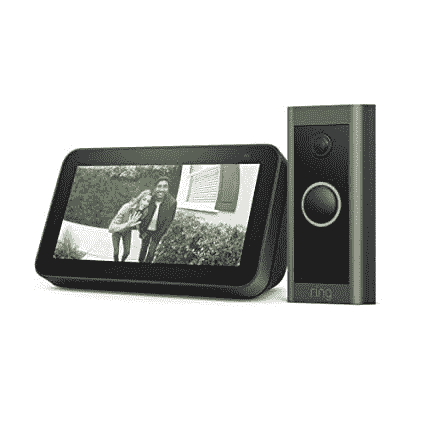
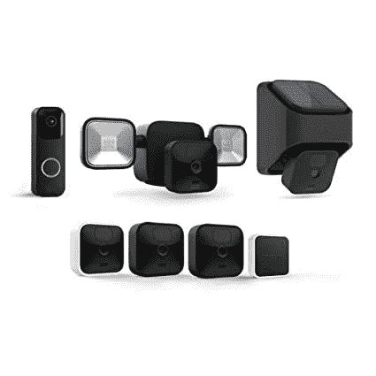
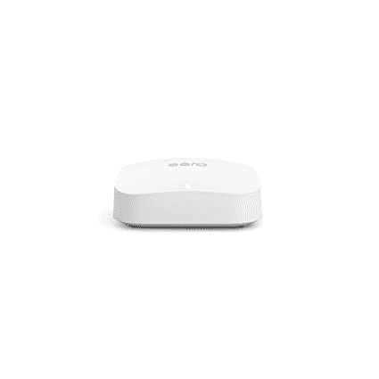

# 利用这些早期的黄金日优惠活动，购买视频门铃、安全摄像头等，以低廉的价格保护您的家

> 原文：<https://www.xda-developers.com/amazon-early-prime-day-deals-security-cameras-doorbells-more/>

在今年第二次 Prime Day(T1)销售活动的前几天，亚马逊为其各种产品提供 Prime Day 早期优惠。我们已经谈论了一些关于 Echo 智能扬声器和显示器的[最佳交易](https://www.xda-developers.com/amazon-prime-day-deals-echo-devices/)、 [Fire 电视设备和 Fire 平板电脑](https://www.xda-developers.com/amazon-early-prime-day-deals-fire-tv-tablets/)。但这并不是亚马逊提供的全部。该公司还在视频门铃、安全摄像头和 Eero Wi-Fi 路由器上有一些惊人的交易，所以你可以保护你的家，而不用在你的口袋里烧一个洞。

### 有线环形视频门铃和 Echo Show 5(第二代)套装优惠 60%

亚马逊对有线环形视频门铃和 Echo Show 5(第二代)组合提供 60%的折扣，使其价格降至仅 60 美元。如果你已经拥有了一个 Echo 智能显示器，并且不需要 Echo Show 5，你可以只花 58 美元买到一个带有第三代 Echo Dot 的[门铃。](https://www.amazon.com/dp/B095DWJ1XC?tag=xda-2nar4ac-20&ascsubtag=UUxdaUeUpU43944&asc_refurl=https%3A%2F%2Fwww.xda-developers.com%2Famazon-early-prime-day-deals-security-cameras-doorbells-more%2F&asc_campaign=Affiliate)

 <picture></picture> 

Ring Video Doorbell Wired with Echo Show 5 (2nd Gen)

##### 与 Echo Show 5(第二代)连接的门铃

在亚马逊上购买 Ring Video 门铃 Wired 和 Echo Show 5 combo 可以节省 90 美元，并且很容易知道谁在你家门口。

### 以不到 400 美元的价格，使用 Blink Home Bundle Plus 查看您房子的所有部分

Blink Home Bundle Plus 对于那些寻找完整家庭安全包的人来说是一个很好的选择，它绝对便宜 375 美元。该套件包括一个闪烁视频门铃、一个泛光灯支架和一个太阳能电池板充电支架，以及三个室外摄像机、一个室内摄像机和一个同步模块 2。

 <picture></picture> 

Blink Home Bundle Plus

##### Blink Home Bundle Plus

Blink Home Bundle Plus 包括一个 Blink 视频门铃、三个室外摄像机、一个室内摄像机、一个太阳能电池板支架、一个泛光灯支架和一个同步模块 2。现在只需 375 美元，所有这些都是你的了。

### 以 180 美元的价格使用 Eero Pro 6E Wifi 网状路由器改善您房子周围的 Wifi 连接

Eero Pro 6E Wifi 网状路由器系统可提供高达 2，000 平方。制成覆盖范围，支持 100 多种连接设备，网络速度高达 2.3Gbps。这是你可以为你的智能家居提供的最好的 Wifi 路由器之一，目前售价仅为 180 美元。如果你有一个更大的房子，你也可以花 499 美元买一个两个装的[或者花 699 美元买一个三个装的](https://www.amazon.com/dp/B091G68F8C?tag=xda-2nar4ac-20&ascsubtag=UUxdaUeUpU43944&asc_refurl=https%3A%2F%2Fwww.xda-developers.com%2Famazon-early-prime-day-deals-security-cameras-doorbells-more%2F&asc_campaign=Affiliate)[来不间断地覆盖整个房子。如果你不介意牺牲一点速度，你可以花 148 美元买一台旧的](https://www.amazon.com/dp/B091G64GVK?tag=xda-2nar4ac-20&ascsubtag=UUxdaUeUpU43944&asc_refurl=https%3A%2F%2Fwww.xda-developers.com%2Famazon-early-prime-day-deals-security-cameras-doorbells-more%2F&asc_campaign=Affiliate) [Eero Pro Wifi 6 Mesh 路由器](https://www.amazon.com/Amazon-eero-pro-6-3-pack/dp/B085VNCZHL/?tag=xda-2nar4ac-20&ascsubtag=UUxdaUeUpU43944&asc_refurl=https%3A%2F%2Fwww.xda-developers.com%2Famazon-early-prime-day-deals-security-cameras-doorbells-more%2F&asc_campaign=Affiliate)。

 <picture></picture> 

Eero Pro 6E Wifi Mesh Router

##### Eero Pro 6E Wifi 网状路由器

Eero Pro 6E Wifi Mesh 路由器的 Prime 会员价格降至 180 美元。立即购买，改善您房子周围的 Wifi 连接。

### 杂项交易

除了上面提到的交易，亚马逊还为其他几个视频门铃和安全摄像头组合提供了一些很大的折扣。请点击下面的链接，在存货售完之前抢购商品。