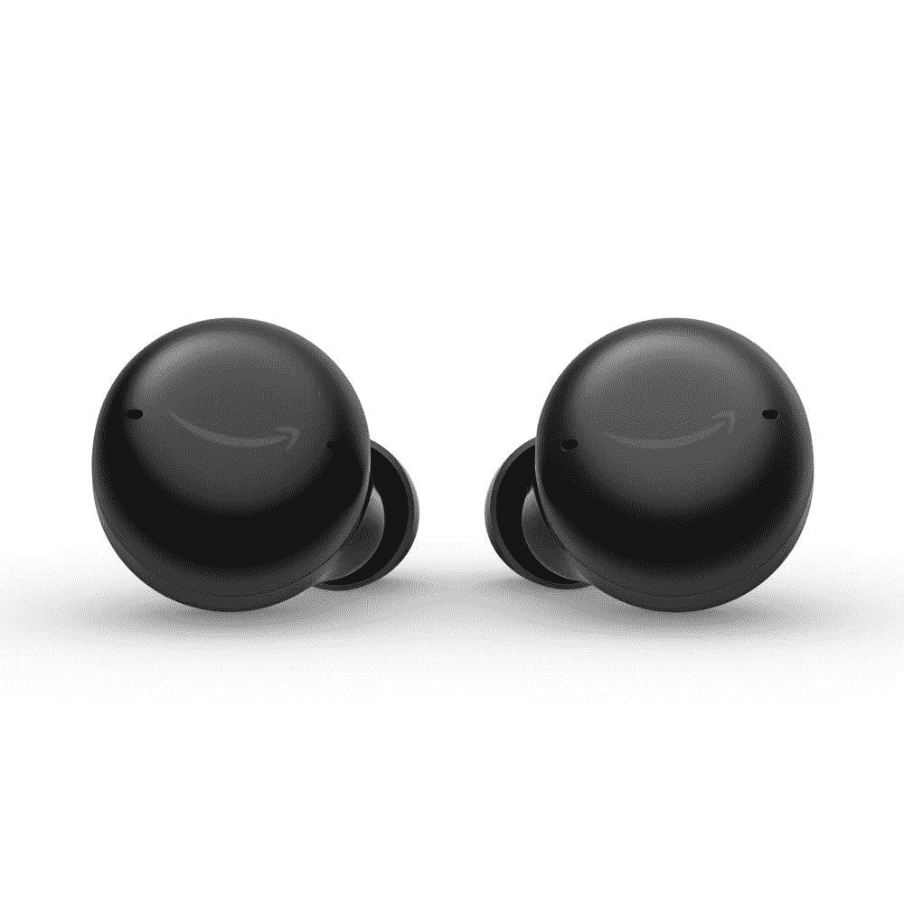

# 亚马逊配备 ANC 的 Echo Buds 第二代只需 70 美元

> 原文：<https://www.xda-developers.com/amazon-echo-buds-2nd-gen-prime-early-access-deal/>

# 亚马逊配备 ANC 的 Echo Buds 第二代只需 70 美元

亚马逊在 Prime Early Access 销售期间大幅削减了其 Alexa 驱动的 Echo Buds 第二代的价格。请继续阅读。

购买亚马逊自有产品的最佳时机莫过于其黄金销售活动期间。正在进行的 Prime Early Access 销售也不例外，因为这家零售巨头正在为从 Echo 扬声器和 Kindle 电子阅读器到 Fire Sticks 和 Eero 网状路由器的所有产品提供大幅折扣。如果你在市场上购买一副价格实惠的 ANC 耳塞，你会很高兴地知道亚马逊的 Echo Buds 第二代也大幅降价。

Echo Buds 2 于去年推出，价格合理，为 120 美元。但是今天，它们降到了 70 美元。节省了 50 美元。请注意，此价格适用于带有线充电盒的型号。支持 Qi 无线充电的型号也在销售，目前从通常的 140 美元价格降至 90 美元。

 <picture></picture> 

Amazon Echo Buds 2nd Gen

##### 亚马逊回声芽第二代

获取配备 ANC 的 Echo Buds 第二代，仅需 70 美元。

第二代 Echo Buds 对原来的 Echo Buds 进行了许多改进。他们更新的设计和更小的尺寸使他们比他们的前辈更舒适，而新的内置通风口有助于平衡耳朵压力，实现更好的透气体验。此外，由于采用了新的定制设计的 ANC 技术，新款耳塞还可以消除两倍于前代产品的噪音。还有一种直通模式，让你不用摘下耳塞就能听到周围的声音，包括人们的声音。同时，更新的音频驱动器提供了低失真和扩展动态范围的平衡声音。

Echo Buds 第二代的另一个亮点是内置的 Alexa 支持，可以让你跳过歌曲，控制 ANC，在不接触耳塞的情况下调高音量。至于电池寿命，Echo Buds 第二代的额定播放时间为一次充电 5 小时，充电盒可容纳额外的 10 小时电量。