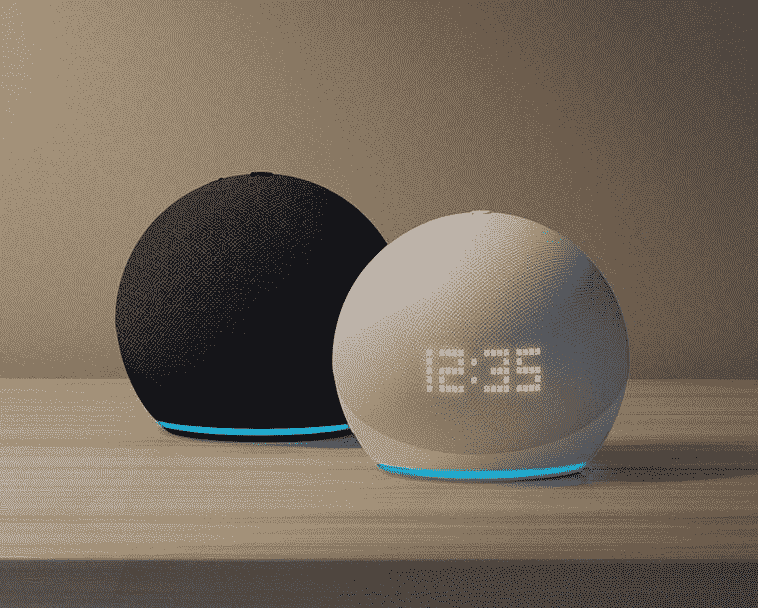
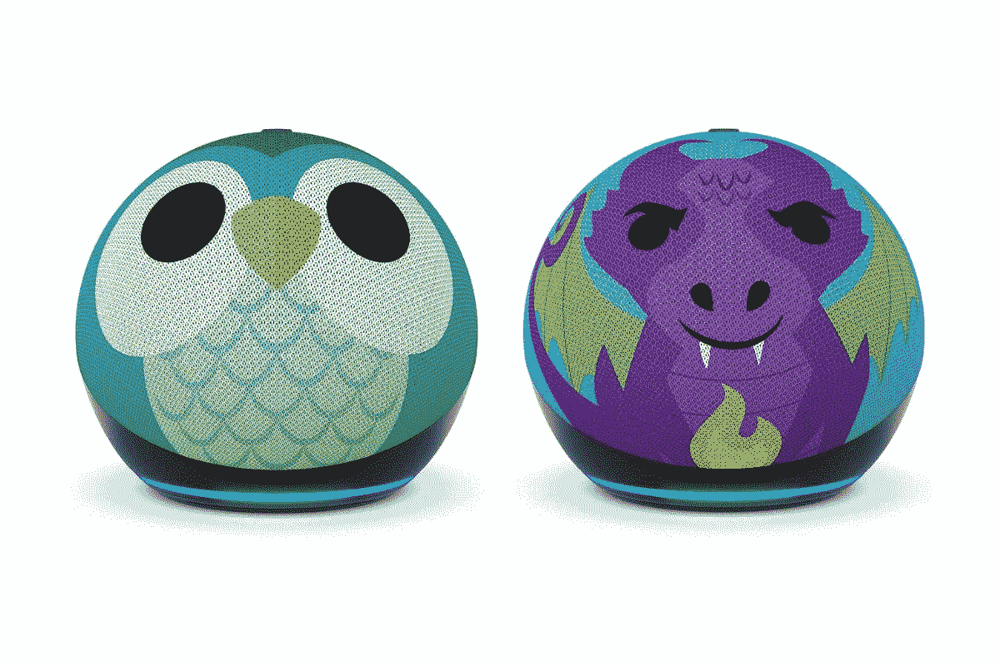

# 亚马逊推出新一代 Echo Dot，集成 Eero、迪士尼合作伙伴关系等

> 原文：<https://www.xda-developers.com/amazon-echo-dot-5th-gen-announced/>

在该公司的秋季发布会上，亚马逊推出了新一代 Echo Dot 设备，包括一款带时钟的新 Echo Dot。它们是最新一代的 Echo Dot 设备，具有改进的音频、更多的时钟显示用途、温度传感器等等。它们从今天开始可以预购，并有两个 Echo Dot 儿童版本，分别带有猫头鹰和龙的设计。

 <picture></picture> 

Amazon Echo Dot and Echo Dot with Clock

##### 带时钟的亚马逊回声圆点(第四代)

亚马逊最新的智能音箱，Echo Dot 和带时钟的 Echo Dot。

正如亚马逊所描述的，全新的 Echo Dot 通过内置的自定义驱动程序将低音“翻倍”，同时降低了声音失真。根据该公司的说法，它们是最好的回声点，但它会变得更好。如果你有一个 [Eero 网状网络](https://www.xda-developers.com/get-an-eero-6-wi-fi-router-for-46-off-or-build-a-3-station-mesh-network-for-98-off/)，你可以使用这些回声点作为你网络的扩展。这意味着，您可以购买更多的 Echo Dot 设备来扩展您的网络，而不是为您的家庭购买额外的扩展器，而无需购买两台设备。

最重要的是，带圆点的回声时钟采用高密度圆点技术。您现在可以看到时间、当前播放的艺术家、歌曲名称、即将到来的日历事件，甚至可以看到透过您的窗户直射进来的阳光。

 <picture></picture> 

Echo Dot Kids

##### 亚马逊回声点儿童(第四代)

最新的亚马逊智能音箱专为儿童打造，造型为猫头鹰或龙。

Echo Dot 的零售价为 49.99 美元，而 Echo Dot with Clock 和 Echo Dot Kids 的零售价分别为 59.99 美元。该公司还宣布，其“嘿迪士尼”合作伙伴关系将很快在美国推出，其中包括与迪士尼 MagicBand Plus 的新集成和一个独家语音助手，可供儿童订阅的客户使用。Echo Dot Kids 可以根据孩子选择的偏好为孩子创作故事，尽管该功能将在假期推出。

与此同时，亚马逊宣布了 Echo Studio 的新白色版本。最后，该公司还表示，所有工作室都将进行更新，改善立体声，提高清晰度和低音响应。这将推广到新的和现有的工作室客户。

 <picture></picture> 

Amazon Echo Studio

##### 亚马逊 Echo 工作室

Echo Studio 是亚马逊提供的最好的智能扬声器。这款扬声器有木炭色和全新冰川色可选。