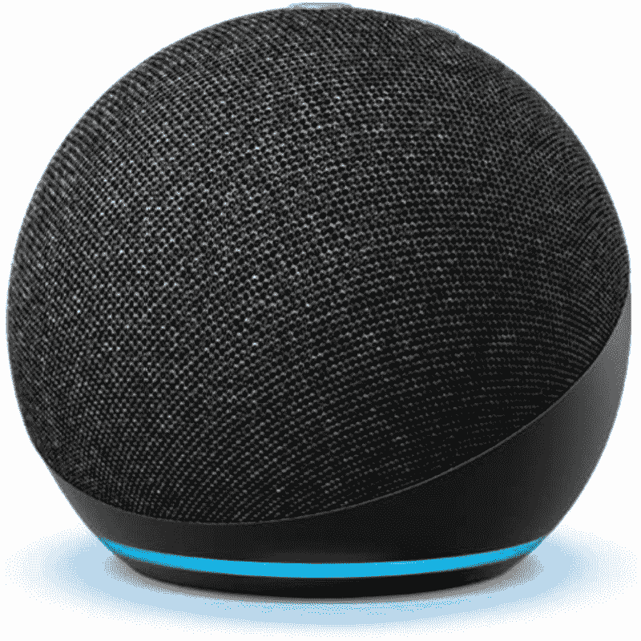
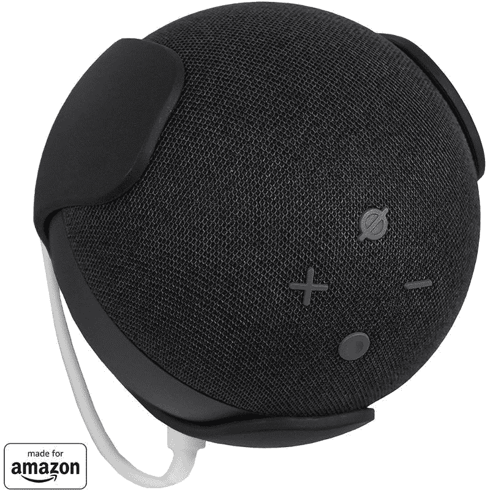
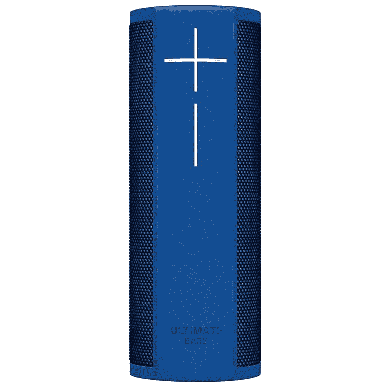

# 亚马逊 Echo Dot 防水吗？它有 IP 等级吗？

> 原文：<https://www.xda-developers.com/amazon-echo-dot-water-resistance/>

亚马逊的 Echo 阵容在过去几年中显著增长。该公司的 Echo 家族现在比以往任何时候都更大，其中许多人在我们收集的 2022 年最佳智能扬声器中赢得了令人尊敬的一席之地。 [Echo Dot](https://www.xda-developers.com/amazon-echo-dot-4th-gen-review/) 可能是最受欢迎的回声设备之一，它具有很强的冲击力。这款售价 40 美元的微型扬声器有很多令人喜欢的地方，让我们很容易推荐它。

如果你想买 Echo Dot 扬声器，你可能想知道它是否防水，是否有 IP 等级。毕竟，如果有合适的配件，它可以用作便携式扬声器。然而，简短的回答是**不**。亚马逊 Echo Dot 不防水。

## 不要把液体溅到亚马逊回声点上

很多人不知道这一点，但亚马逊的 Echo 扬声器都不防水。不仅仅是回声点。没有防水支撑，我们不仅仅意味着它们不能被水淹没或溅到。在任何可能受到水或湿气影响的地方使用 Echo Dot 可能不是一个好主意。这意味着你应该避免在下雨的时候在室外使用它们，或者在游泳池或海滩附近使用。除非你有办法给它供电，否则你不能在游泳池或海滩附近使用 Echo Dot，但它仍然值得一提。这些设备并不防水，所以即使少量的水也可能迫使你购买新的 Echo Dot。

 <picture></picture> 

Amazon Echo Dot (4th gen) speaker

##### 亚马逊回声点(第四代)

亚马逊 Echo 是大多数人最好的全能智能扬声器，拥有漂亮的设计、出色的声音和 Alexa 生态系统的巨大力量。

有些人喜欢在浴室里放一个回声扬声器，并使用 Alexa 听音乐，甚至在淋浴中途用完洗发水时订购洗发水。当然，Alexa 可以帮助你，但你应该考虑把回声点放在远离水的地方。你可以买一个扬声器支架，贴在墙上或天花板上。或者，你也可以把它放在壁架或梳妆台上，安全地远离水。不管选择哪个选项，如果你正在洗热水澡，我们都建议把扬声器放在外面。基本上，桑拿浴室或其他高湿度的房间可能会永久损坏您的 Echo 扬声器。

 <picture></picture> 

Amazon Echo Wall mount

##### 亚马逊回音壁支架

这个简单的配件可以让您将 Echo Dot 扬声器安装在墙上。它有两种颜色可供选择，以匹配 Echo Dot 配色。

## 如果你需要防水，去别处看看

长话短说——不要在水边用回声点。如果你真的需要，你最好再买一个防水的 Alexa 便携式扬声器。UE Blast 是一个值得考虑的可靠选项。它不如 Echo dot 便宜，但它防水，音频输出很好，也能与 Alexa 兼容。

 <picture></picture> 

Ultimate Ears Blast

##### 终极耳朵爆炸

UE Blast 是微型 Echo Dot 扬声器的可靠替代品，因为它是防水的，并且也可以无线工作。