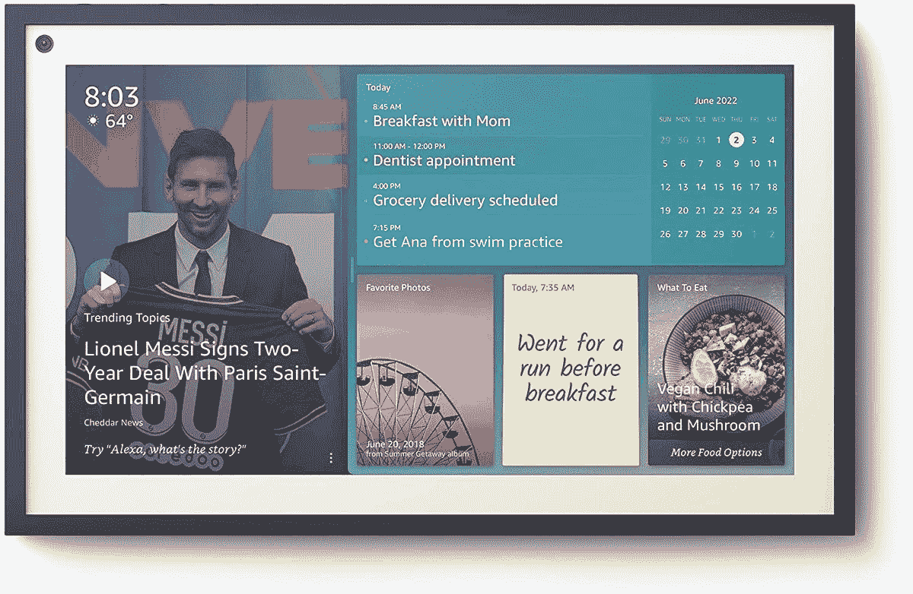

# Echo Show 15 跌至亚马逊 Prime Day 最低价

> 原文：<https://www.xda-developers.com/amazon-echo-show-15-prime-day-deal/>

# Echo Show 15 跌至亚马逊 Prime Day 特卖最低价

亚马逊 Echo Show 15 是你可以为你的房子购买的最好的 Echo 设备之一。它目前在亚马逊上以折扣价出售。

亚马逊 Prime Day 销售已经正式开始，这意味着你现在可以在不同类别的各种产品上获得巨大的折扣。今年的 Prime Day Echo 交易是我们很长时间以来看到的最好的交易之一，因此这是让您的智能家居设备井然有序的最佳时机之一。亚马逊 Echo Show 15 是您家中的最佳产品之一，现在只需 180 美元即可购买。

作为亚马逊 Prime Day 销售的一部分，Echo Show 15 现在优惠 70 美元。考虑到它通常要 250 美元左右，180 美元的价格是很棒的。总的来说，这也是一款很棒的设备，它让你不仅仅是控制智能家居设备，还能做更多的事情。

Echo Show 15 配备了 15.6 英寸的高清显示屏，是你能买到的最大的 Echo Show。它非常适合拥有宽敞房子的家庭，因为与其他较小的 Echo Show 设备相比，大屏幕更容易消费内容。您可以将 Echo Show 15 安装在墙上，或使用“倾斜支架”配件将其放置在桌子上。在回声设备上安装一个屏幕会有很大的不同。如果你是 Echo Show 设备领域的新手，你将会有一个很棒的体验。

除了所有典型的 Echo 功能，带有屏幕的 Echo Show 还可以让您观看视频、进行视频通话等。您甚至可以将它作为一个中枢，从而更好地控制您的智能家居设备。Echo Show 15 的相框功能使其安装在墙上时看起来像艺术品。它在纵向和横向都可以工作，所以请随意尝试，看看它在墙上是什么样子。

 <picture></picture> 

Amazon Echo Show 15

##### 亚马逊回声秀 15

Echo Show 15 是一个巨大的智能显示器，可以挂在墙上或放在工作台上。它是所有 Alexa 智能设备的中枢，也是一个家庭管理工具。

如果你不确定为你的家庭购买 Echo Show 15，那么我们建议你看看我们收集的[最佳亚马逊 Echo 设备](https://www.xda-developers.com/best-amazon-echo-devices/)，看看哪一个最适合你的使用案例。我们将在亚马逊的 Echo 设备上寻找更多惊人的交易，请务必保持关注。