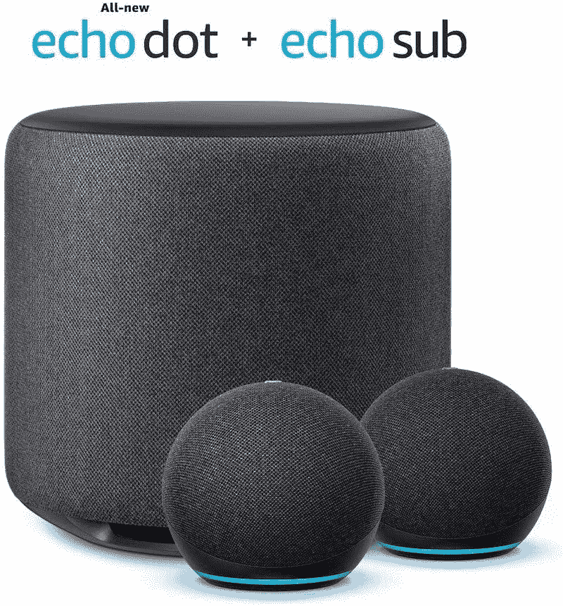
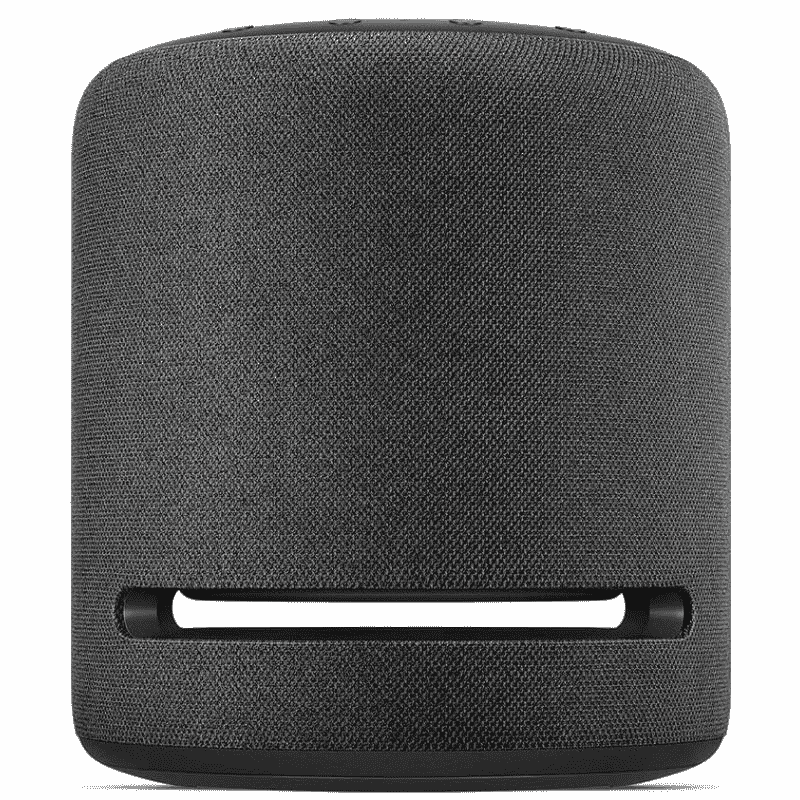

# 亚马逊 Echo Sub vs Echo Studio:2022 年买哪款音箱

> 原文：<https://www.xda-developers.com/amazon-echo-sub-vs-amazon-echo-studio/>

亚马逊在 2018 年推出了 Echo Sub，作为那些希望为音频体验添加更多低音的人的可靠选择。它与其他 Echo 扬声器配合使用，帮助创建扬声器无法独立产生的坚实超低音。虽然它是回声重的家的一个坚实的补充，但它有一些令人沮丧的限制，音频质量本身与其他优质扬声器相比并不好。因此，更大更响的 Echo 扬声器的大门仍然敞开着，这就是亚马逊推出 Echo Studio 的原因。这是一个更先进的扬声器，具有更好的声音处理和输出。

如果你现在正在市场上为你的家购买一个新的扬声器，你可能想知道买哪一个？那么，在这篇文章中，我们将看看亚马逊 Echo Sub 和 Echo Studio 之间的一些关键差异，告诉你在 2022 年为你的家庭音频设置购买哪一个更好。

**浏览这篇文章:**

## 亚马逊回声潜艇 vs 回声工作室:设计

Echo Sub 和 Echo Studio 都符合其他 Echo 扬声器的一般审美。然而，与一些常规 Echo 扬声器相比，它们更宽，甚至更高。就尺寸而言，回声潜艇高 7.9 英寸，宽 8.2 英寸。相比之下，Echo Studio 的高度为 8.1 英寸，宽度为 6.9 英寸，这意味着它的整体占地面积略小。Echo Studio 还设计为独立工作，因此您不必购买或设置额外的扬声器。即使它可以无线连接到其他回声扬声器，它仍然需要其他单元，因此需要更多的房间空间。

Echo Sub 只是在顶部有一个塑料外壳，没有任何按钮或麦克风。与此同时，Echo Studio 配备了一个麦克风、一个麦克风开/关按钮、一个操作按钮以及音量控制按钮。Echo 工作室有一个向上发射的扬声器，顶部还有一个环形灯。相比之下,“回声”号潜艇的所有这些疏漏使它显得相当暗淡。就连 Echo Sub 上的动作按钮也笨拙地放在后面。它甚至没有 Echo Studio 拥有的 3.5 毫米音频光学线。

 <picture></picture> 

Echo Studio

至于硬件本身，Echo Sub 自带 100W 类放大器和低音扬声器。它坐落在一个小的圆盘形底座上，使它稍微抬起，给 6 英寸的司机一些空间。Echo Studio 在这方面更先进，配备了一个 5.25 英寸的向下发射低音扬声器，一个 1 英寸的向前发射高音扬声器，以及三个向左、向右和向上发射的 2 英寸中音驱动器。如果你想知道的话，所有驱动器都是由一个峰值总功率为 330W 的放大器和一个 24 位 DAC 驱动的。Echo Studio 是两者中声音更好的扬声器，而 Echo Sub 本质上只是一个依赖其他 Echo 扬声器工作的配套设备。

## Alexa 支持-回声潜艇没有大脑

正如我们前面提到的，回声潜艇没有任何按钮，甚至没有麦克风来召唤 Alexa。这是因为它没有自己的大脑。Echo Sub 是一个配套单元，可与您系统中的其他 Echo 扬声器配合使用。它可以连接到其他 Echo 扬声器，为您的音频体验增添更多低音。工作室听不到你的声音或回应你的命令，这意味着你必须带上你的回声。它通过 Alexa 应用程序与多达两个 Echo 扬声器配对，只能通过配对的扬声器播放音乐。

然而，Echo Studio 是一个独立的扬声器，提供与其较小的兄弟姐妹相同的 Alexa 语音助手功能。把它想象成一艘有大脑的回声潜艇。它有麦克风来检测你的声音，并召唤一个助手来帮助你指挥。除了播放音乐，Echo Studio 还可以用于获取天气预报等信息，控制智能家居产品等。Echo Studio 最棒的一点是，它还可以与扬声器组中的其他 Echo 扬声器配合使用，在多个房间或立体声系统中播放音乐。

不能作为一个独立的扬声器工作也增加了回声潜艇的连接困难。正如我们在专门的帖子[中提到的，强调了 Echo Sub](https://www.xda-developers.com/is-amazon-echo-sub-worth-it/) 的一些问题，它很难连接或保持与其他扬声器的连接。事实上，亚马逊论坛充满了关于回声潜艇连接性的类似抱怨。

## 亚马逊 Echo Sub vs Echo Studio:音质

Echo Studio 在硬件方面更先进，因为与 Echo Sub 的单个 6 英寸低音扬声器相比，它有五个独立的驱动器。它还支持 3D 音频，无论是看电影或电视节目还是听音乐，都可以获得卓越的体验。在音频质量方面，Echo Studio 与谷歌 Home Max 和苹果的 Homepad 等产品竞争。

Echo Sub 有时会用大量的低音抑制人声和乐器，与之不同，Echo Studio 可以轻松地以高音量填充房间，同时保持良好的音频平衡。那些想要重击低音的人总是可以将他们的 Echo 工作室与 Echo Sub 配对，尽管工作室本身应该足以满足大多数用户。值得注意的是，Echo Studio 还可以针对其所在的房间进行专门调整。

## 亚马逊 Echo Sub vs Echo Studio:该买哪个？

Echo Sub 和 Echo Studio 现在市场上都有售，价格分别为 130 美元和 200 美元。Echo Sub 听起来可能是一个相对便宜的好交易，但 Echo Studio 无疑是更好的扬声器，即使你有其他 Echo 扬声器。当然，Echo Sub 可以用更少的钱给你的音频系统添加更多的低音，但它不能独立工作的事实意味着你必须花更多的钱在其他 Echo 扬声器上。再加上一个 40 美元的 Echo Dot 扬声器，Echo Sub 的价格开始变得不那么诱人了。我们建议您将 Echo Sub 与至少两个 Echo Dot 扬声器配对，以获得良好的音频体验。亚马逊目前有一个 210 美元的捆绑包，其中有一个 Echo Sub 扬声器和另外两个 Echo Dot(第四代)扬声器。

Echo Studio 对于那些希望从头开始构建新音频设置的人来说更有意义，因为它本身提供了非常好的音频体验，而无需依赖其他扬声器。正如我们前面提到的，Echo Sub 有其他令人沮丧的限制，使我们很难推荐，即使是那些有两个其他 Echo 扬声器的活动音频设置的人。当谈到连接时，它不是最可靠的，在最终能够与现有的扬声器一起使用之前，您可能需要尝试多次。在 Echo Studio 中，您不必处理这些连接问题，因为配对过程相当简单。值得注意的是，Echo Studio 还支持 Alexa 和 3.5 毫米音频线，可以与手机或 Windows 电脑等其他设备连接。

 <picture></picture> 

Amazon Echo Sub + Echo Dot (4th gen) bundle

##### 亚马逊回声潜艇

亚马逊目前正在提供 Echo Sub 的捆绑包，其中包括两个 Echo Dot 或两个常规 Echo 扬声器，以实现完整的设置。

 <picture></picture> 

Amazon Echo Studio

##### 亚马逊 Echo 工作室

与 Echo Sub 相比，Amazon Echo Studio 提供了更好的用户体验。它支持 Alexa，也有更强大的音频驱动程序，以获得更好的音频质量。

Echo Studio 总体上提供了更好的体验，尽管有点贵。它可以独立工作，支持亚马逊的语音助手，由于独立的音频驱动器和一个强大的放大器，它还具有更好的音频输出。那么你打算给家里买哪一款音箱呢？请在下面的评论中留言告诉我们。