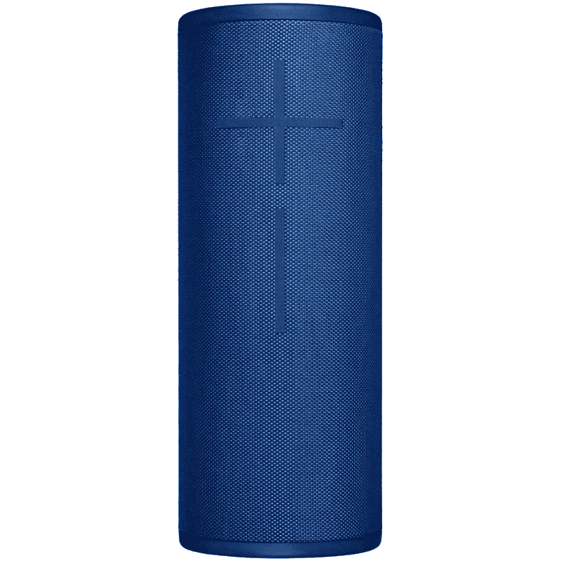

# 亚马逊 Echo Sub 防水吗？它有 IP 等级吗？

> 原文：<https://www.xda-developers.com/amazon-echo-sub-water-resistance/>

Echo Sub 是亚马逊 130 美元的低音炮，你可以[与一个或两个 Echo 扬声器](https://www.xda-developers.com/how-to-pair-echo-sub-amazon-echo/)配对，以增加扬声器本身无法产生的强大低音。Echo Sub 没有一长串值得大书特书的功能，主要是因为它只是一个增强音频体验的配套产品。但你可能想知道它是否防水，是否有 IP 等级？Echo Sub 并不完全是一个便携式设备，但它可以在游泳池或海滩附近使用，只要你能给它供电。然而，简短的答案是**不**。亚马逊回声潜艇不防水。

Echo Sub 不是为在雨中、游泳池或任何其他可能受到影响的地方使用而设计的，更不用说被淹没、喷洒或溅水了。最好是让它远离潮湿和湿气。不过，回声潜艇不防水的事实并不令人惊讶。我们这么说是因为现在市场上没有一款 Echo 音箱是防水的。

与其他一些[回声扬声器](https://www.xda-developers.com/amazon-echo-4th-gen-review/)不同，回声潜艇也不完全是便携式设备。它的重量超过 4 千克(约 9 磅)，也比一个 [Echo Dot](https://www.xda-developers.com/amazon-echo-dot-4th-gen-review/) 大得多，只要有合适的配件，它就可以在浴室内使用。作为一款低音炮，Echo Sub 放在地板上也能更好地工作。我们不建议将它放在桌子或梳妆架上，除非它足够重，不会在低音炮振动时发出嘎嘎声或移动。关于 Echo Sub 需要注意的另一件重要事情是，你还必须携带一个 Echo 扬声器来使用 Sub，这使得在你的房子、办公室或工作室以外的任何地方使用它变得更加困难。

 <picture></picture> 

Amazon Echo Sub + Echo Dot (4th gen) bundle

##### 亚马逊回声潜艇

亚马逊目前正在提供 Echo Sub 的捆绑包，其中包括两个 Echo Dot 或两个常规 Echo 扬声器，以实现完整的设置。

如果你正在寻找一个具有强大低音和出色音频输出的替代扬声器，我们建议选择像终极耳朵 MEGABOOM 3 这样的产品。这款扬声器最大的优点是它是便携式的，可以通过蓝牙无线工作，而且还防水，这意味着你可以带着它去游泳池或海滩。

 <picture></picture> 

Ultimate Ears Megaboom 3

##### 终极耳朵大爆炸 3

UE Megaboom 3 是无线工作且防水的 Echo Sub 的一个很好的替代方案。