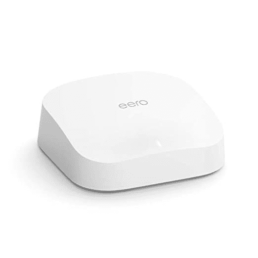

# 购买 Amazon Eero WiFi 6 mesh 路由器可节省高达 46%的费用

> 原文：<https://www.xda-developers.com/amazon-eero-wifi-6-mesh-routers-deal-november-2021/>

# 购买 Amazon Eero WiFi 6 mesh 路由器可节省高达 46%的费用

亚马逊的 Eero WiFi 6 mesh 路由器正在打折，你可以节省高达 184 美元。这是一个限时优惠，所以趁他们有货的时候买一个。

黑色星期五已经过去，但是网络星期一已经来临，亚马逊现在有一些诱人的交易！它的 Eero WiFi 6 mesh 路由器正在促销，您可以节省高达 46%的费用。这些路由器和扩展器可以覆盖 2000 和 1500 平方英尺。制成分别是。由于亚马逊的软件更新，他们可以自动获得最新的功能和安全补丁。它们极简、简单、功能强大，而且很可能支持你所有的设备。

 <picture></picture> 

Amazon Eero WiFi 6 mesh routers and extenders

##### 亚马逊 Eero 6

这些亚马逊 Eero WiFi 6 路由器和扩展器限时特价，您可以节省高达 46%的费用。趁他们还有存货，抓一个(或几个)吧！

这个 Eero 集合包括路由器和扩展器。

### 亚马逊 Eero 网状 WiFi 6 路由器

这些双频和三频路由器带有内置的 Zigbee 智能家庭集线器。因此，你可以在智能家居中使用支持 Alexa 的设备。它们占地 2000 平方英尺。制成 WiFi 速度高达千兆。Eero mobile 应用程序会引导您完成设置，并允许您从任何地方管理您的网络，因此您不需要精通技术就可以自己完成。路由器会自我更新，因此您也不需要手动更新来利用新功能和错误修复。这些路由器有不同的捆绑包，所以购买多个路由器可以节省更多的钱。你可以只花 77 美元买一个，或者花更多钱买更大的包。

### 西文字的延伸部分

亚马逊 Eero 扩展器增加了 1500 平方英尺。制成现有 Eero 路由器的额外覆盖。不过，它们与其他路由器不兼容。它们和普通的 Eero 路由器一样容易设置，并且会收到相同的软件更新。

*你会购买亚马逊 Eero WiFi 路由器或扩展器吗？请在下面的评论区告诉我们。*