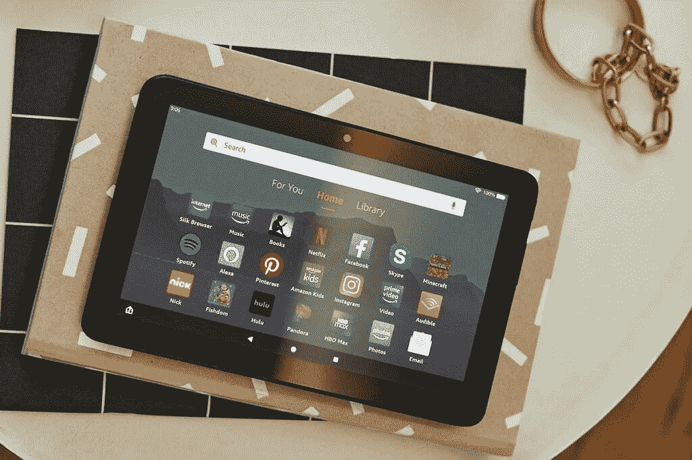

# 亚马逊 Fire 7 (2022) vs 亚马逊 Fire 7 (2019):亚马逊的热门平板电脑有什么升级？

> 原文：<https://www.xda-developers.com/amazon-fire-7-2022-vs-amazon-fire-7-2019/>

Fire 7 是亚马逊最畅销的平板电脑。它没有高端的规格或精致的设计，而且最肯定的是，它的目标不是与[最佳 ipad](https://www.xda-developers.com/best-ipad/)或[最佳安卓平板电脑](https://www.xda-developers.com/best-android-tablets/)竞争。但由于其极其便宜的价格，它仍然是精打细算的买家中非常受欢迎的选择。对于想要一台基本平板电脑来浏览网页、观看网飞和阅读书籍的人来说，这是一个完美的选择。凭借其丰富的应用生态系统和广泛的家长控制，它也是一款出色的儿童平板电脑。亚马逊今年早些时候用新硬件更新了入门级平板电脑，带来了强大的芯片组，更多的 RAM 和存储，USB-C 和大电池。

如果你正在摇火 7 (2019)，你可能会想你是否应该升级到更新的模型。这是你做出明智决定所需要知道的一切。

## 亚马逊 Fire 7 (2022) Vs Fire 7 (2019):规格

|  | 

烈火 7 (2022)

 | 

火 7 (2019)

 |
| --- | --- | --- |
| 建设 |  |  |
| 尺寸和重量 | 

*   180.68 毫米 x 117.59mm 毫米 x 9.67mm 毫米
*   282 克

 | 

*   163.1 x 74.9 x 8.3mm 毫米
*   189 克

 |
| 显示 | 

*   7 英寸 IPS 液晶屏
*   1024 x 600
*   最大亮度:300 尼特

 | 

*   7 英寸 IPS 液晶屏
*   1024 x 600
*   最大亮度:300 尼特

 |
| 社会学 | 

*   联发科 MT8168V/B
    *   ARM Cortex-A53 (2GHz)
    *   GPU: Mali-G52 3EE MC 1

 |  |
| RAM 和存储 | 

*   2GB LPDDR4 RAM
*   16GB 或 32GB
*   最高 1TB 的 microSD

 | 

*   1GB 内存
*   16GB/32GB
*   高达 512GB 的 MicroSD 卡

 |
| 电池和充电 | 

*   3750 毫安时
*   盒子里的 5W 有线充电器
*   10 小时的电池寿命

 |  |
| 安全性 | 没有指纹扫描仪 | 没有指纹扫描仪 |
| 后置摄像头 |  |  |
| 前置摄像头 |  |  |
| 港口 |  | 

*   MicroUSB
*   3.5 毫米音频插孔

 |
| 连通性 | 

*   Wi-Fi 双频(2.4GHz + 5GHz)
*   蓝牙 5.0

 | 

*   Wi-Fi 双频(2.4GHz + 5GHz)
*   蓝牙 4.1

 |
| 软件 | 

*   基于 Android 11 的 Fire OS 8

 | 

*   基于 Android 9 的 Fire OS 7

 |
| 价格 | 起价 59.99 美元 | $49.99 |

## 设计和展示:变化不大

就设计而言，新的 Fire 7 (2022)看起来与之前的型号相同。它的显示屏周围仍然有厚重的边框，并且是全塑料结构。如果亚马逊给平板电脑改头换面，缩小边框，让它看起来更现代，我们会很高兴，但似乎我们必须等到下一次升级才能实现。这当然不是最糟糕的平板电脑，如果你不喜欢无聊的黑色，你也可以搭配牛仔和玫瑰色。

尺寸和重量与上一款相同，电源按钮、音量键和 3.5 毫米音频插孔的位置也是如此。但是有一个很大的变化。古老的 microUSB 口终于没有了，取而代之的是 USB-C 口，充电体验更加便捷。

 <picture></picture> 

Amazon Fire 7 tablet

这款平板电脑的显示屏与上一款没有变化，这令人失望，因为显示屏本来就没有那么好。这是相当低的分辨率，沉闷，相当暗淡。这是一款 7 英寸的显示器，分辨率仅为 600 x 1024，每英寸 170 像素。它甚至不是高清的(720p)，你可以很容易地挑出单个像素。最大亮度为 300 尼特，这对于室内使用来说很好，但对于在阳光直射下使用该设备来说太低了。

* * *

## 升级的性能，更多的内存

从外面看，Fire 7 2022 可能与上一款没有太大区别，但其内部零件已经升级，具有更强大的部件。新的 Fire 7 (2022)由四核联发科 MT8168V/B 芯片组驱动，具有四个主频为 2.0GHz 的 Arm Cortex-A53 内核。亚马逊表示，新处理器比 Fire 7 (2019)的处理器快 30%，后者装有一个主频为 1.3GHz 的四核 CPU。RAM 也从 1GB 升级到 2GB，这意味着新型号可以在内存中容纳更多应用程序，应该可以提供更好的多任务处理体验。

虽然这些改进是受欢迎的补充，但平板电脑的真实性能仍然令人印象深刻。在 Geekbench 中，这款平板电脑在单核和多核测试中的得分分别仅为 166 分和 525 分。底线:不需要太多功率的任务，如网页浏览、媒体流和阅读书籍，应该没问题，但不要指望在这种硬件上运行图形密集型游戏。

* * *

## 更长的电池寿命，但充电速度仍然很慢

新的 Fire 7 (2022)摇滚与 Fire 7 (2019)相同的 2MP 前后摄像头；正如你所料，他们并不出色。单扬声器也没有变化。然而，电池看到一个大的更新。亚马逊表示，新型号配备了可持续 10 小时的更大电池，比 2019 年型号的 7 小时电池寿命有了显著改善。在现实世界中，平板电脑实现了它的承诺。在我们的视频流测试中，Fire 7 在电量耗尽前持续了 10 小时 26 分钟。虽然新平板电脑使用 USB-C 端口，但其充电速度仍然慢得令人痛苦。使用捆绑的 5W 充电器，大约需要四个小时才能将设备充满电。谢天谢地，你可以使用快速充电器，将充电时间缩短一半。

软件是 Fire 7 (2022)比上一代更有优势的另一个领域。它搭载了基于 Android 11 的新 Fire OS 8。同时，2019 版运行基于 Android 9 Pie 的 Fire OS 7。Fire OS 8 带来了许多新功能和变化，包括系统范围的黑暗模式，在后台访问 GPS/位置的能力，对请求访问位置、麦克风和摄像头的应用程序的一次性许可，以及其他底层改进。

* * *

## 火 7 (2022) vs 火 7 (2019):该不该升级？

 <picture></picture> 

Amazon Fire 7 2022

##### 亚马逊大火 7 (2022)

Fire 7 (2022)提供 7 英寸显示屏、更快的芯片组和长达 10 小时的电池续航时间。

从外面看，Fire 7 (2022)看起来和它的前代非常相似。然而，这两款设备在内部有很大差异。新的 2022 版本带来了几项显著的升级，包括更快的芯片组、更大的存储空间、切换到 USB-C、更长的电池寿命和更新的软件。然而，这些改进伴随着价格的上涨；新款起价 59.99 美元，比上一款贵了 10 美元。在我们看来，改进的性能、更多的 RAM 和存储以及 USB-C 使 Fire 7 (2022)成为 Fire (2019)的一个值得升级的产品。然而，我们不禁觉得，亚马逊应该给平板电脑配备更好的显示屏。如果流媒体是您的主要使用案例，我们建议选择 Fire 8 HD 或 Fire 10 HD，这两款显示器都很出色。看看我们对 Fire 7 与 Fire 8 高清版和 Fire 10 的面对面比较，看看哪一款 Fire 平板电脑最适合你。

尽管有种种限制和缺点，但不可否认的是，Fire 7 (2022)是目前最好的廉价安卓平板电脑之一。亚马逊还提供了一款特殊的[Fire 7(2022)](https://www.xda-developers.com/amazon-fire-7-2022-vs-amazon-fire-7-kids-2022/)儿童版，配有坚固的外壳和两年保修期。