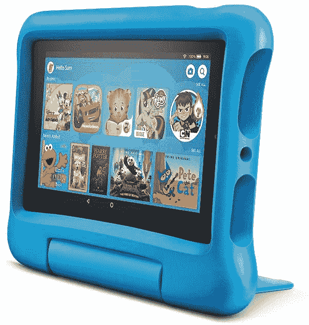

# 亚马逊 Fire 7 (2022) vs 亚马逊 Fire 7 Kids (2022):你该买哪款平板？

> 原文：<https://www.xda-developers.com/amazon-fire-7-2022-vs-amazon-fire-7-kids-2022/>

当亚马逊把他们的 Fire 7 平板电脑发给我查看时，他们还提供了一款 Fire 7 儿童平板电脑。对于那些想知道 Fire 7 和 Fire 7 孩子之间有什么区别的人来说，真的没有任何区别。Fire 7 儿童平板电脑配有一个又大又破的泡沫橡胶外壳，但在内部，平板电脑完全一样。如果你读了我对亚马逊 Fire 7 平板电脑的评论，你会知道这是一款便宜的“山寨”平板电脑，你应该买，但不要太在意。

## 添加上

但是 Fire 7 儿童平板电脑上有一些额外的东西，以证明你额外花费的 49 美元是合理的。我们会看看这些额外的东西，看看它们是否值得多花些钱。以下是您购买 Fire 7 儿童平板电脑后获得的体验:

1.  亚马逊 Fire 7 平板电脑
2.  泡沫橡胶外壳
3.  一年 Amazon Kids Plus 订阅
4.  两年无忧保障

### 保险杠外壳

最后一项是最有趣的，我们一会儿会讲到，但现在，让我们谈谈这个案例。这是一个厚泡沫橡胶外壳，厚度超过 Fire 7 的两倍。但我向你保证，这种厚度是用得其所的。毫不夸张地说，我花了几十分钟的时间将这个平板电脑从我日光浴室的水泥地上弹了起来。我想看看我是否能像篮球一样弹跳。我从未接近过，但不是因为缺乏尝试。

这种情况下的角落吸收粗糙的冲击时，下降，实际上是从一个坐姿抛出。我将这款平板电脑正面、背面、侧面和角落摔落，平板电脑本身没有受到任何损坏。当火还在箱子里的时候，你唯一能扑灭它的方法就是你碰巧撞到了桌子角上的屏幕或者其他什么东西。即使发生这种情况…

### 两年无忧保障

亚马逊将这款平板电脑视为面向儿童的设备，而儿童并不总是最关心电子产品。从掉落到溅出，尽管平板电脑有装甲，但孩子可能有一百种不同的方式取出它。这就是为什么亚马逊为这款平板电脑提供两年无疑问保修的原因。如果它坏了，寄回去，他们会给你寄一个新的。保险杆只能到此为止，保修单会带你走完剩下的路。

### 亚马逊儿童计划一年

Amazon Kids Plus 是亚马逊的儿童友好内容订阅计划。作为父母，你可以设置你的孩子可以下载什么，他们何时可以访问这些内容，甚至可以设置阅读或学习限制，例如，“是的，比利，你可以在阅读 30 分钟并继续使用这个数学应用程序 30 分钟后观看 Backyardigans。”亚马逊每月收取 4.99 美元的订阅费，所以当你购买这款平板电脑时，一年就是 60 美元的价值。

## 为什么您应该购买 Fire 7 儿童平板电脑

那么谁应该购买这款平板电脑呢？想给孩子一些无忧娱乐的父母是这里的主要顾客。在经历了抚养两个超过七岁的孩子的挑战后，我可以证明把电子产品放在孩子手中会有多大的压力。就我个人而言，我见过一些父母给孩子递 iPhone，我私下质疑过他们的心智是否正常。这是一个大胆的选择。

这款带保险杠外壳的平板电脑更适合这种情况。加上它提供的两年保证和安心，这本身就可以证明额外的费用是合理的。

当我的孩子长大时，亚马逊儿童增强版还不是一个真正的东西，所以我不能证明它对这么小的孩子有多大用处。但是，有一些基础是值得一试的。如果你想限制屏幕时间，或者什么应用可以下载，亚马逊 Kids Plus 是一个很好的机制。我真正喜欢 Kids Plus 的主要原因是“先学习”机制，它允许父母设定学习目标，在孩子继续观看视频或玩游戏之前必须达到这些目标。这是一个非常聪明的想法，坦率地说，我希望更多的家长控制软件可以做到这一点，是的，我在跟你说谷歌和苹果。

## 如果你没有孩子呢？

这里要记住的重要一点是，如果你购买 Fire 7 儿童平板电脑，你得到的是一个普通的 Fire 7 平板电脑，带有一个易于拆卸的保险杠。

有些人可能会看着两年保修期，心想，“如果我买了这款儿童平板电脑，我会得到同样的 Fire 7 平板电脑，但有两年保修期，所以如果我坏了，我可以用比第二个 Fire 7 更少的钱更换它。”一旦你算出来，这是一个合理的论点。Fire 7 平板电脑售价 60 美元，这款儿童平板电脑售价 110 美元。如果你在两年的时间里坏了一次，亚马逊会更换它，你可以花 110 美元买到价值 120 美元的平板电脑。从长远来看，你会为自己节省 10 美元。当然，那只是在你真的打破它的情况下。

简而言之，即使没有保险杠，Fire 7 平板电脑也是一款坚固的小平板电脑，即使你在头两年内弄坏了它，你也只能节省 10 美元的更换费用。正如我在评论中所说，这是一款已经相当耐用的廉价平板电脑。当然，儿童版附带的保险杠可以让你把它从墙壁和地板上弹开，但除非你真的打算这么做，否则它不会给等式增加任何其他内容。

当然，这不仅仅是一次替换。亚马逊没有限制你可以获得的替换平板电脑的数量。只要你能把坏了的平板电脑送进来，亚马逊会在整个两年内进行更换。它可能是两个坏了的平板电脑，或者二十个，尽管祝你好运向客服解释第二十个。

假设你不是地球上最容易发生事故的人，购买这款平板电脑的唯一原因是你有处于适当年龄范围的孩子。亚马逊说这是三到十二岁的孩子。我怀疑我的女儿不会在八岁左右就被保险杠撞死，但当然，你的里程数可能会有所不同。

Fire 7 平板电脑和 Fire 7 儿童平板电脑都可以在 Amazon.com 买到。

 <picture></picture> 

Amazon Fire 7 Kids

##### 亚马逊解雇 7 名儿童

亚马逊 Fire 7 Kids 是 Fire 7 平板电脑的儿童友好版。

总的来说，如果你有孩子，这是一个不错的交易。如果你打算使用 Amazon Kids Plus，它会变得更好。平板电脑可能足够坚固，能够承受你可能向它投掷的许多东西。这意味着仅仅是担保不值得额外的钱。保险杠是俗气的，七岁以上的自尊的人不会在公共场合用它撞死，所以也要记住这一点。但如果你有孩子，你想给他们一台平板电脑，并且在接下来的两年里不在乎它，这是一个不错的选择。