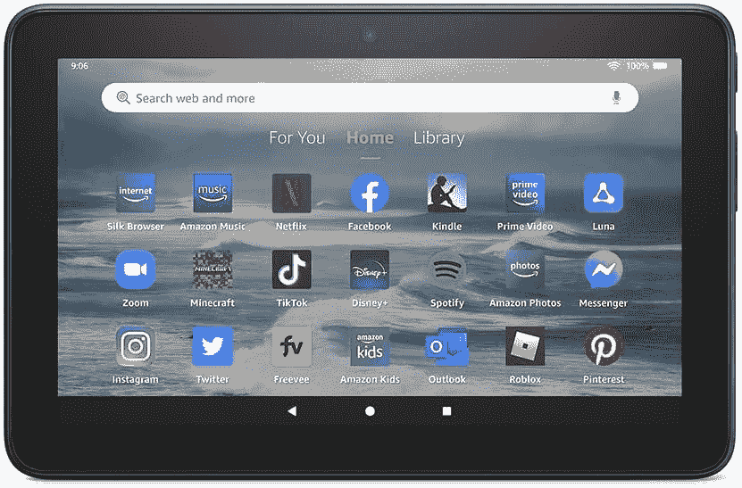

# 亚马逊 Fire 7 评论:这是你的山寨平板电脑

> 原文：<https://www.xda-developers.com/amazon-fire-7-review/>

亚马逊 Fire 系列平板电脑是最受欢迎的非 iPad 系列平板电脑之一。Fire 7 是亚马逊阵容中最便宜的，这一点显而易见。你可以指出这款平板电脑的任何功能，批评它需要做得更好。处理器？绝对的。屏幕？肯定的！触摸灵敏度？是啊！这款平板电脑唯一引人注目的地方是电池续航时间，以及它使用 USB-C 充电和传输数据。其他的都是妥协。

但是这款亚马逊 Fire 7 平板是 60 美元。你不应该关心它。它应该放在咖啡桌上，只要你想阅读或看电影，它就在那里。由于缺乏更好的术语，它是一次性平板电脑。这是你给孩子的平板电脑，告诉他们去玩吧。

这不应该是电脑的替代品，也不是真正的 Kindle 替代品(尽管它可能是)。它也不意味着取代任何其他最好的安卓平板电脑。这款平板电脑是为那些认为自己可能想要一台平板电脑，并且一直在亚马逊购物的人准备的。60 美元，这是一笔好交易。如果你能在亚马逊的任何一次定期销售中以更低的价格买到它(例如 [Prime Day](https://www.xda-developers.com/amazon-prime-day/) )，那就是便宜。

 <picture></picture> 

Amazon Fire 7 tablet

##### 亚马逊 Fire 7

亚马逊 Fire 7 平板电脑是基本款，也是你能买到的最便宜的平板电脑。它走了很多弯路，但如果你进入亚马逊的生态系统，它是一个不错的设备。

* * *

## 亚马逊 Fire 7:规格

| 

规格

 | 

亚马逊 Fire 7

 |
| --- | --- |
| **尺寸&重量** | 

*   180.68 毫米 x 117.59mm 毫米 x 9.67mm 毫米
*   282 克

 |
| **显示** | 

*   7 英寸 IPS
*   1024 x 600
*   最大亮度:300 尼特

 |
| **SoC** | 

*   联发科 MT8168V/B
*   ARM Cortex-A53 (2GHz)
*   GPU: Mali-G52 3EE MC 1

 |
| **风筒&储存** | 

*   2GB LPDDR4 RAM
*   16 或 32GB
*   最高 1TB 的 microSD

 |
| **电池&充电** | 

*   3750 毫安时
*   盒子里的 5W 有线充电器

 |
| **后置摄像头** | 

*   初级:2MP
*   前置:200 万像素

 |
| **端口** | USB 类型-C |
| **软件** | 

*   费罗斯·8.3.1.1
*   基于 Android 11，API 级别 30

 |
| **颜色** |  |

***关于这个评论:**我收到了亚马逊发来的一个亚马逊 Fire 7 平板来评论。亚马逊没有对这篇评论的内容提出任何意见。*

* * *

## 亚马逊 Fire 7:定价和可用性

亚马逊 Fire 7 在美国有售，价格如下:

*   支持锁屏广告:
*   不带锁屏广告:

* * *

## 亚马逊 Fire 7:硬件和设计

*   这栋建筑是廉价塑料做的，屏风很差。
*   够轻，是个好读者。

Fire 7 平板电脑上的硬件几乎是最基本的。这款平板电脑的机身由塑料制成，背面印有亚马逊品牌(商标 smile)。它有黑色、牛仔布和玫瑰色。我审查的设备是牛仔布。当以横向放置时，左上方有一个向上发射的扬声器。在右边，有一个电源按钮，音量摇杆，USB-C 端口和耳机插孔。底部是 microUSB 插槽，可以使用指甲访问。

总的来说，这不是令人印象深刻的硬件。屏幕尤其不好。最大 300 尼特，白天看不到。甚至我的阳光门廊在很多时候都太亮了。对比度不能给你一个好的明暗区分。因此，如果你的电影中有一个明亮的场景，你将能够很好地看到它，但一旦事情变暗，你就会失去所有的细节。

不仅如此，它的屏幕分辨率非常低，只有 600 x 1024 像素和 170ppi。你不会在屏幕上获得蓝光质量，甚至一些用户界面看起来有颗粒。我可以在这里提醒你，这款平板电脑的价格是 60 美元，但这将重复我自己的观点，因此对你来说幸运的是，我不会。

这款平板电脑重 282 克，比普通手机和 Kindle Paperwhite 重约三分之一。

触摸灵敏度也不是很好。当你正在播放视频并试图暂停或倒带时，有时需要额外点击一两下。它会到达那里，但是它可能需要一些额外的坚持。很难说这是因为屏幕，还是驱动触摸控制的处理器。不管怎样，都不好。不过，我没有注意到阅读时翻页有任何问题，所以我想知道是否是处理器的问题。话说回来，我也没有注意到在玩更多处理器的游戏时有任何问题，所以这可能是两者的结合。

说到阅读，这款平板电脑重 282 克，比普通手机和 Kindle Paperwhite 重约三分之一。在长时间的阅读过程中，我没有发现任何不适。当然，更轻更好，但总的来说，我认为亚马逊让这款设备足够轻，可以作为一个明智的电子阅读器和视频播放器。

* * *

## 亚马逊 Fire 7:软件

*   亚马逊确实为了更好而收紧了它的用户界面。
*   它首先是为你提供亚马逊内容。

在软件方面，FireOS 和操作系统一样基本。fire OS 8.1.1.3 基于 Android 11，所以你可以在 UI 底部看到熟悉的返回、主页和多任务按钮。UI 的其余部分旨在帮助你做一件事——消费内容，最好是 Amazon 内容——有一个例外，我们稍后会谈到。

我肯定更喜欢这个版本的 Fire OS。

主屏幕分为三个基本部分:“为您”、“主屏幕”和“资料库”。“为你”页面提供了你最近的应用程序、天气以及专为你策划的内容的概览。您可以从 Appstore 查看 Kindle Unlimited、Prime Video 和应用程序建议中包含的内容。您还可以通过向上或向下移动类别来对“为您”页面进行最小程度的自定义。你的图书馆就是你拥有的或在你的愿望清单上的应用程序、书籍和视频的集合。

家是两者的结合。在顶部，有一个小部件向你提供推荐的内容，并允许你在应用程序中从哪里离开就回到哪里。向下滚动，你会看到你已经安装的应用程序，以及其他建议，如亚马逊购物和亚马逊 Kindle。在你问之前，不，除了华盛顿邮报，你不能删除任何一份。

所以，如果对这块石碑的用途有任何疑问，那就把它放下吧。这是一款为你提供亚马逊内容的平板电脑。它可以是你已经拥有或即将拥有的内容，但无论哪种方式，亚马逊都是有报酬的。这就是为什么亚马逊可以卖 60 美元的平板电脑。

我喜欢亚马逊最近收紧了用户界面。在过去，你可以/必须在更多的标签之间滚动，包括应用程序、电影、书籍、亚马逊购物等等。当时它是不同的东西，正因为如此，它令人耳目一新。但是新鲜感很快就消失了。我肯定更喜欢这个版本的 Fire OS。

至于软件的其余部分，亚马逊应用商店激发了另一篇关于它有多糟糕的社论。TL；DR 版本是，只要你在做平板电脑该做的事情，Appstore 就很棒。你可以像网飞、派拉蒙+当然还有亚马逊 Prime Video 这样的流媒体内容，或者你可以连接到 Twitter、脸书和 Instagram 这样的社交媒体网络。大概就是这样。Appstore 中有很多游戏，但它们仅限于“闲踢踏舞”和“连续三排相同颜色的球”类型的游戏。

如果你降低对这款平板电脑功能的期望，你会没事的。如果你想玩第一人称射击游戏，请三思。

* * *

## 亚马逊 Fire 7:相机

*   除了视频通话，他们什么都不擅长。
*   前部和后部是相同的传感器，它们是上一代产品的延续。
*   不要用后置摄像头。说真的，就是不要。

前置和后置摄像头都是相同的 2MP 传感器，也就是说它们并不起眼。它们还是上一代的 200 万像素传感器，因此节省了成本！幸运的是，在使用缩放功能播放视频流时，2MP 已经足够了。通话质量和图片一样非常清晰。当然，这将取决于良好的照明，所以也许拿起一些环形灯，你会一切顺利。

背面的摄像头不是你应该使用的东西，但那是因为它是一台平板电脑，而不是因为摄像头不好。还有，相机不好。尽管如此，我还是暂时放下自尊，拍了几张照片。

不足为奇的是，相机拍出的照片平平无奇，完全缺乏细节。我把我的拍照时间限制在白天，加入了一些微距镜头。所以真的，摄像头对于视频会议来说刚刚好，而且视频会议仅限于 Zoom 和 Alexa。

* * *

## 亚马逊大火 7:杂项笔记

*   续航不错。
*   音频不太好，但是有很多选择。
*   性能与 60 美元的平板电脑不相上下。

### 电池和充电

平板上电池续航不错。Fire 7 平板电脑配有 3750 毫安时电池。由于显示屏的原因，我一直都是在最大亮度下使用这款平板电脑。不过，在认输之前，这款平板电脑实现了 10 小时 26 分钟的视频流。当我加入一点游戏的时候，时间降到了 8 小时左右。包装盒中的 5W 充电器需要四个多小时才能充满电。我通过使用 65W 的充电器缩短了这个时间，但只减少了大约一半的充电时间。

### 声音的

从一个向上发射的扬声器发出的声音对于视频播放来说不够响亮，但游戏声音可以产生足够的音量。如果你决定走这条路，平板电脑可以连接到蓝牙 5.0 LE。对于喜欢有线解决方案的人来说，还有一个耳机插孔。

### 表演

Fire 7 获得 166/525(单核/多核)的 Geekbench 成绩。这两个都不好，但你不需要社交媒体和流媒体的强大马力。闲置 tap 游戏运行完美。有大量动画和图形的游戏会给你带来问题，但是当然，你的收获可能会有所不同。

### 电源按钮

平板电脑的构造对我的肉偶手来说有点小。因此，当在横向模式下玩游戏时，意外碰到电源按钮并关闭屏幕是很常见的。当我重新打开时，游戏恢复得很好，但它经常发生，令人讨厌。

### 持久性

在过去，亚马逊对这款平板电脑的耐用性大做文章。我没有对这一特性进行任何具体测试，但在我的测试中，这款平板电脑确实经受住了从桌子上摔下来的一两下。我见过 Fire 平板电脑从楼梯上摔下来还能幸存下来，我毫不怀疑这款平板电脑也能幸免于难。这并不是建议您故意摔下平板电脑。但问题是，即使你把它掉在地上摔坏了，它也是 60 美元，所以它通常不被认为是银行抢劫犯。

### 官方火灾 7 案

我的评测小组还带来了一个官方保护套，这增加了平板电脑的耐用性。外壳是塑料的，外面有一层布，里面有一层柔软的覆盖物。盖子被对角分成两半，因此翻盖可以翻转，以垂直或水平支撑平板电脑。这种支撑效果并不好——平板电脑总是不稳定。你可能会为你的 Fire 7 找到一个更好的第三方案例。

* * *

## 该不该买亚马逊 Fire 7？

正如这篇评论指出的，亚马逊 Fire 7 并不是钱能买到的最好的平板电脑。这款平板电脑的独特之处在于它的目标是低廉的价格。实际上，这款平板电脑的一切都可以更好，但这将是只见树木不见森林。它不是要取代你的电脑、手机，甚至不是你的 iPad。

Fire 7 不应该是计算机的替代品

这款平板电脑的目的是降低进入亚马逊生态系统的门槛，并继续充当进入该系统的门户。低廉的价格意味着你可以买几个，然后忘记它们，当你换成手机或[好的 iPad](https://www.xda-developers.com/best-ipad/) 不是一个选项时再拿起它们。

有了 Prime Day 的优惠，人们甚至可以以低于 60 美元的起价买到这款手机，在这种情况下，在家里保留一台手机就变得有点不需要动脑筋了，因为。在厨房的桌子上放一个，在沙发旁边的咖啡桌上放一个，在车库里放一个，给你的每个孩子一个——这就是亚马逊在 Fire 7 中的目标。因此，下次你使用显示器时，你有更高的机会使用联合亚马逊服务，对亚马逊来说，这是一个胜利。

 <picture></picture> 

Amazon Fire 7 tablet

##### 亚马逊 Fire 7

亚马逊 Fire 7 平板电脑是基本款，也是你能买到的最便宜的平板电脑。它走了很多弯路，但如果你进入亚马逊的生态系统，它是一个不错的设备。