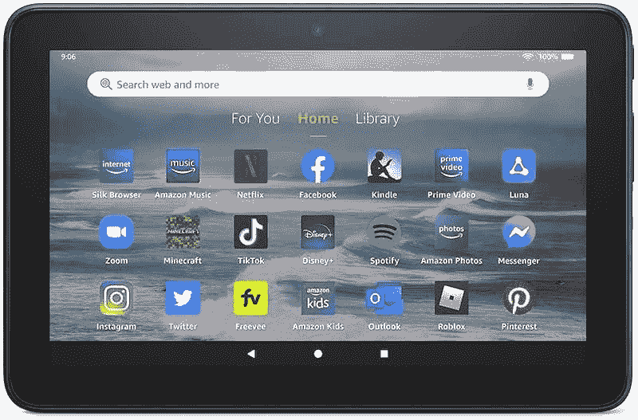

# 亚马逊 Fire 7 vs Fire HD 8 vs Fire HD 10:你该买哪款亚马逊平板？

> 原文：<https://www.xda-developers.com/amazon-fire-7-vs-amazon-fire-hd-8-vs-amazon-fire-hd-10/>

亚马逊的 Fire 平板电脑可能是 2022 年你能买到的最实惠的平板电脑。它们为桌面带来了巨大的价值，非常适合那些只想要一台可靠的平板电脑来消费媒体和访问网络的人。Fire 平板电脑运行在亚马逊的 Fire 操作系统上，并依赖于该公司的应用商店，而不是谷歌 Play 商店。它们可能不是最好的 iPads 或 T2 最好的安卓平板电脑的绝佳替代品，但预算有限的消费者会发现其中一个很有价值。

然而，真正的问题是买哪一款亚马逊 Fire 平板电脑？在这篇文章中，我们将看看[亚马逊 Fire 7](https://www.xda-developers.com/amazon-fire-7-review/)vs[Fire HD 8](https://www.xda-developers.com/amazon-fire-hd-8-plus-fire-hd-8-upgrades/)vs Fire HD 10 的对比，看看 2022 年买哪个更好。在亚马逊购物时，你会遇到更多的 Fire 平板电脑型号，但这些是你的主要选择，而其他的是稍微升级的版本，增加了一些功能。让我们开始比较，看看哪一款 Fire 平板电脑最物有所值。

**浏览此比较:**

## 亚马逊 Fire 7 vs Fire HD 8 vs Fire HD 10:规格

在开始比较之前，我们先来快速看一下每款 Fire 平板电脑的规格:

| 

规格

 | 

火灾 7

 | 

Fire HD 8

 | 

Fire HD 10

 |
| --- | --- | --- | --- |
| **显示** | 7 英寸 IPS 液晶屏(1024 x 600) | 8 英寸 IPS 液晶屏(1280 x 800) | 10.1 英寸 IPS 液晶屏(1280 x 800) |
| **处理器** | 

*   联发科 MT8168 四核芯片组
*   马里-G52 3EE MC1

 | 

*   联发科 MT8168 四核芯片组
*   马里-G52 3EE MC1

 | 

*   联发科 MT8183 八核芯片组
*   马里-G72 MP3

 |
| **内存** | 2GB 内存 | 高达 3GB 内存 | 高达 4GB 内存 |
| **存储** | 16/32GB(最高 1TB 的 microSD 卡) | 32/64GB(最高 1TB 的 microSD 卡) | 32/64GB(最高 1TB 的 microSD 卡) |
| **音频** | 单声道扬声器 | 带杜比全景声的双扬声器 | 带杜比全景声的双扬声器 |
| **后置摄像头** | 2MP | 2MP | 5MP |
| **前置摄像头** | 2MP | 2MP | 2MP |
| **电池** | 

*   长达 10 小时
*   含 5W 充电器

 | 

*   长达 12 小时
*   含 5W 充电器

 | 

*   长达 12 小时
*   含 9W 充电器

 |
| **端口** | 

*   USB 类型-C
*   3.5 毫米耳机插孔

 | 

*   USB 类型-C
*   3.5 毫米耳机插孔

 | 

*   USB 类型-C
*   3.5 毫米耳机插孔

 |
| **颜色** |  | 

*   怀特（姓氏）
*   黑色
*   暮光蓝
*   李子

 | 

*   黑色
*   斜纹粗棉布
*   橄榄
*   淡紫色

 |

看一下规格表，可以肯定地说，与产品线中的其他两款平板电脑相比，Fire HD 10 配备了更多功能。就规格而言，Fire 7 是最经济的选择，而 Fire HD 8 则介于两者之间。

## 设计与展示

就设计和制造质量而言，亚马逊 Fire 平板电脑没有一款能取悦大众。Fire 7、Fire HD 8 和 Fire HD 10 都是塑料外壳的平板电脑，以反映其价格标签。即使是 Fire HD 8 和 Fire HD 10 的 Plus 版本也是如此，因为它们在物理上是相同的设备，只是增加了一些功能。每款平板电脑的儿童版本都配有亚马逊所说的儿童保护套，旨在防止跌落和碰撞。Fire HD 10 平板电脑看起来有点现代，因为屏幕周围有统一的边框。

正面是你可以看到大部分差异的地方，因为三款平板电脑都有不同尺寸的显示屏。Fire 7 正面有一个 7 英寸的面板，这意味着它是所有产品中最小的。Fire HD 10 配备了 10.1 英寸的面板，而 Fire HD 8 位于中间，配有 8 英寸的显示屏。Fire 7 的显示器也是三款显示器中分辨率最低的，为 1024 x 600，相当于每英寸 171 像素。Fire HD 8 支持最大 1280 x 800 (189 PPI)的分辨率，Fire HD 10 支持最大 1920 x 1200 (224 PPI)的分辨率。

在这次比较中，Fire HD 10 不仅比其他两款平板电脑的显示屏更大，而且在一些清晰的视觉效果方面，它也是最清晰的。你最好购买 Fire HD 8 或 Fire HD 10 平板电脑用于媒体消费，因为它们都有双扬声器设置，支持杜比 Atmos。Fire 7 是最小最便宜的平板电脑，只有一个单声道扬声器。如果显示器尺寸和清晰度，或者只是一般的媒体消费体验对你很重要，你最好购买 Fire HD 10 或 Fire HD 8 平板电脑。这三款平板电脑上都有一个 USB Type-C (2.0)端口和一个 3.5 毫米耳机插孔，这很好。

## 硬件和性能

这次比较的三款平板电脑都采用了联发科芯片组。亚马逊 Fire HD 10 获得八核联发科 MT8183 芯片组，采用 ARM Mali-G72 MP3 GPU。Fire HD 8 和 Fire 7 平板电脑都配备了四核联发科 MT8168 芯片组，采用 ARM Mali-G52 3EE MC1 GPU。在这次比较中，Fire HD 10 是性能更好的平板电脑，但在日常任务方面，Fire HD 8 和 Fire 7 同样出色。Fire HD 10 在内存方面也有一个小优势，因为它可以购买高达 4GB 的 RAM。Fire HD 8 的最高内存为 3GB(plus 版本),而 Fire 7 的内存仅为 2GB。

拥有更多内存固然很好，但即使是 Fire 7 和配备 2GB 内存的 Fire HD 8 标准版本也可以顺利处理几乎所有任务。2GB 内存应该足以满足你的日常使用，无论是在 Prime Video 上观看视频还是使用 Kindle 应用阅读电子书。额外的内存将允许您在后台打开更多的应用程序。然而，更实惠的 Fire 7 在存储部门缺乏。

虽然 Fire HD 8 和 Fire HD 10 平板电脑都配备了高达 64GB 的内部存储空间，但 Fire 7 的最高存储空间为 32GB。事实上，Fire 7 的基本版本只有 16GB 的存储空间，其中只有大约 10GB 可供用户使用。是的，你可以在所有三款平板电脑上添加一个存储容量高达 1TB 的 microSD 卡，但如果你打算长期使用这些平板电脑，那只是要求你花更多的钱。Fire HD 8 和 Fire HD 10 都获得了 32GB 的基本存储，我们认为这对大多数用户来说是理想的。

亚马逊没有公开其 Fire 平板电脑的电池规格。然而，假定 Fire 7 具有三个给定物理尺寸的电池中最小的电池是安全的。亚马逊还表示，Fire 7 最多只能使用 10 小时，而 Fire HD 8 和 Fire HD 10 都可以使用 12 小时。

Fire HD 10 配有 9W 充电器，而 Fire HD 8 和 Fire 7 平板电脑的包装盒内只有 5W 充电器。即使是 9W 的充电速度也没有什么值得大书特书的，但它会稍微快一点。这两款平板电脑都没有无线充电选项，所以请记住这一点。

在平板电脑的情况下，相机通常不会占据中心位置，在这次比较中，Fire 平板电脑也是如此。Fire 7 和 Fire HD 8 的前后都有一对 200 万像素的摄像头。Fire HD 10 的背面有一个略好的 500 万像素传感器，但在前面保留了相同的 200 万像素传感器，用于自拍和偶尔的视频通话。

## 软件

尽管在这次比较中 Fire 7 是最实惠的平板电脑，但它运行最新的软件也赢得了加分。这是该系列中唯一一款运行亚马逊基于 Android 11 的新 Fire OS 8 的平板电脑。Fire HD 8 和 Fire HD 10 都运行 Fire OS 7 版本，如果你想知道的话，该版本是基于 Android 9 的。如果亚马逊决定更新 Fire HD 8 和 Fire HD 10，它们似乎都可以运行 Fire OS 8，尽管目前还没有官方消息。

你不会注意到 Fire OS 7 和 Fire OS 8 之间的巨大差异，因为它们都是 Android 的去谷歌版本。然而，新的操作系统带来了许多重要的变化，包括系统范围的黑暗模式，最新的安全调整等等。我们建议你查看亚马逊的[开发者文档](https://developer.amazon.com/docs/fire-tablets/fire-os-8.html)来了解更多细节上的差异。请放心，从亚马逊 Appstore 下载的所有应用程序和预装在平板电脑上的应用程序在所有这些平板电脑上都可以正常运行。如果你有心情修补你的 Fire 平板电脑，你可以随时寻找变通办法[安装 Google Play 服务和 Play Store](https://www.xda-developers.com/amazon-fire-toolbox-helps-install-google-apps-change-launchers-and-more-on-amazon-fire-tablets/) 。

至于软件体验，你可以期待使用所有的亚马逊服务，包括亚马逊 Alexa、音乐、书籍、视频、电影等等。Fire 平板电脑非常适合那些大量投资亚马逊产品和服务的人。你还可以用你的声音召唤亚马逊的数字助理，并导航软件。值得注意的是，你还可以获得一些简洁的功能，包括显示模式，它将许多 Alexa 的功能显示在屏幕上供你使用。它可以显示日历约会、新闻报道、智能家居设备控制等等。尤其是 Fire HD 10，由于屏幕更大，它还利用了分屏功能来实现更好的多任务处理。

儿童版平板电脑附带一年的亚马逊儿童+订阅，其中包含数千本无广告的书籍、游戏、视频等。他们还获得了一个家长仪表板，根据孩子的年龄、教育目标等过滤内容。这些功能是对儿童保护外壳和两年保修的补充，使用两年保修，您可以免费更换损坏的平板电脑。

## 亚马逊 Fire 7 vs Fire HD 8 vs Fire HD 10:你该买哪个？

新的亚马逊 Fire 7 平板电脑将花费你 59 美元购买 16GB 存储空间的基本款。32GB 型号售价 79 美元。这些 Fire 7 平板电脑的价格是针对带锁屏广告的变体的。不带锁屏广告的基本款起价 75 美元。带广告支持的 Fire HD 8 的基本版本售价为 89 美元，而不带锁屏广告的基本版本售价为 105 美元。在这次比较中，Fire HD 10 是最贵的平板电脑，不带任何广告的基本款起价为 205 美元。

那么，2022 年你应该买哪一款亚马逊 Fire 平板呢？嗯，这主要取决于你的预算和平板电脑的日常使用。对于那些想要试水并第一次习惯这款平板电脑的人来说，Fire 7 很好。购买 Fire 7 平板电脑的一个主要优势是，它配备了最新的 Fire OS 软件，这是其他两款平板电脑所缺乏的。但如果你忽略软件优势，Fire HD 8 和 Fire HD 10 都是值得考虑的明显更好的选择。

与 Fire 7 相比，Fire HD 8 和 Fire 10 不仅尺寸更大、外观更好，而且基本型号的存储空间也更大。与 Fire HD 8 的基本型号 89 美元的价格相比，Fire 7 的 32GB 版本 79 美元的价格看起来有点不太合意。你最好多花 10 美元购买 Fire HD 8，以利用更多的存储空间和更好的显示效果。

但如果你打算购买一款纯粹用于媒体消费的 Fire 平板电脑，那么你肯定会获得 Fire HD 10 的最佳体验。与 HD 8 相比，它有更好的显示屏，甚至升级了内部部件。长话短说，买 Fire HD 8 比买 Fire 7 好，尽管后者在软件方面更好。但如果你不介意在平板电脑上花一大笔钱用于媒体消费，那么 Fire HD 10 显然是赢家。

 <picture></picture> 

Amazon Fire 7

##### 亚马逊 Fire 7

Fire 7 是亚马逊新推出的入门级平板电脑，价格仅为 59 美元。

 <picture></picture> 

Amazon Fire HD 8

##### 亚马逊 Fire HD 8

Fire HD 8 是比 Fire 7 平板电脑略好的产品。它拥有更大更清晰的显示屏，但在软件方面有所欠缺。

 <picture></picture> 

Amazon Fire HD 10

##### 亚马逊 Fire HD 10

Fire HD 10 是 2022 年你能从亚马逊买到的最好的 Fire 平板电脑。除了更大更好的显示屏，Fire HD 10 还更新了内部结构。