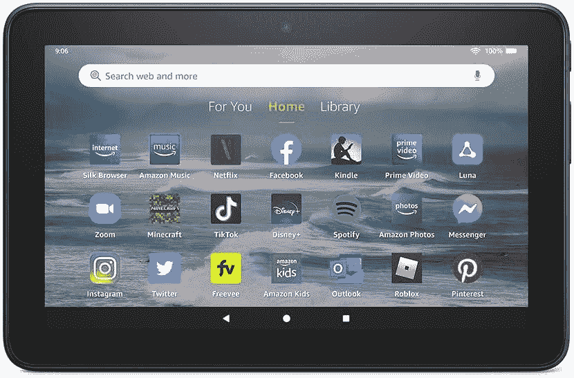

# 亚马逊 Fire 7 与亚马逊 Kindle:哪个设备更好？

> 原文：<https://www.xda-developers.com/amazon-fire-7-vs-amazon-kindle/>

亚马逊 Fire 7 和亚马逊 Kindle 有一个共同的外形，但它们是两个完全不同的东西。一个是传统的平板电脑，另一个是用于阅读的专用设备。亚马逊 Fire 7 (2022)是亚马逊平板电脑阵容中的最新版本，带来了几项显著的改进，如更快的芯片组、两倍的内存、更长的电池寿命和免提 Alexa。虽然亚马逊自 2019 年以来一直没有更新基本版 Kindle 和 Oasis，但它去年确实更新了 Kindle Paperwhite 系列，推出了 Paperwhite 第 11 代和 Paperwhite Signature Edition。新机型带来了关键的升级，如更大更好的显示屏、更快的翻页速度、USB-C 端口、无线充电和更长的电池寿命。

Fire 7 和亚马逊 Kindle 都可以用来阅读书籍和 pdf 文件。但是哪个是更好的设备呢？对于狂热的读者来说哪个更好？从技术上来说，Kindle 当然是最好的阅读设备，但在做出最后决定之前，你可能需要考虑其他因素。以下是你需要知道的。

## 设计和便携性

亚马逊 Fire 7 (2022)和入门级 Kindle 在设计上是站在同一起跑线上的。Kindle Fire 7 看起来像是直接从 2015 年出来的。它的设计与其前代产品相同，采用塑料结构和厚重的边框，违背了边对边显示器的趋势。

 <picture></picture> 

Amazon Kindle Paperwhite 11th Gen

基本版 Kindle 看起来没有太大的不同，因为它有相当大的边框和全塑料设计。两者都不具备防水性能。Fire 7 有一个 USB-C 端口、一个 3.5 毫米音频插孔和一个 microSD 卡。另一方面，Kindle 使用 microUSB 端口，没有音频插孔或 SD 卡插槽。

 <picture></picture> 

Amazon Fire 7 (2022)

Fire 7 2022 平板电脑和 Kindle 握起来都很舒服，便于随身携带。然而，Fire 7 的重量为 288 克，比基本版 Kindle(174 克)和 Paperwhite 第 11 代(205 克)稍重一些。

## LCD 与 E Ink:哪个屏幕更适合阅读？

显示器是 Fire 7 (2022)和 Kindle 之间最大的区别。Fire 平板电脑有一个 7 英寸的液晶面板，分辨率为 1024 x 600，每英寸 171 像素。按照 2022 年的标准，这款显示器相当小，分辨率也很低。Kindle 第十代采用了 6 英寸的 E Ink 显示屏，像素密度为 167 PPI。虽然这两款设备在显示屏尺寸和像素密度方面很接近，但它们使用的显示技术完全不同。

Kindle 的低功耗电子墨水显示器非常适合显示文本，看起来和行为都像真纸一样。与 LCD 或 OLED 面板不同，E Ink 屏幕没有眩光，所以无论你是在阳光直射下还是在房间里阅读，显示器都像打印的页面一样可读。E Ink 显示器没有背光；相反，它们依赖于环境中的环境光——同样，实体书需要外部光源。照明条件越好，E Ink 显示屏会显得越清晰、越明亮。对于夜间阅读，所有 Kindle 电子阅读器都配有内置的前置灯，比背光液晶显示器和有机发光二极管更容易保护眼睛。Paperwhite 第 11 代和 Kindle Oasis 还具有温暖的光线，允许用户将光线颜色从白色变为琥珀色，以获得更舒适的阅读体验。

Fire 7 2022 有一个液晶面板，非常适合观看视频和照片以及玩游戏。它有更快的刷新率(60Hz)，可以显示各种颜色，不同于单色的 E Ink 显示器。然而，在阅读体验方面，它不是 Kinde 的 E Ink 显示器的对手。众所周知，液晶显示器在阳光下会出现大量眩光。由于它们是背光的，这意味着光线是从显示器后面投射出来的，所以它们可能会有点太亮，无法在晚上或黑暗中阅读。Fire 7 2022 适合休闲阅读，但用于大量阅读时可能会导致眼睛疲劳。

作为一个在所有设备上广泛阅读的人，包括智能手机、笔记本电脑和电子阅读器，我可以告诉你，Kindle 是长时间阅读的最佳设备。我可以舒舒服服地在 Kindle Paperwhite 上阅读几个小时，而不会让眼睛疲劳。

## 电池寿命

任何 Kindle，无论是 base Kindle 还是 Paperwhite，在续航能力方面都将轻松击败 Fire 7 (2022)。你需要每隔几天给你的 Fire 7 充电，但是 Kindle 一次充电可以用几周(而不是几天)。Kindle 第 10 代声称可以提供长达四周的电池，而更新的 Paperwhite 第 11 代可以持续十周。Kindle 的电子墨水显示屏非常节能。只有当你翻到新的一页或与屏幕互动时，它才会耗电。当只是在屏幕上显示文本时，它几乎不耗电，当你想到这一点时，你会感到非常惊讶。

## 局限性:为什么你不想买 Kindle 而不是 Fire 7

Kindle 电子阅读器是专用的阅读设备，虽然它们有 Wi-Fi(和可选的蜂窝)连接，但它们只用于浏览和下载书籍。它们的功能极其有限。你不能在 Kindle 上看视频、玩游戏或听音乐。这意味着，当您希望一款设备能够满足您多种多样的需求时，它们并不适合。因此，如果你正在旅行，只想携带一台设备阅读和观看 YouTube 上的偶尔视频，Kindle 不是你想要的。

亚马逊 Fire 7 平板电脑能做的就这么多，因为它运行的是基于 Android 11 的 Fire 操作系统。你可以从亚马逊应用商店下载免费的 Kindle 应用程序，并获得 Kindle 电子阅读器提供的几乎所有功能，包括文本高亮显示、页面书签、长按一个单词以快速查找其定义、自定义字体和背景等。虽然没错，你确实失去了 Kindle 的一些硬件亮点，但你仍然可以轻松阅读。所以偶尔读一两个小时的书也是可行的。

简单来说:Fire 7 可以做 Kindle 能做的一切，但 Kindle 不能做 Fire 平板电脑能做的一切。

## 结论

Fire 7 平板电脑是万能的。它可以做任何事情，让你看视频、玩游戏、拍照、听音乐和看书。但它的显示屏不是最清晰的，也不是阅读长篇小说的最佳选择。如果你想要一个可以做很多事情的设备，包括一点点轻松阅读，那么 Fire 7 是你应该考虑的。你可以花 75 美元买一台 Fire 7，如果你能忍受锁屏上的广告，价格甚至可以是 60 美元。以这样的价格，这是一个值得考虑的有利可图的选择。

 <picture></picture> 

Amazon Fire 7 (2022)

##### 亚马逊大火 7 (2022)

亚马逊 Fire 7 (2022)提供 7 英寸显示屏、16GB 存储空间和免提 Alexa。

如果你是一个如饥似渴的读者，买一个像 Kindle 这样的电子阅读器是比平板电脑更好的选择。Kinde 的电子墨水显示屏比 LCD 或 OLED 面板更容易看，你的阅读不会因通知、电子邮件和社交媒体而分心，因为这些东西在这里不存在。Kindle 的基本价格约为 110 美元，带锁屏广告的价格为 90 美元，所以你失去了这么多平板电脑的功能，但作为电子阅读器却获得了出色的覆盖率。对于更长时间和频繁的阅读，我们建议使用 Kindle。

 <picture></picture> 

Amazon Kindle Paperwhite 11th Gen

##### 亚马逊 Kindle Paperwhite(第 11 代)

Kindle Paperwhite 第 11 代采用了 6.8 英寸的 E Ink 显示屏，具有可调的前光和暖光，USB-C 端口，电池续航时间长达 10 周。

如果阅读不是优先事项，Fire 7 2022 将是更好的选择，因为它比入门级 Kindle 更便宜，功能也更丰富。如果 Fire 7 对你来说太基础，你还可以从一些[棒的 ipad](https://www.xda-developers.com/best-ipad/)和[好的安卓平板电脑](https://www.xda-developers.com/best-android-tablet/)中挑选。