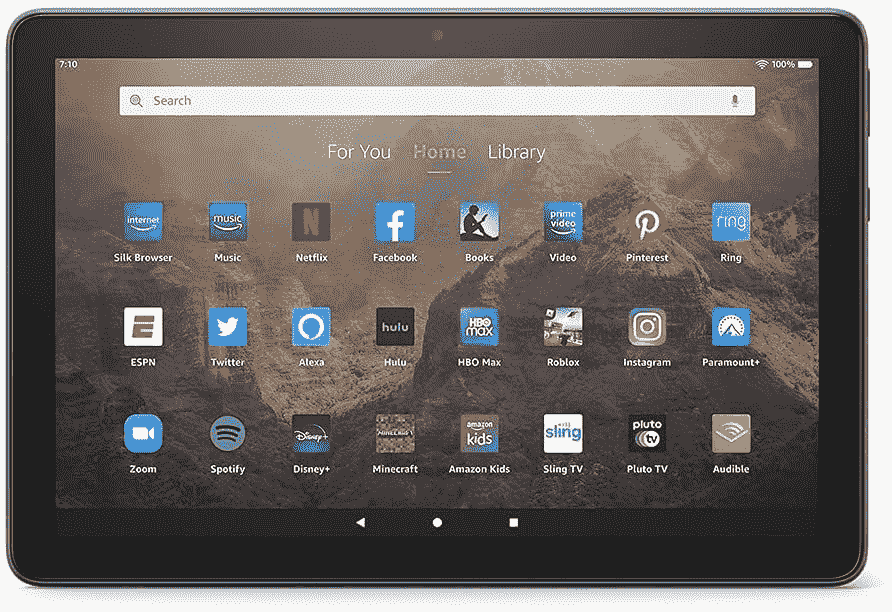

# 亚马逊的 Fire HD 10 平板电脑现在更加实惠，限时优惠 43%

> 原文：<https://www.xda-developers.com/amazon-fire-hd-10-tablet-85/>

 <picture></picture> 

Amazon Fire HD 10 tablet

##### 亚马逊 Fire HD 10 (2021)

这款平板电脑非常适合轻度使用，例如浏览网页、观看电影和电视剧、阅读新闻、参加远程课程等。只需 85 美元就能买到，而且这个 43%的折扣还在。

如今市场上有很多优秀的安卓平板电脑，但亚马逊的平板电脑往往物超所值，尤其是在打折的时候。亚马逊 Fire HD 10 目前限时打折 43%，价格降至仅 85 美元。如果你一直在考虑给自己买一台新的 Android 平板电脑，如果你预算有限，Fire HD 10 可能是一个可以考虑的选择。

亚马逊 Fire HD 10 由八核处理器、3GB RAM 驱动，拥有漂亮的 10.1 英寸 1080p 显示屏。这种型号的显示器被吹捧为比以前的型号亮 10%，如果你打算在户外或明亮的条件下使用它，这应该会很方便。此外，该平板电脑一次充电可持续 12 小时，并可以通过其 USB-C 端口快速充电。

最重要的是，这款平板电脑经久耐用，能够承受日常使用中可能遇到的碰撞和摔落。基本型号配有 32GB 的内部存储，但可以使用其 microSD 卡插槽进行扩展。至于应用程序，你可以通过亚马逊的专用应用商店获得一些最好的应用程序。虽然不如谷歌 Play 商店强大，但它仍然提供了很多大多数人在使用平板电脑时寻找的应用程序。

如果你不太确定可能有什么可用的，你可以在购买之前提前检查 Appstore，以确保你需要的应用程序在平台上。虽然大多数平板电脑都有平淡无奇的颜色，但亚马逊 Fire HD 10 共有四种颜色，其中三种颜色赋予了它一点个性和天赋。你可以从黑色、牛仔布、橄榄色和淡紫色中选择。如果有兴趣，你现在可以在有限的时间内以仅 85 美元的大幅折扣价格购买亚马逊 Fire HD 10。