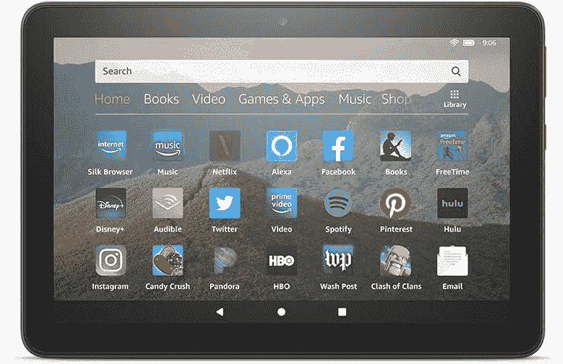

# 只需 55 美元，就能拥有一台 Fire HD 8，随时随地享受娱乐

> 原文：<https://www.xda-developers.com/amazon-fire-hd-8-deal/>

你想买什么样的平板电脑在很大程度上取决于你想用它做什么。一些平板电脑实际上是迷你笔记本电脑，能够毫不费力地启动生产力应用程序，甚至玩一些轻度游戏。但是这种平板电脑很贵，而且没有昂贵的键盘盖感觉也不太好。如果你只是想在上下班途中找些东西看或读，你不需要花几百美元买一台平板电脑。为此，像 Fire HD 8 平板电脑这样的产品会更适合你。

通常情况下，Fire HD 8 的价格是 90 美元，这有点贵，但这款平板电脑定期上市，尤其是在每年的这个时候。现在，你可以花 55 美元买到这款亚马逊平板电脑，作为 Alexa 生日交易的一部分。Fire HD 8 是一款简单的平板电脑，有黑色、紫色、暮光蓝和白色可供选择，旨在将您所有的便携式娱乐设备集中在一个地方。无论是用 Kindle 应用阅读书籍，观看节目还是流媒体音乐，这款平板电脑都能做到，没有更昂贵平板电脑的所有功能。

有些人对 Fire 平板电脑的用户界面有问题，但不要担心，因为[有一个简单的解决方案。有了这样的价格和简单的解决方法，你还在等什么？](https://forum.xda-developers.com/hd8-hd10/development/official-amazon-fire-toolbox-v1-0-t3889604)

 <picture></picture> 

Fire HD 8 Tablet

##### 亚马逊 Fire 8

需要一款简单的平板电脑，让您在旅途中轻松享受娱乐？Fire 8HD 是适合您的平板电脑。现在只需 55 美元，通过快速变通，这是一个伟大的平板电脑，用于阅读书籍，流媒体电影和节目，等等！

Fire 8 HD 也不是为 Alexa 的生日销售的唯一一款平板电脑。 [Fire 10 HD 也在售](https://www.amazon.com/Fire-HD-10/dp/B07KD6YDKC?tag=xda-2alnv50-20&ascsubtag=UUxdaUeUpU30531&asc_refurl=https%3A%2F%2Fwww.xda-developers.com%2Famazon-fire-hd-8-deal%2F&asc_campaign=Short-Term)，低至 80 美元。不过，这款新机型是否值得多花 25 美元取决于你。如果你正在为你生命中的孩子寻找一些东西， [Fire 7 儿童版仅售 60 美元](https://www.amazon.com/Fire-7-Kids-Edition-Tablet/dp/B07H8WS1FT?tag=xda-2alnv50-20&ascsubtag=UUxdaUeUpU30531&asc_refurl=https%3A%2F%2Fwww.xda-developers.com%2Famazon-fire-hd-8-deal%2F&asc_campaign=Short-Term)，将会是一个非常棒的节日礼物。还有很多亚马逊设备是这次限时特卖的一部分，所以如果你想早点完成假日购物，不要犹豫！