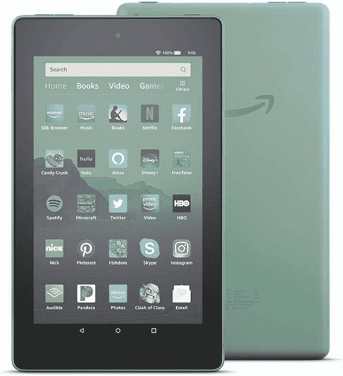

# 亚马逊 Fire 平板电脑获得了一个设备仪表盘来控制 Alexa 设备

> 原文：<https://www.xda-developers.com/amazon-fire-tables-smart-home-device-dashboard-control-alexa/>

# 亚马逊 Fire 平板电脑获得了一个智能家居设备仪表盘来控制 Alexa 设备

亚马逊正在增加一个设备仪表板功能，以选择 Fire 平板电脑，使控制许多智能家居设备变得更加容易。

亚马逊正在推出一项选择 Fire 平板电脑的更新，这将使它们成为兼容 Alexa 的智能家居设备(通过 [*、ZDNet*](https://www.zdnet.com/article/amazon-fire-tablets-to-get-smart-home-device-dashboard/) )。

这项名为“设备仪表板”的功能在导航栏中引入了一个智能主页按钮。据亚马逊称，这就是触摸可能比语音更方便的地方。发布后，Fire 平板电脑用户将获得所有智能家居设备的概览，并可以选择快速关闭所有灯、插头和开关。

设备仪表板还为已锁定的设备和最近使用的设备提供了磁贴，因此您可以查看摄像头、关灯和调节恒温器。与新设备仪表盘兼容的亚马逊 Fire 平板电脑有:

*   亚马逊火 7 (2019)
*   亚马逊 Fire HD 8 (2018)
*   亚马逊 Fire HD 8 (2020)
*   亚马逊 Fire HD 10 (2019)

亚马逊表示，你不必关闭当前的应用程序来访问设备仪表盘。你甚至可以从锁定屏幕访问控制，这样你就不必跳过一堆圈来控制你的设备。

亚马逊的设备仪表板完全是关于触摸的，让人想起[谷歌最近对其智能显示用户界面的改变](https://www.xda-developers.com/google-assistant-smart-displays-new-ui-dark-mode-multi-account-support/)，它更强调触摸而不是语音。区别在于亚马逊的 Fire 平板电脑是便携式的，这使得今天的更新非常重要，尤其是如果你的网络上有很多支持 Alexa 的智能家居设备。

从今天开始，更新将推广到受支持的设备。如果你没有 Fire 平板电脑，你可以以低至 49 美元的价格获得 Fire 7。

 <picture></picture> 

Amazon Fire 7

##### 亚马逊 Fire 7

亚马逊 Fire 7 平板电脑是一款价格实惠的设备，非常适合玩游戏和看电影。现在，它非常适合控制您的智能家居设备。